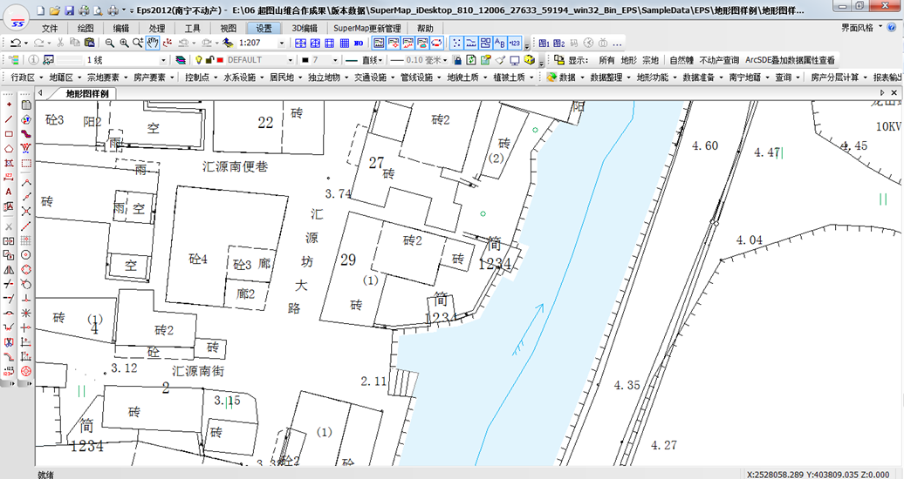
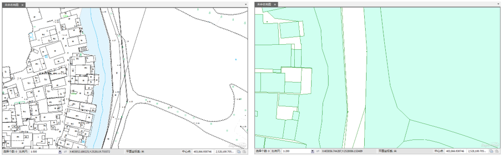
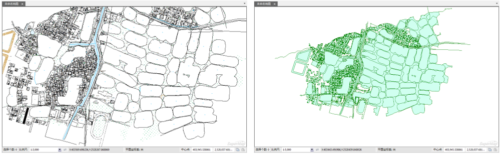
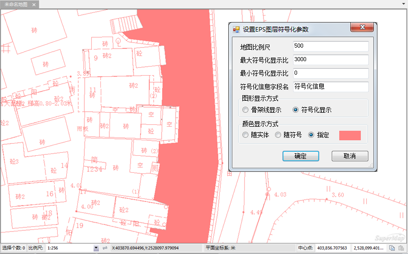

EPS平台生产的数据，一般是大比例地形数据，例如1：500比例尺，不同类型的要素是按照不同地形数据风格显示，如下图所示。

  
  
SuperMap iDesktop中实现了针对EPS平台数据的符号化插件开发，在大比例尺下，EPS数据集在iDesktop中支持以EPS中的风格显示。

### 操作步骤

  1. 在数据源中，按住Shift键选中所有数据集，在右键菜单中选择“添加EPS图层到新地图”。
  2. 弹出“设置EPS图层符号化参数”对话框，具体参数说明如下：
  * **地图比例尺** ：导入的EDB数据的比例尺，可根据EDB数据的比例尺进行设置。默认值为500。
  * **最大符号化显示比** ：设置EPS数据符号化显示的最大比例尺。小于此比例尺，EPS数据将以SuperMap中的普通数据集风格显示。默认值为3000。如下，左图比例尺3000以符号化风格显示；右图比例尺5000以普通数据集风格显示。   
    
  * **最小符号化显示比** ：设置EPS数据符号化显示的最小比例尺。大于此比例尺，EPS数据将以SuperMap中的普通数据集风格显示。默认值为0。如下：左图比例尺500以符号化风格显示；右图比例尺200以普通数据集风格显示。   
       
  * **符号化信息字段名** ：用来指定EPS数据添加到地图窗口以符号化方式显示的字段名称。默认字段名为“符号化信息”。
    * **图形显示方式** ： 
      * 骨架线显示：房屋面数据集会以骨架线的方式显示。
      * 符号化显示：以EPS平台中的要素风格进行显示。默认选项。
    * **颜色显示方式** ： 
      * 随实体：添加到地图窗口的EPS数据的颜色根据点、线、面等实体的颜色进行显示，为iDesktop中的数据集默认显示颜色。
      * 随符号：添加到地图窗口的EPS数据的颜色根据符号的颜色进行显示，即跟在EPS平台中各个要素的颜色是一致的。默认选项。
      * 指定：自定义添加到地图窗口的EPS数据的显示颜色。  

  

