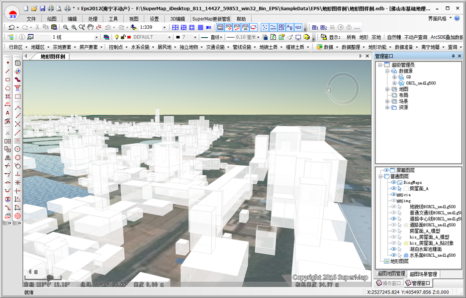

在2016年，超图软件和山维科技成立联合研发工作组，在SuperMap SDX+空间数据库引擎中增加完全兼容EPS对象的数据模型，使得EPS软件生产的数据可以无损地存储在SuperMap SDX+空间数据库中。在数据模型统一后，双方又在软件上深度整合：在EPS系列产品中集成了SuperMap的GIS制图以及三维可视化能力；在SuperMap GIS系列产品中则集成了EPS的基础地形图可视化模块，联合打造测绘大比例尺数据的生产、发布与应用一体化。
下图为 SuperMap 中 EPS 基础地形图的展现：
  
下图为 EPS 中打开 SuperMap 的工作空间  
  

  
超图软件和山维科技双方产品联合的优势：

  * 数据生产应用一体 

无论是在EPS中创建的Oracle数据库，还是在SuperMap中创建的，同一个地理数据库，在EPS和SuperMap中均可以打开查看和管理，省去数据交换的环节。数据成图后，通过 SuperMap 桌面软件，可以直接一键发布为iServer地图或者数据服务，满足在浏览器上浏览查看的需求。也可以配置为天地图风格发布，满足大众化的浏览需求。
下图为EPS数据发布为iServer服务： 
  

  * 基于虚拟地球的快速信息提取与展示 

EPS三维测图系统可以基于倾斜模型进行全息DLG数据的采集，采集的结果则可以在SuperMap产品中实现批量建模、模型的单体化查询等展示，替代传统测绘和人工三维建模，实现智能化测绘。  
下图为EPS软件中的DLG数据采集与在SuperMap中的应用  

  

  * 二三维一体化建库与动态更新 

基于EPS的房产测绘数据，例如单栋楼宇的分层分户数据，SuperMap桌面软件中都可以无缝符号化展示。在三维场景中，可以直接将楼宇的平面图拉伸为高楼大厦，自动构建三维模型，选中楼宇中的每一层，并进行相应的属性查询，对大楼中分层分户的情况一目了然。

在数据生产与处理时，动态更新技术，可以实现二三维数据的增量更新，实现数据的下载、上传与自动检测，以及外业、内业的入库更新一体化。
下图为楼层分户信息查询  

  

  * 管线数据生产与应用一体化 

管线数据多以立体的形式展现。EPS管网系统生产的管线数据，在SuperMap桌面软件中，可以直接在地图窗口符号化显示，也支持添加到三维场景中，赋予管线风格，实现三维线型符号的自动化构建，三通、四通等管点符号的自动生成，并且也可以实现管线属性的直接查询，爆管分析等，可以结合城市模型，再现真实的城市管网系统。
下图为管线数据的应用  
  

从以上的介绍可以看出，山维科技产品家族的优势在于，测绘生产建库，是基础的测绘数据生产，而SuperMap产品的优势，则是GIS强应用，把各种基础测绘数据，转变为GIS应用，为决策者提供更加直观的方案依据。

需要注意的是，山维科技的EPS平台，目前只提供32位版本，所以需要下载 SuperMap iDesktop
32位版本，才能使用SuperMap中的对接成果。SuperMap iDesktop 64位版本，仅支持浏览已保存的有风格的 EPS 地图，便于用户发布服务、分享 EPS 地图等出图的操作。

