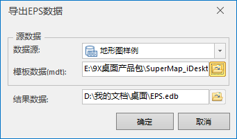

SuperMap iDesktop 中支持将数据源中的 EPS 数据集，基于 mdt 模板（注：mdt 为 EPS 平台提供的带有风格的数据模板），导出为
EDB 数据，可以在 EPS 平台中打开使用。

### 操作步骤

  1. “开始”选项卡→“数据处理”分组中，单击“数据导出”下拉按钮，选择“导出EPS数据”]选项。
  2. 在弹出的对话框中，选择要导出的数据源、模板数据以及结果数据的路径，“确定”后，即可导出为EDB数据。 注意：mdt 模板数据位置：iDesktop 安装路径\EPS\Templates，此模板为 EPS 平台提供，如不能满足需求，可联系山维科技公司。   
     

  3. 点击“确定”。即可将EPS数据导出到指定路径。

