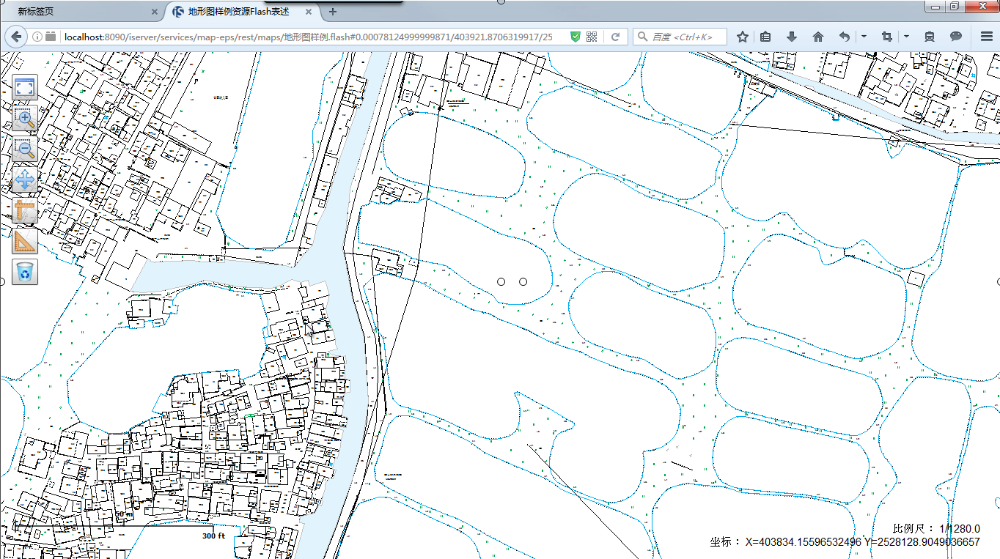

通过SuerMap
iDesktop，可以直接将保存的、带有EPS风格的地图，发布为iSever的REST数据服务、地图服务，在浏览器中进行浏览。本小节中，将以发布本地地图服务为例。

### 操作步骤

  1. 保存地图、保存工作空间；
  2. “在线”选项卡->“发布iServer服务”分组中，点击“工作空间”选项；
  3. 在弹出的对话框中：输入管理员账号、密码；REST服务中选择“地图服务”。 

**注** ：如果iServer部署在服务器上，可选择发布为“远程服务”，需要注意服务地址，端口号的填写。

  4. 点击“发布”。地图服务发布成功后，会在输出窗口输出发布成功的提示信息，以及发布的地图服务地址，点击url可以直接访问。下图为在浏览器端浏览的发布服务结果。   
     
 
  5. 除了可以直接将EPS风格的地图发布为REST服务外，也可以将转换为简单数据集后的数据配置为天地图风格的电子地图，发布为地图服务，或者数据服务。
