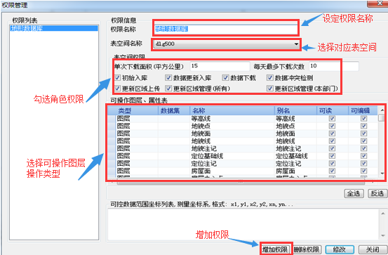
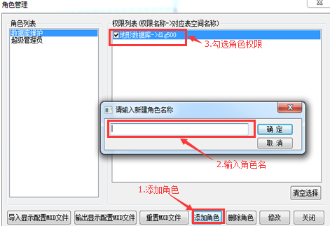
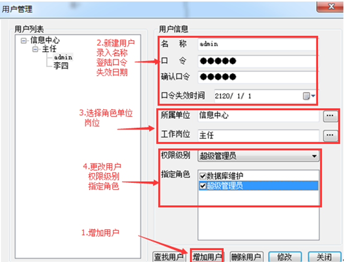

用户权限管理功能主要包括：权限管理、角色管理、用户管理，详细操作说明如下：

### 权限管理

首次加载SuperMap更新管理模块需进行权限管理设置。权限管理功能主要在于规定用户角色所拥有权限，避免数据被低级别权限用户更改，造成数据破坏。

**操作步骤** ：“Super Map更新管理”→“系统管理”→“权限管理”。

  

  
### 角色管理

权限设定完毕，开始设定角色。点击“添加角色”，输入角色名称，勾选角色权限，点击修改添加结束。

**操作步骤** ：“SuperMap更新管理”→“系统管理”→“角色管理”。

  

  
### 用户管理

用户管理功能用于管理登录用户信息，点击“添加用户”，输入用户信息，勾选用户拥有角色，点击修改添加结束。

**操作步骤** ：“SuperMap更新管理”→“系统管理”→“用户管理”。

  

