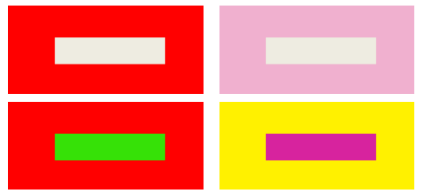

色彩是所有颜色的总称，它包括无彩色系和有彩色系。黑、白、灰属于无彩色系，红、橙、黄、绿、青、蓝、紫属于有彩色系。

本小节将简单介绍与色彩相关的色相、明度、饱和度，色彩感觉等方面的内容，如需更深入的了解学习与色彩相关的其他知识，例如色彩的混合、色彩模式等等内容，还请参考与色彩相关的专业书籍或者网络资料。

### 色彩的基本属性

色彩的基本属性是指人的视觉能够辨别的颜色的基本变量。色彩的三属性包括色相、明度、饱和度，这三个属性既相互区别、各自独立，又相互依存、互相制约。

  

  
  * **色相**

色相即每种颜色固有的相貌。色相表示颜色之间“质”的区别，是色彩最本质的属性。光谱中的红、橙、黄、绿、青、蓝、紫7种分色光是具有代表性的7种色相。

  

  * **明度**

明度是指色彩的明暗程度，也指色彩对光照的反射程度。如下图所示，在无彩色系中，明度最高的是白色，最低是黑色，其间为各种深浅的灰色。

  
  
  

  * **饱和度**

饱和度是指色彩的纯净程度。纯色纯度最高，混色（不论黑、白、灰或者有彩色系）越多越降低其纯度。

需要注意的是，“饱和度”和“明度”是两个概念，“明度”是指明暗、强弱，而“饱和度”是指鲜灰、纯杂。明度高不一定纯度高。

### 色彩的感觉

色彩本身是没有灵魂的，它只是一种物理现象，但人们却能感受到色彩的情感，这是因为人们长期生活在一个色彩的世界中，积累着许多视觉经验，一旦知觉经验与外来色彩刺激发生一定的呼应时，就会在人的心理上引出某种情绪。

  * **色彩的兴奋与沉静**

色彩的兴奋与沉静感取决于刺激视觉的强弱。在影响人的感情的色彩属性中，最起作用的是色相，其次是饱和度，最后是明度。例如红、橙、黄等暖色让人兴奋，青、蓝等冷色让人沉静，界于之间的绿、紫等色则是中性的。高明度色具有兴奋感，低明度色具有沉静感。

  * **色彩的冷暖感**

暖色系：红、橙、黄等；冷色系：青色、蓝色等；中性色：绿色、紫色等。

  
 

  * **色彩的进退与胀缩**

暖色，有凸起之感，属于前进色；冷色，有凹下之感，属于后退色。地图设计中，可利用颜色的远近感来形成不同的层面，区分内容的主次。

  * **色彩的轻重与软硬感**

色彩的轻重感与知觉度有关。明度低深色系，稳重，感觉重；明度高浅色系，轻快，感觉轻。在明度一定的条件下，纯度高的暖色具有重感，纯度低的冷色具有轻感。色彩的轻重感的基本规律为：

  * （重）黑>低明度>中明度>高明度>白（轻）
  * （重）高纯度>中纯度>低纯度（轻）

色彩的软硬感主要取决于明度和纯度，高明度的含灰色具有软感，低明度的纯色具有硬感。

  * **色彩的华丽与朴素**

色彩的华丽与朴素感以色相关系为最大，其次是纯度与明度。红、黄等暖色和鲜艳而明亮的色彩具有华丽感;青、蓝等冷色和浑浊而灰暗的色彩具有朴素感。彩色系具有华丽感，非彩色系具有朴素感。色彩的华丽与朴素感也与色彩组合有关。

  

  * **色彩的活泼与忧郁**

色彩的明快与忧郁感主要与明度与纯度有关。明度较高、鲜艳之色―明快感，灰暗浑浊之色―忧郁感。高明度基调的配色容易取得明快感，低明度基调的配色容易产生忧郁感。

非彩色系列中：黑与深灰容易使人产生忧郁感，白与浅灰容易使人产生明快感，中明度的灰为中性色。

### 色彩的对比与调和

  * **色彩的对比**
  * **明度对比**

在色彩三属性中以明度的差异形成的对比称为明度对比。明度高的会显得明亮，明度低的会显得更暗。例如同一明度的色彩，在白底上会显得暗，而在黑色背景上却显得更亮。

  

  * **色相对比**

在色彩三属性中以色相差异为主形成的对比称为色相对比。色相对比有同种色的对比，类似色的对比，对比色的对比，互补色的对比。

  
 
  * **饱和度对比**

在色彩三属性中以纯度差异形成的对比称为纯度对比。同一纯度的颜色，在几乎等明度、等色相而纯度不同的两种颜色背景上时，在纯度低的背景色上的会显得鲜艳一些，而在纯度高的背景色上会显得灰浊。

  
 
  * **冷暖对比**

用冷暖差别而形成对比称为冷暖对比。一幅图中冷色和暖色的分布比例决定了画面的整体色调，就是通常说的暖色调和冷色调。使用了冷暖对比色可使画面更加有层次感。

  

 * **面积对比**

当色相并置时，其色相面积的大小会影响观赏者的感受，而利用面积大小的关系所做的对比配色，称为面积对比。例如，同色相配色常因色彩面积大小与位置的改变，便产生不同的视觉感受。

  
 
  * **色彩的调和**

色彩调和，有两种解释，一种指有差别的，对比着的色彩，为了构成和谐而统一的整体所进行的调整与组合的过程；另一种是指有明显差别的色彩，或不同的对比色组合在一起能给人以不带尖锐刺激的和谐与美感的色彩关系，这个关系就是色彩的色相、明度、纯度之间的组合的“节律”关系。

色彩调和的方法、手段和原理有很多，在这里不做具体的介绍，我们只需要记住色彩调和的重要原则：配色要符合主题目的，引起读者审美心理的共鸣。

  

###  相关内容：

 [点状符号的色彩设计](SymbolColorDesign)

 [线状符号的色彩设计](LineColorDesign)

 [面区域的色彩设计](PolygonColorDesign)

 [实用的颜色工具](ColorTools)
