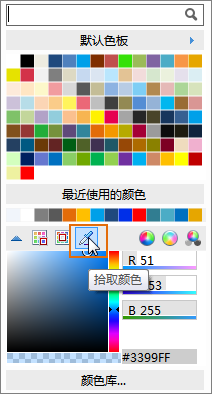
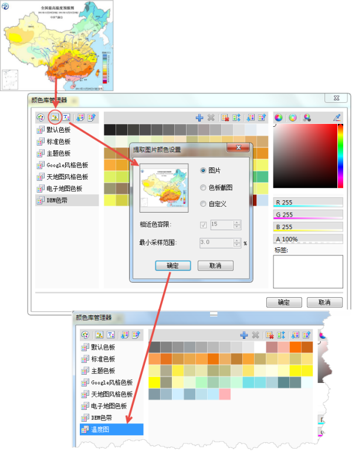
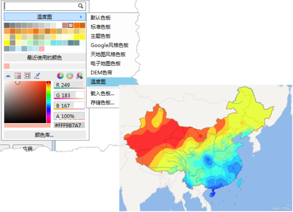
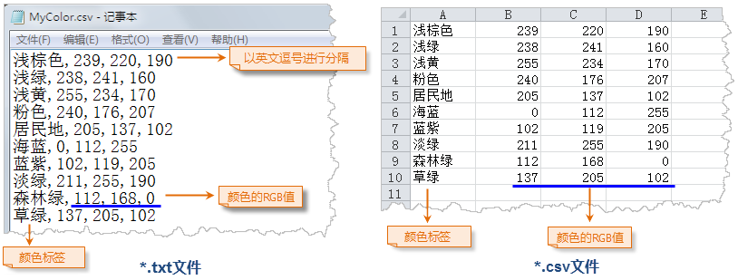
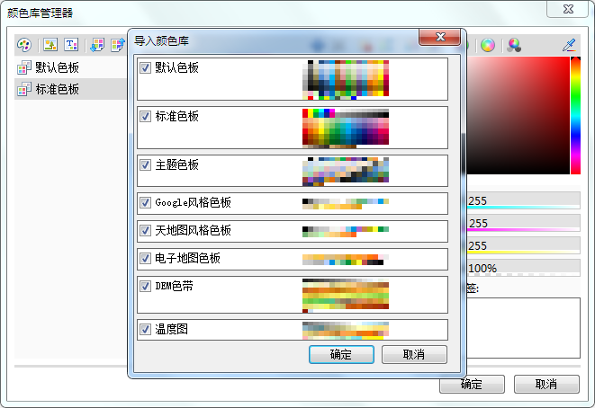
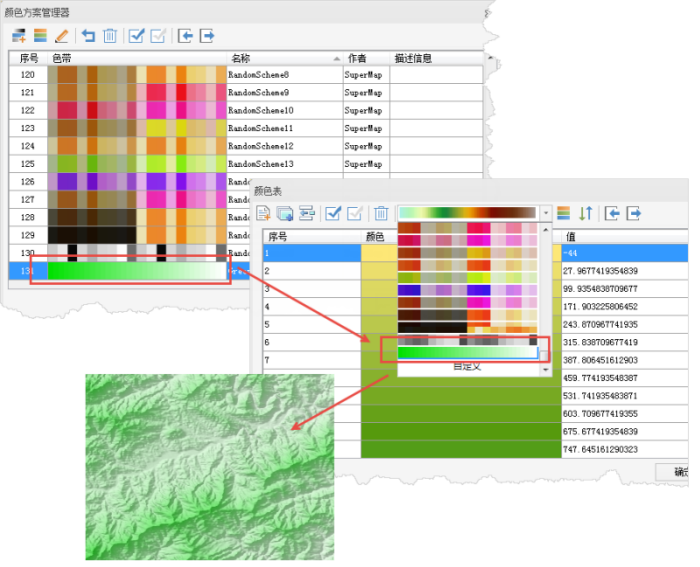

在本章节中，将介绍几个 SuperMap iDesktop 中的实用颜色工具。合理的使用这些工具，可以有效的帮助我们提高制图的效率。

### 取色器

取色器，是各种绘图软件、画板等涉及到颜色设置软件的必备小工具，SuperMap iDesktop
中也提供了这一好用的工具。在颜色面板中，它代表拾取颜色，可以拾取当前屏幕上的任意色彩，应用到地图当中。如下图所示：

  

  
### 颜色库管理

颜色库管理器提供了对当前颜色库中的颜色进行高级管理的功能，可以更为灵活、专业地管理颜色集合。在颜色库管理器中，可以完成以下操作：

  1. **添加色板**

系统默认提供了默认、标准、主题、Google风格等几种色板，如果不能满足制图需求，用户可以通过此功能，添加新色板，构建符合实际应用需要的颜色集合。在这里新建的色板，或者色块，选择保存下来后，会同步到其它涉及颜色选择的地方，真正的做到一方管理，多方应用。

  2. **从图片采集颜色，构建新的色板。**

此功能可从已有的图片文件中提取图片中的所有颜色，将这些颜色作为新的色板中的颜色导入到当前颜色库中。下图为从图片采集颜色，并将其颜色应用于制图。

  

  
  
  3. **从文本文件导入色板**

可以将记录了颜色的文本文件导入到当前颜色库中。文本文件的格式可以为：*.txt 或 *.csv，但颜色的记录格式要符合一定的要求。如下图所示，第一个逗号（英文逗号）的内容为颜色的标签，之后为 RGB 颜色值，颜色值必须使用 RGB
颜色模式；一行代表一个颜色记录。如果文本文件中存在记录没有严格遵守这个规则，该记录将被忽略，对应的颜色不被导入。

  
  
  4. **导入/导出颜色库文件**

可以将当前颜色库管理器中的所有色板导出SuperMap颜色库文件（*.xml），与他人共享，也可以将他人制作好的颜色库文件导入。在导入时，可以选择要导入的色板文件，这可以当作是成果备份的一种方式。

  

  
除此之外，颜色库管理器中，还可以对色板中的颜色进行近似色的排列，为色块添加标签，用以增加色块的辨识度，或者搜索使用。

### 颜色方案管理

颜色方案器用来对程序中的颜色方案进行定制和管理。SuperMap iDesktop
在颜色管理器中保存了一系列常用的颜色方案。其中有些颜色方案是为特定的领域准备的，比如用于显示高程的颜色方案。同时也支持用户创建自定义的颜色方案，以满足不同的应用需求。如下图所示。

  

  
总之，地图的色彩设计是一件复杂的事情，必须在懂得色彩学和地图设色的知识的基础上，经常分析国内外优秀地图作品，学习好的用色方法，才能逐渐掌握彩色设计的规律，从而提高地图的表现力，增强地图的艺术效果。

初次接触地图配色的人员，如果是配置常用的电子地图，可多参考上文中提及到的网络在线地图，这些网络地图的色彩搭配还是比较符合大众的审美要求的，具有可参考的价值。

###  相关内容：

[色彩的基本特征与色彩心理](ColorCharacteristicsAndPsychology)

 [点状符号的色彩设计](SymbolColorDesign)

 [线状符号的色彩设计](LineColorDesign)

 [面区域的色彩设计](PolygonColorDesign)