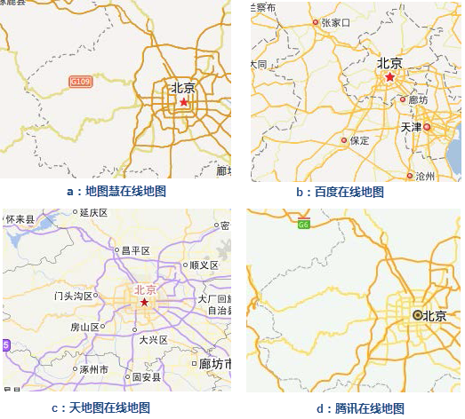
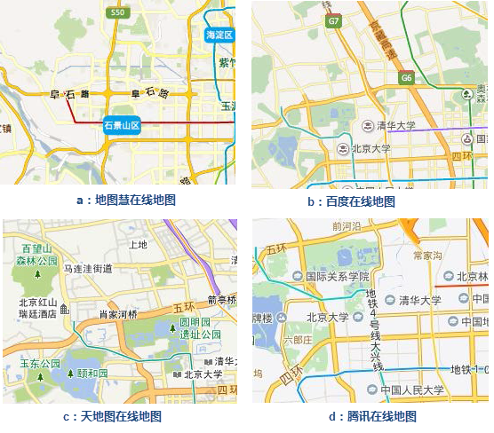
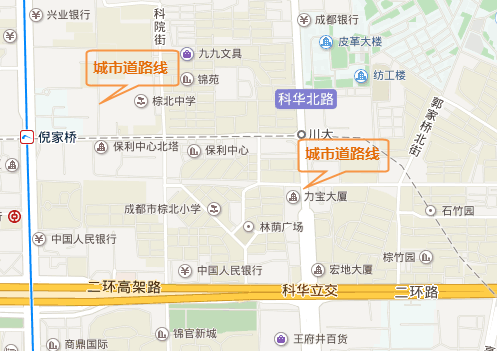
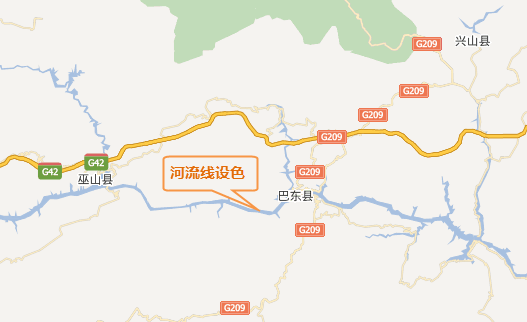

线状符号在地图中起骨架作用，它是地图信息的主要载体之一，如道路、河流等。在进行地图设计时应将其作为重点元素予以突出表示。线状符号十分狭窄、细长，只有通过色彩的加重表示，才能将线状符号凸现出来。因此，进行线状符号设计时线划部分应选择饱和度大的颜色。不同等级的线状符号设色，宜采用不同色相、不同明度和饱和度的色彩来表示。如高速公路、国道、省道和县乡道等不同等级的道路，需用不同的颜色来区分。还有一些线划可以采用专色，如城市地铁线，等高线的用色。下面，将重点介绍几种地图中常见的线状符号的色彩设计。

### 道路

本文中所讲到的道路色彩设计，都是基于地图底图的色彩偏灰色，也是一般常用的底图设色，如果底图的色彩偏深色，可能会不适用，这就需要制图者根据具体底图的颜色搭配出合适的道路色彩，以达到整体地图色彩的协调。

地图慧、百度、天地图、腾讯等在线地图在1：50公里时对不同等级的道路设色。地图慧、百度、腾讯对道路的设色，都采用的是黄色系，按照道路等级，颜色由深到浅。天地图对高速公路的颜色设置采用了紫色，其他级别的道路也是以黄色表示。

  

  
地图慧、百度、天地图、腾讯等在线地图在1:2公里时对不同等级的道路设色。相比上一幅图，这一级别比例尺下的道路展现的更丰富，高速公路、国道、省道等道路都以双线的方式展示，主色系仍然是黄色系。在双线的颜色设置上，边线的颜色要比中间的主色深一些，两者颜色仍属于同一色系，但是又要有对比。

  

  
从前面的讲述可以看出，高速公路、国道、省道、县乡道路的颜色设置，主要采用的是黄色系。因为黄色给人轻快、充满希望和活力的感觉，道路线可以说是地图上展示最多的线状符号，轻快、活力的颜色不仅能增加地图的美感，也能给人带来愉悦感。

当然，并不是在所有比例尺下，所有的道路线都可以用黄色系中的颜色表示，当密密麻麻的城市街道线出现而重点又不是表现街道线时，可以采用一些饱和度较低的颜色来设置，以降低道路线的视觉效果，例如灰色系。

  
 
  
上图为城市街道线在不同的比例尺下的色彩设计。单线时，设置为灰色（H=0，S=0，B=79），双线时，边线为灰色，主色为白色。城市道路线一般纵横交错，包含各种街道小巷，使用饱和度低的色彩能够减少对视觉的冲击，地图的可读性更强。

### 铁路

在电子地图中，铁路线一般以灰白相间的符号表示，所以在色彩的设计上也不复杂，就两种颜色灰色和白色。如图下图中，使用的是H=0，S=0，B=79的灰色，可以调整亮度值（HSB中B的值）和整个地图色彩匹配。

  

  
### 河流

人们对江河湖泊这些水系的颜色认知，一般都是蓝色的，而不是我们实际生活中看到的黄色、绿色或其他颜色（与环境等诸多因素相关，这里不做详述），所以在电子地图中，对江河湖泊的色彩设计，是以蓝色系为主。不同等级的河流线可以采用不同饱和度和亮度的蓝色来表示，而在公共电子地图中，一般都采用一种蓝色表示，饱和度适中，如下图所示。

  

  
除了道路、铁路、河流线的设色之外，还有国境线、行政区划线（省、市、县等）等的色彩设计。国境线、行政区划线的色彩设计，一般以灰色为主，但如果要做区分，像国境线中，区分出中国和其他国家，中国的国境线可以用其他色系的颜色表示。例如腾讯地图中使用的黄色系；省、市、县等的行政区划线，是不同等级的行政区划表现，可使用同色系中饱和度和亮度不同的颜色表示，或者使用不同的线型符号以示区分。

###  相关内容：

[色彩的基本特征与色彩心理](ColorCharacteristicsAndPsychology)

 [点状符号的色彩设计](SymbolColorDesign)

 [面区域的色彩设计](PolygonColorDesign)

 [实用的颜色工具](ColorTools)

* * *

  
  
---

