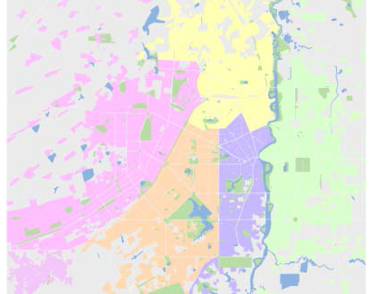
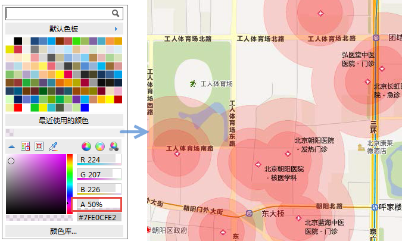

面区域面积较大，能够迅速抓住读者的视觉，影响读者的审美兴趣。成功的面域用色是用较少的地图语言传递出较丰富的地理信息，使地图用途和设计意图得以清晰、完整、准确地表达。因此，面域用色应区分层次，选用不同的色值。

不同的面区域在地图中所表达的性质是不同的。面区域的颜色设计应该根据其性质选用有别于其他符号的颜色。植被、水域、街区（或居民地）是常见的面区域。一般情况下，植被绿地使用绿色，水域使用蓝色。街区可以根据地图用途选用不同的色系。例如地形图中街区颜色为灰色(
K= 20)，政区图中街区可根据其归属选用不同的色系和色值，用浅粉色( M= 25)、浅黄色( Y= 30)、浅橙色( M= 15、Y= 30)、浅紫色(
C=22、M= 28)或浅绿色( C= 15、Y= 20)等表示分别属于不同行政区划的街区，效果都还可以。

  

  
面区域和其他图层进行叠加显示时，会有遮盖的现象。在实际的地图生产时，我们也可以通过设置色彩的透明度，达到半透明效果的显示，尤其是在和影像数据进行叠加显示时。开启“地图属性”中的“Alpha通道”后，在RGB模式下设置面区域颜色时，设置A（Alpha）值，就可以达到颜色值的半透明显示效果。A值范围：0-100，0：表示全透明，100：表示不透明。

  

  
###  相关内容：

[色彩的基本特征与色彩心理](ColorCharacteristicsAndPsychology)

 [点状符号的色彩设计](SymbolColorDesign)

 [线状符号的色彩设计](LineColorDesign)

 [实用的颜色工具](ColorTools)
