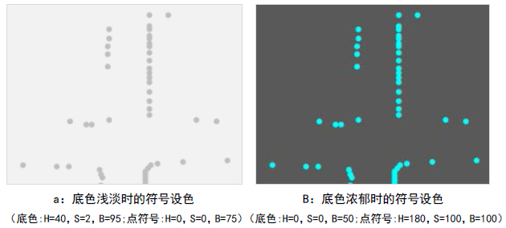
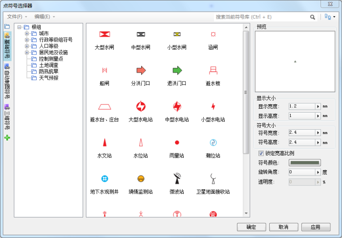
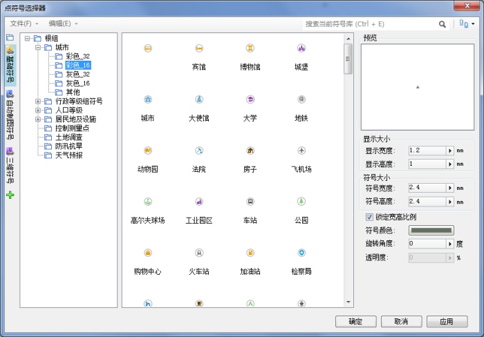
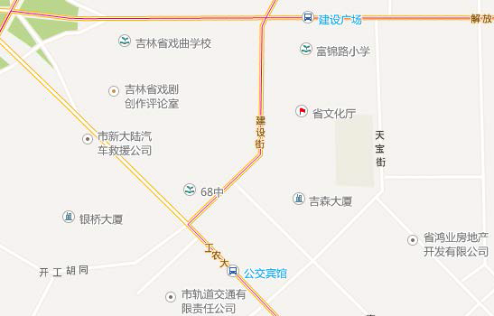

在进行地图色彩设计时，SuperMap iDesktop 提供了三种颜色模式可选：RGB 模式、CMYK 模式、HSB
模式。如果地图是用来在计算机上浏览或发布成为网络地图服务，地图设色时可以采用 RGB 模式；但如果地图需要印刷出图，建议在地图配色时选择 CMYK 模式，CMYK 为印刷色彩模式；HSB 模式中的H、S、B分别表示色相、饱和度、亮度，这是一种从视觉的角度定义的颜色模式，S 和 B 呈现的数值越高，饱和度明度越高，色彩越艳丽。在具体设色时，采用哪种模式，可根据实际情况而定。

下文举例中出现的颜色示意，采用哪种颜色模式值列举，将根据介绍内容而定，不局限于固定的颜色模式。 在实际的制图过程中，我们一般会接触到三种场景的点状符号设置。

### 系统符号

POI点的数据量较大，但又没有明确的分类。针对这种情况，我们在设置数据集风格时，一般会选取系统符号（SuperMap中的系统符号分为方块和原点两种），再来设定符号的颜色和大小。
符号的大小，可以根据地图的需要进行设置；符号的颜色，也需要根据地图的底色来设置。底色非常浅淡，符号色彩可以较浓；底色浓郁，符号色彩则宜采用纯度较高、饱和度较强的鲜艳色彩。如下图所示：

  

  
从Google、百度、腾讯等网络在线地图的色彩设置中我们可以看到，公众地图不追求色彩上的艳丽，而是整体上的舒适和谐，大范围的区域用色彩用的都是饱和度较低的灰色系，例如行政区划。如果我们在制图时，底图颜色参照的是这种用色，那么在符号的设色上，建议采用同系列的饱和度低的颜色（注意：HSB模式中，S=0时为灰色），如上图所示。

### 矢量符号

点状符号为矢量符号，各个矢量符号所代表的含义不同，有固定的符号大小和颜色设置，这种一般是行业地图居多，例如测绘地图、水利设施地图等。如下图所示。

  

  
从上图也可以看出，一般情况下点状矢量符号的主要部分选用纯度较高的颜色，同一类别的不同类型符号可采用不同色相来表示。如图中的分洪门口与退洪门口可以用同一种符号，但色彩不一样，分洪门口用红色、退洪门口用绿色。

但像上图所示的行业符号，都有严格的符号颜色和大小的要求，在符号制作或者符号风格设置时，按照要求来即可。

### 栅格符号

点状符号用形象的栅格符号来表示，这是电子地图普遍采用的一种方式。栅格符号可以形象的传达想要表达的实物，所以在用色上也应该力求接近实物景色。例如公园用绿色表示，加油站用蓝色或者橙色表示等。如下图所示：

  
 
  
栅格符号的设色也不是绝对的，但是也不能太标新立异，要符合大众对实物色彩的认知。例如代表政府单位的地点一般用红色表示，设置为绿色或者黑色就不太适合。

栅格符号的大小和颜色需要跟地图的整体色彩搭配协调。在不确定各种实物应该设置哪种颜色时，可以将栅格符号的主色设置为同一种颜色，例如灰色系（HSB模式中，S=0）。

SuperMap iDesktop 中所使用的栅格符号，需要使用绘图软件如 photoshop
制作，再导入到符号库中使用，这就要求在制作栅格符号的时候，对符号的颜色就确定好，省去符号颜色跟地图效果不搭配而重新制作的麻烦。需要注意的是，栅格符号一般都带有圆形的背景，背景色一般采用白色，与主色形成对比。
另外，在电子地图中，点状符号旁边一般都跟随注记，所以如果没有形象的符号，点状符号所代指的实物也可以通过注记识别，这也是我们可以大胆设置点状符号为默认符号的原因之一。

  

  
###  相关内容：

[色彩的基本特征与色彩心理](ColorCharacteristicsAndPsychology)

 [线状符号的色彩设计](LineColorDesign)

 [面区域的色彩设计](PolygonColorDesign)

 [实用的颜色工具](ColorTools)