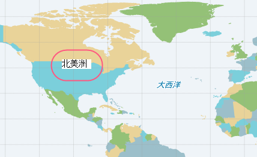
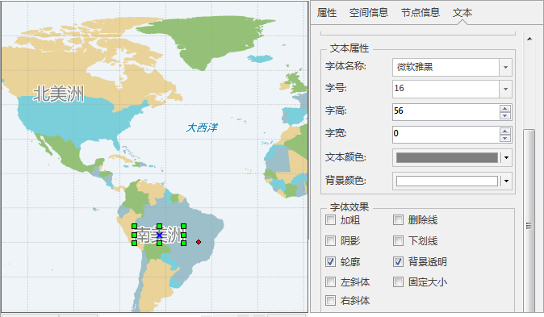
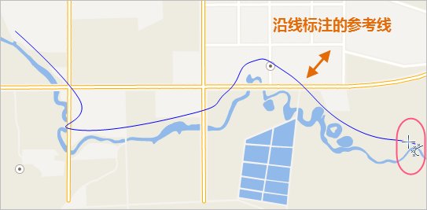
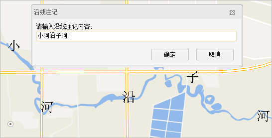
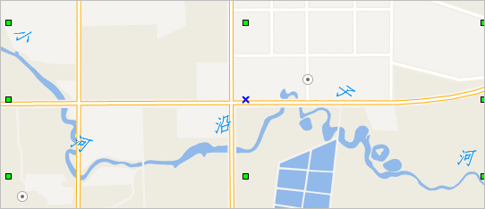
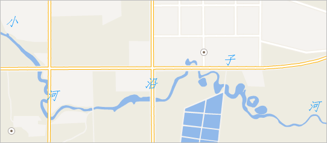

当您的地图注记数量较少，并且要求注记的放置位置固定不变，或者需要严格控制注记的放置位置时，您可以通过文本数据集和 CAD 数据向地图中添加注记。

### 实例一：为区域范围制作注记

像给世界地图中标注大洲的名称，由于大洲内包含许多国家和地区的面域数据，并且，您不可能将标注依附于任何一个面状要素进行标注，此时，您最好的办法就是通过文本数据集或者CAD数据集，将注记文本手动放置到地图中合适的位置。为大洲添加名称具体操作如下：

  1. 新建一个CAD数据集，将其添加到地图中，并设置该图层为可编辑。
  2. 开始绘制文本，在“对象操作”选项卡中单击“文本”下拉按钮，选择“文本”选项，将鼠标移至地图中的适当位置，单击鼠标左键，在文本编辑框内输入大洲名称即可，如下图所示：   
     

  3. 在地图其他任意区域右键鼠标，完成文本对象的添加，此时鼠标状态讲切换为为选择状态。
  4. 修改文本风格：双击文本对象，弹出文本“属性”面板，并可在“文本”区域设置文本风格，此后该数据集中绘制的文本对象风格都与该文本风格一致。 

本实例将文本风格设置为：

  * 字体：微软雅黑。
  * 字号：16。
  * 文本的颜色：RGB(127，127，127)。
  * 轮廓：勾选“轮廓”复选框，设置轮廓线颜色为白色。  

  

  5. 在地图中适当位置继续添加各大洲的文本对象，此时绘制的文本风格与上一个文本风格一致。

### 实例二：为面状水系制作沿线注记

对于电子地图中面积较大水系通常使用面状要素表达，而水系的注记也采用沿线的形式，而 SuperMap
标签专题图暂不支持根据面要素的走势放置注记，所以需要使用文本数据集或CAD数据集来放置这些水系的注记。本实例将使用文本数据的放置来实现面状河流的沿线标注。

  1. 新建一个文本数据集，将其添加到当前地图中，并设置该图层为可编辑。
  2. 绘制文本：在“对象操作”选项卡中单击“文本”下拉按钮，选择“沿线标注”选项，将鼠标移至地图中，根据河流的走向绘制一条临时的线对象作为沿线标注的参考线，所添加的注记将沿着这条临时线进行标注。  
      
 
  3. 绘制好临时的线后单击鼠标右键，在弹出的“沿线标注”对话框中输入标注文本，单击“确定”，如下图所示。   
     
 
  4. 修改文本风格：双击该文本对象，弹出文本“属性”面板，在“文本”区域设置文本风格。 

本实例将文本风格设置为：

  * 字体：仿宋体。
  * 字号：15.5。
  * 文本的颜色：RGB(2，147，253)。   
     

  5. 此时，您可能发现沿线注记各个字的旋转不太合理，可以通过属性对话框中的“旋转角度”调整每一个字的旋转角度，使之美观合理。所添加的“小河沿子河”沿线注记中每一个字为一个子对象，所以旋转角度调整前，要在“子对象”列表中选择要调整的字，再调整角度即可生效生效。 

将文本子对象的旋转角度微调之后，可优化标签的合理性和美观性。

  

