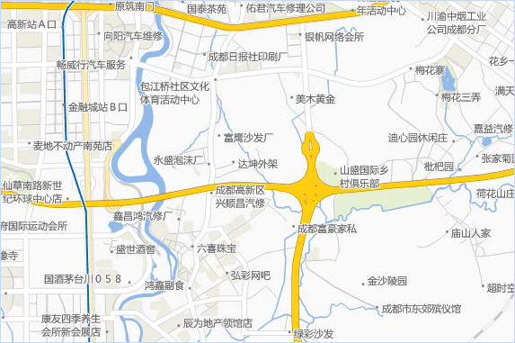

随着电子地图所反映的信息越来越丰富，越来越全面，地图要素往往出现了相互压盖的情况，特别是用来传达地图要素信息的标注文本，其越详细越容易出现相互压盖或者与地图要素压盖的情况，这就是地图注记的冲突问题，那么如何根据制图需要来处理这些压盖问题呢？

通常，地图注记发生压盖是由于注记密度过大，我们通过控制合理的注记密度可以解决一部分压盖问题，并且通过如何放置更多的注记保证一定程度的信息量。然而，这里要说的是一些特殊的注记压盖冲突处理方式，往往根据制图需要进行一些特殊的压盖处理。

  1. **显示与不显示压盖对象**

当地图注记方式压盖时，最简单直接的处理方式就是将左右发生压盖的内容隐藏掉，此时，只需要保证地图属性设置对话框中的“显示压盖对象”不勾选，即可隐藏所有发生压盖的地图注记，还包括隐藏发生压盖的地图对象。

也可以勾选“显示压盖对象”来查看被隐藏的发生压盖的对象。还可通过“地图”选项卡“地图制图”组中的“冲突检测”功能，将发生压盖被隐藏的对象以特殊的风格样式明显地显示在地图中。如下图所示，红色标签标识与其他标签存在显示冲突。

  

  2. **自定义压盖范围实现对象抽稀**

默认情况下，当两个对象的距离小于等于0时，即可说两个对象为压盖。SuperMap
软件允许用户自定义压盖的容限，即界定当两个对象间的距离为何种情况时算是发生了压盖。单击“地图属性”对话框中的“压盖设置”按钮，打开的列表中“压盖范围”区域可以指定一个矩形范围，该范围被看做对象的范围，与该范围相交的对象都将认为与该对象发生了压盖。

关于压盖范围的自定义，从另一方面也可以达到对象抽稀的效果。在控制合理的注记密度一节中，介绍了通过“文本避让的缓存范围”实现抽稀密度大的注记；而通过压盖范围的自定义来实现抽稀则不仅限于注记的抽稀，还包括点对象的抽稀。

需要注意：压盖范围设置会应用到整个地图，而不是针对某个图层，所以设置压盖缓存范围的结果，对地图来说是全局的。

如下图所示，是一个没有设置文本避让的缓存范围的标签专题图，但设置了不显示压盖对象并且开启了自动避让。图上的标签十分密集，下面通过设置压盖范围为25（单位为0.1毫米）是标签达到了一个抽稀显示的效果，如下图所示；对地图进行放大或在缩小操作后，系统柜根据设定的容限值实时调整。

  

  3. **隐藏没有标签的点对象**

在制作地图数据的过程中，您的地图中间结果可能会出现下面这种现象，如下图所示，框选区域由于图中的点对象的标签发生了相互压盖，并且地图设置了隐藏压盖对象，所以导致文本标签被隐藏了。一般地图中出现这种情况属于信息表达不完整，所以我们要么使点对象的标签显示出来，要么也不显示这些缺失标签的点对象。对于前一种处理方式比较困难，所以推荐使用后面的“隐藏没有标签的点符号”，SuperMap
软件提供了十分简洁的操作，只要勾选“点随标签显隐”的功能项，即可实现。

  
 
  
单击“地图属性”对话框中的“压盖设置”按钮，在打开的列表中勾选“点随标签显隐”前的复选框，设置完成后的效果如下图所示。

  
  
  4. **显示隐藏的等级符号**

等级符号专题图是通过符号大小来展现数量上的统计特征的，所以等级符号间不免要发生压盖，默认情况下，地图是不显示任何压盖对象的，所以会有如下左图的效果，显然此时，统计信息表达不完整，通常我们不在如下右图的状态下开启显示隐藏的等级符号，因为这样的显示效果易读性差。

  

可以通过等级符号专题图属性对话框，在设置等级符号风格的时候，设置等级符号颜色的A值（Alpha值），将等级符号设置为半透明的效果，那么在此状态下显示压盖的等级符号，既具美观性又具可读性，如下图所示。

  

  5. **显示隐藏的统计符号**

压盖的统计元素并不应用统计图传达信息，所以，这种发生压盖的统计元素可以不隐藏显示。

单击“地图属性”对话框中的“压盖设置”按钮，在打开的列表中勾选“显示被压盖的统计符号”前的复选框，可以显示地图上的发生压盖而隐藏的统计专题图元素。

  
