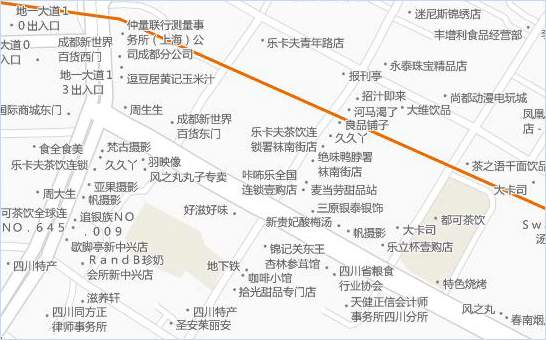
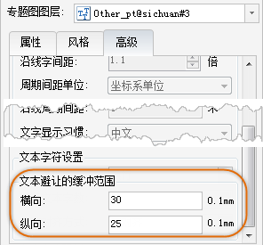
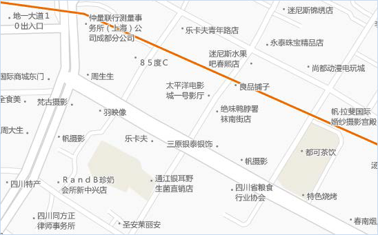
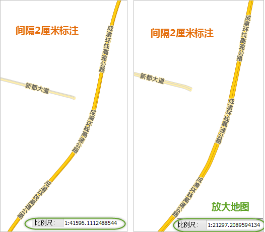
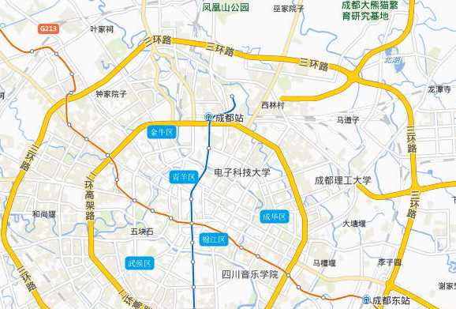

从地图制图实用性的角度，一般地图要保证提供丰富的信息量；而从地图的美观性和易读性角度，就要求地图内容不能过于拥挤，尤其地图上的文字不能过于密集，那么如何控制地图上注记达到一个合理的密度呢？这个问题同样没有一个标准答案，这主要根据地图设计的目的和设计者的审美决定，这里我们主要提供一些控制地图上注记密度的手段和方法，以及我们推荐的一个合理的效果，仅供参考。

  * **抽稀密度大的注记**

如下图所示，某地区一个详细的点位数据并通过标签专题图为点对象添加了注记，该数据对点的标签开启的自动避让和换行显示超长文本功能，从而保证图面上显示了最大信息量的点信息；不过，该地图的注记明显过于密集，读取其中的信息比较费力气，如下图所示的注记密度就不够合理，需要进一步调整。

  

  
SuperMap 软件支持的调整标签密度的有效手段是设置“文本避让的缓存范围”，就是通过指定一个水平和垂直距离，如下图所示，由这两个值限定的矩形范围不允许其他标签压盖此范围，从而达到标签抽稀显示的效果。

  

  
对前一地图中的点标签专题图，设置“文本避让的缓存范围”，横向=30，纵向=25，单位为0.1毫米调整后的效果如下图 所示，标签的密度比较适中。

  
 
  * **控制道路沿线注记频率**

如下图所示，一道主干道路只有一个标注，这样当地图放大浏览后，有可能这条道路的线就没有标注显示了，如何解决呢？

  

  * 方法一：打开该标签专题图层的“流动显示”，这样在浏览的过程中，标签自动移动，从而保证了道路在任何时候都有标注显示，这种方法的缺点是，标签的位置不可控，可能影响对地图整体效果的把握，而且在地图输出缓存时，流动显示功能必须关闭，因此，不建议采用这种方法处理，推荐使用下面的方法二，即固定循环间隔标注。 
  * 方法二：首先要关闭“流动显示”。然后进入“高级”选项卡，下图这个区域将完成固定循环间隔标注，固定循环标注就是每隔固定的距离添加一个注记。 

关于固定循环间隔标注的设置项的具体作用和用法，请参见下面的内容：

  * 沿线字间距可以调整标注中字与字之间的距离，数值表示当前字大小的倍数。
  * 周期间距单位与沿线周期间距功能决定一条线上标注出现的频率，即间隔多远放置一个标注，其中，周期间距单位有两种。

**备注：**
一种与地图单位同，即地图坐标单位是米，则沿线周期间距的数值单位就是米。如果数值设置为500，那么在道路上将每个500米距离放置一个标注，这样的效果时，将地图比例尺发生变化是，标注的间距在视觉上也变化了。

  
另一种是0.1毫米，即不考虑地图单位是什么，而使用的是屏幕逻辑单位，沿线周期间的数值单位就是0.1毫米。如果数值设置为200，那么在屏幕上看，将每个2厘米距离在道路线对象上放置一个标注，这样的效果为，将地图比例尺发生变化时，标注间距总是保持屏幕上的2厘米距离标注。

  

  
下面将调整地图上线对象的沿线标注，注意标注的间距要合理，不宜过于密集也不能太稀疏，这主要根据设计需求而定。如下图为我们对沿线标注的间距处理，使用“0.1毫米”为标注间距单位，数值设置为1200，即12厘米。

**备注：**
固定循环间隔标注是以一个线对象作为参考，从线对象的矢量化的起点开始计算直到矢量化的终点。标注间隔的量算方式为上一个标注的末端到下一个标注的起始端距离。

  
