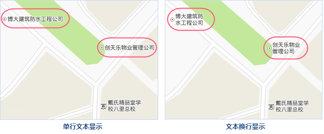
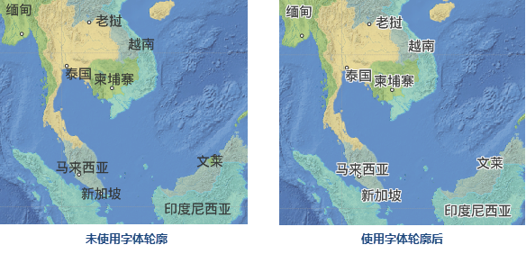
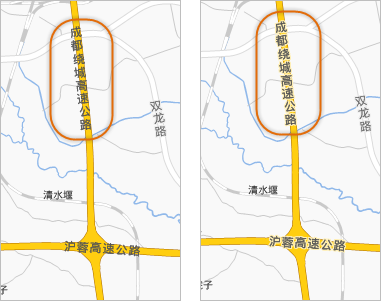
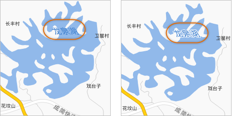

标注的显示效果直接影响整幅地图的审美，然而，对于注记文字设置成什么样算美并没有严格标准可以遵循的，都需要根据您的地图背景来调整的，这里分享一些使用
SuperMap 进行文字风格设置的技巧和经验，希望可以使您从中获得启发、点燃您的制图灵感。

* **字体**

首先，选择一个美观的字体，不同字体有风格上的差异，对地图格调造成不同影响，尤其是字数多的字体，影响更大，例如，黑体字偏刚性，圆角字、楷体字偏柔性，宋体字、仿宋字刚柔相济。也可以添加
SuperMap 软件未提供的字体库以满足您的应用需要。目前，在 SuperMap 软件的电子地图制图中，沿线道路标注字体常使用文泉驿微米黑，显示效果更佳。

* **字号**

在设置注记大小时，我们既不能将文字大小设置过于小，也不能过于大，既要看得清晰又不浪费版面；既要兼顾视力不佳的人，又不能一味采用大字号的文字。一般8号字可以满足这个要求，然后，您可以根据注记的重点程度在这个基础上适当增大或者调小字号。为了强化地图图面的层次感，一幅地图不能采用单一的字体和字号大小。

需要注意的是，这里所说的字号都是兼容Office字号，也就是必须勾选“地图属性”对话框中的“ **兼容Office字号**
”复选框；否则采用SuperMap字号标准，其相比Office软件中的同字号字体要偏小很多。

* **多行文本标注**

当地图注记的内容较长时，一般不建议使用单行显示，可采用换行的方式，使地图既美观又节省空间，可以显示更多的注记内容。

  

标签专题图的“高级”属性选项卡中，提供了超长注记的处理功能，您可以选择换行的方式显示注记，可以控制换行的位置（“单行文本字数”指定一行所显示的字数，然后换行）以及换行后的多行文本的对齐方式。

如果采用换行方式显示后注记仍旧太长，也可以选择省略的方式显示注记，也就是显示指定字数的注记内容，超出的部分省略不显示。超出的部分不显示，并以“…”表示省略部分。

* **标注文字效果**

SuperMap
提供了丰富的文字效果，例如：粗体、斜体、阴影效果、轮廓效果、旋转效果、背景效果等。注记是否使用这些文字效果，要根据地图构图需要而定，文字效果的作用主要起到重点突出、使文字与地图背景和谐显示两方面作用，因此一幅地图上的注记文字不宜使用过多的文字效果，以免给人杂乱的感觉。

* **文字轮廓**

文字轮廓的作用主要美化文字，并且也能一定程度地提高文字清晰度，如下图所示，这是一幅影像与矢量数据叠加显示的地图，地图整体色调较深，地图上的注记未使用任何效果，整幅地图看上去比较暗淡，使用了白色轮廓线后，整幅地图让人眼前一亮。

  

文字轮廓的作用还可以用于平衡文字的颜色与其地图背景的颜色，使文字不会显得过于突兀。

  

文字轮廓的在一定程度上可以提升文字的清晰图，如下图所示，对于水域的注记一般要求使用蓝色调，而水域本身也是蓝色调，所以这种情况下，注记文字不是很显眼，而添加了文字轮廓后，文字与地图背景剥离开，间接提升了文字清晰度。

  

**如何设置文字轮廓**

1. 在“专题图”属性对话框的“风格”选项卡区域，其中，首先，勾选“背景透明”复选框，在勾选“轮廓”，文字轮廓设置才生效；
2. 在“背景颜色”，设置文字轮廓线的颜色；
3. 最后，调整轮廓线的粗细，单位为像素。
* **文字背景**

当文字效果设置中，“背景透明”未被勾选时，文字会有一个矩形的背景，背景的颜色由“
背景颜色”设置决定。还有一种文字背景，就是制作带背景的标签专题图，此中方式可以设置文字背景的形状或者使用点符号作为文字背景。关于如何制作带背景的标签专题图，请参见其他文章的介绍。

* **文字倾斜效果**

文字倾斜与旋转大部分应用于水系、山脉的注记文本。一般规定这类注记的文本要左斜45度。
文字倾斜效果只有标签专题图的文本可以实现，在“专题图”属性对话框的“风格”选项卡区域，必须先勾选“斜体”后“倾斜角度”才可用，才可以通过“倾斜角度”设置文本的左倾斜程度，这里设置为45度左倾斜。

