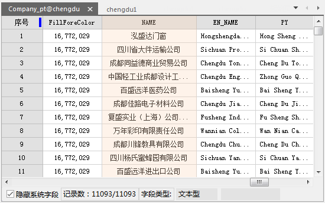
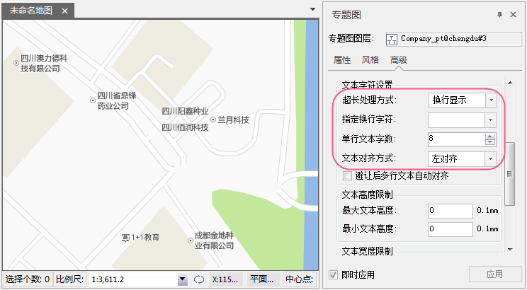
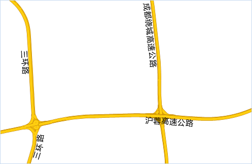
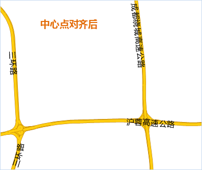
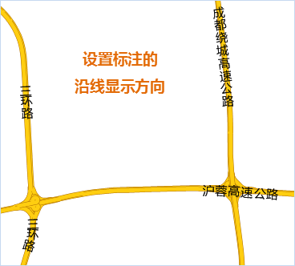
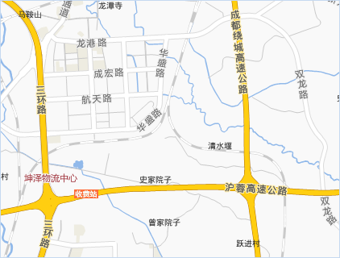
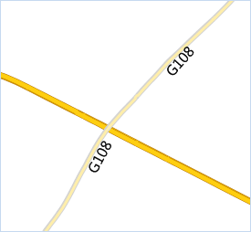
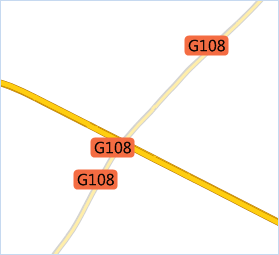
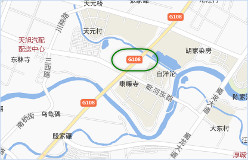

当地图图层的标注数量较多时，则需要采用标签专题图的方式进行标注。标签专题图可更加智能的为地图添加注记，标签专题图将依据数据集中的某个字段，对地图要素添加注记。在数据量较大的地图注记生产中，标签专题图的方式更加方便、易用。

使用标签专题图实现地图注记时，要对图层中的对象标注某一类信息，这类信息存储在数据属性表的某个字段内，那么标签专题图就可以根据指定的字段，取出对象对应的该字段的值，将该值标注在对象附近；标签专题图可以为点、线、面对象添加注记。这是标签专题图进行标注的一般原理，在实际操作中还可以制作更加复杂的标签专题图，如标注的内容可以是经过表达式运算后的结果；标注的形式可以自由组合和定义等等。

### 实例一：对地图中的公司进行标注

下面以成都地图为例，将 Company_pt 数据集中的公司名称添加到地图中展示，此时通过制作标签专题图的方式即可便捷快速的完成，具体操作如下：

1. 首先，看一下 Company_pt 点数据的属性表，公司名称存储在在哪个字段中，这个数据比较适合采用标签专题图的形式制作注记。    
---  
图：查看数据集属性表  
2. 将 Company_pt 数据集添加到地图中，并在图层管理器中选中该图层，单击“专题图”选项卡“标签”分组中的“统一风格”按钮，制作一幅标签专题图。
3. 在弹出的“专题图”对话框的“属性”面板中，将标签表达式的字段设置为“NAME”字段。
4. 在“风格”面板中设置字号大小、对齐方式、文本颜色、文字其他效果（如轮廓线、粗体、斜体、文字旋转等）等，调整标注文字风格，调整字号为8，对齐方式为“左中点”，使用白色轮廓线。 
5. 很多公司名称较长，单行显示会影响其他地图要素显示和整体美观性，建议设置文本换行显示，在“高级”面板中的“超长处理方式”中设置为“换行显示”，单行文本数设置为8，对齐方式为左对齐。同时，也可通过标签预处理及换行符的方式，设置文本换行，具体操作请参见[标签预处理](../../Mapping/TextProcessing)页面。   
    

### 实例二：道路沿线标注

制作电子地图时，经常要给地图中的道路添加标注，即地图制图中常说的沿线标注。地图中的沿线标注要兼顾合理与美观两方面，既要花时间和心思去设计，又要充分利用制图软件的相关功能，才能使理想与现实完美结合。

下文将从沿线标注的合理设计以及 SuperMap 软件支持两方面，介绍道路沿线标注的实践，使您的地图沿线标注有据可依。

**数据准备**

为了使地图中道路及道路沿线标注更趋于完美，在准备道路数据的时候就得做好充分准备。

1. 地图中的双线道路，在小比例尺下，显示上双线就会合并为单线，单在标注的时候双线道路还是单独标注，所以在经过一些避让处理后，有时标注将于设计有一点偏差，所以为了更加完美的沿线标注效果，建议对双线道路提取中心线，在小比例尺下，显示该单线及单线标注。
2. 道路的标注进行合理的分类，有的道路标注为“G101”这种编号式的标注，有的为“三环路”这种标注；由于沿线标注将基于数据的某个字段进行统一标注，所以道路的不同种信息要存储在独立的字段里，或者根据您的标注需要进行分类存储，最好不要混淆在一个字段内。

### 风格一

一级二级三级道路使用道路名称的方式沿线标注。

**制作步骤**

1. 对道路数据制作“统一风格标签专题”，在专题图设置窗口的“高级”选项卡中，勾选“沿线标注”，即可得到如下效果。  

  

2. 从上图来看，沿线标注的文字方向和位置都是不合理的，需再对其做调整，具体操作如下： 
* 在“风格”选项卡，将对齐方式设置为“中心点”，此时，沿线标注就与道路线对齐了。  

  

* 在“高级”选项卡，将沿线显示方向设置为“从上到下，从左到右设置”，这样，沿线标注就符合道路名称的阅读习惯了，设置后的结果如下图所示：  

  

3. 沿线标注相对于道路的位置已经调整好了，下面可以调整文字的显示风格，包括字体、字号、颜色、加粗、背景透明、轮廓等其他风格，最终即可得到如下图所示的结果。  

  

### 风格二

一般省道、国道等编号内容的标注，使用带背景的标签。

**操作步骤**

1. 对道路数据制作“统一风格标签专题”，在专题图“属性”设置窗口中，勾选“高级”选项卡中的“沿线标注”。  

  

2. 给标签添加背景。在专题图设置对话框中，“属性”选项卡的背景设置，根据需要为标签添加背景，本实例选择“圆角矩形”，然后可以单击“设置”按钮，可设置背景风格，如背景颜色、透明度等。这里设置背景为无边框的纯色填充风格。
3. 调整标签与道路的相对位置：在“风格”选项卡中设置对齐方式为“中心基线”；在“高级”选项卡中设置沿线显示方式为“从上到下，从左到右放置”，然后勾选“固定文本角度”，使得标注与道路的相对位置合理。   

  
 
4. 在“属性”对话框中的“风格”面板中，设置文字的字体、大小、颜色等，从而达到更加美观的效果，如下图所示。  

  