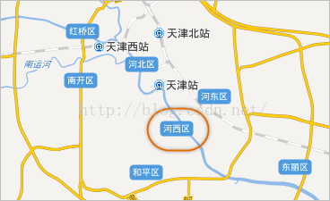

SuperMap 提供了通过文本/CAD数据集、标签专题图两种方式添加地图标注，在实际应用中您可根据数据量等具体情况来选择最合适的方式，两种方式的标注特点和使用情况如下文所述。

注记方式 | 优势 | 劣势  
---|---|---  
文本/CAD 数据集 | 位置固定 | 注记文本手动添加，不适宜海量地图注记生产  
同一图层上的文字风格可以随意定制 | 不适合更新较频繁的注记文本  
标签专题图 | 根据字段自动生成注记，适合海量地图注记制作 | 位置会因地图文字避让而发生变化  
更新方便，注记随字段内容而自动更新 | 统一标签专题图上的文字风格较为统一，只能通过分段标签专题图制作文字风格相对丰富的标签。|道路沿线标注功能更强大  
* **标注少量且位置固定**

当您的地图注记数量较少，并且要求注记的放置位置固定不变，或者需要严格控制注记的放置位置时，这时，可以通过文本数据集和CAD数据向地图中添加注记。例如，在世界地图中标注大洲的名称，由于大洲内包含许多国家和地区的面域数据，并且，您不可能将标注依附于任何一个面状要素进行标注，标签文本的数量较少，位置相对固定，此时，建议通过文本数据集或者CAD数据集，将注记文本手动放置到地图中合适的位置。

例如，对世界地图中的大洋和大洲进行标注，可通过CAD或文本数据集进行标注。

* **地图标注数量较大**

通过CAD数据集和文本数据对地图进行标注，需要一个个手动添加到地图上，当数据量很大时，则需采用标签专题图的方式制作注记。标签专题为地图添加注记更加智能，标签专题图可依据数据集中的某个字段，对地图要素添加注记。在数据量较大的地图注记生产中，使用标签专题图的方式更加方便、易用。

* **地图标注更新频繁**

当您的地图注记更新速度较快时，建议使用标签专题图的方式为地图添加注记。使用CAD数据集和文本数据集添加的地图注记是固定不变的，当注记内容发生变化时，需要手动修改注记，而标签专题图方式添加的注记，由于注记内容来源于属性数据，所以只要属性表中的数据变化了，地图上的注记会自动更新。

* **地图需设置沿线标注**

对于需要沿线放置的注记， **线数据**建议采用标签专题图的方式添加注记，标签专题图专门针对沿线标注提供了实用的设置内容，注记可以很好地与道路的走向吻合，并且提供了固定循环间隔标注的注记放置形式。

对于 **面** 状河流数据，无法通过标签专题图的手段实现河流注记沿河流标注，因此，此时就必须使用CAD数据集或者文本数据集实现面状河流的沿线标注了。

* **根据所需标注背景样式选择**

标签专题图可以制作如下图所示以圆角矩形为背景的注记，并且注记的背景还可以是圆角矩形、矩形、椭圆、菱形还可以用点符号为背景。而文本数据集和CAD数据集添加的注记只能制作出一个矩形的背景效果，其他背景效果不支持。

  

