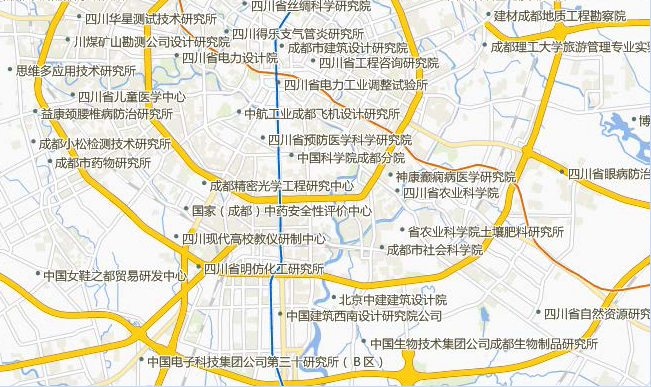
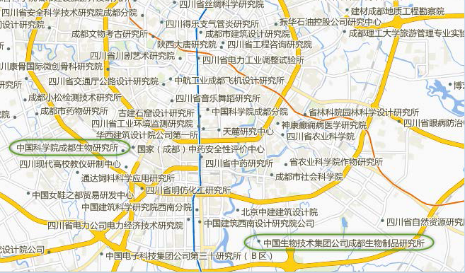
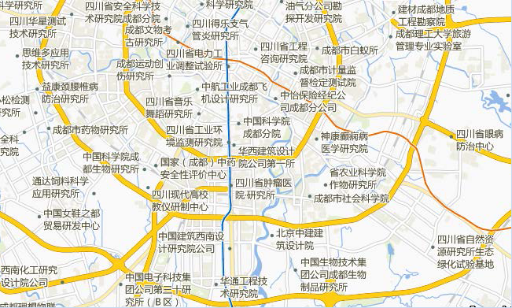

在数据量大的情况下，对象标注的空间是有限的，是不可能将所有标注全部放置在地图上的，而一些专题地图往往要求信息量全面，此时，可以使用 SuperMap
软件提供的技巧，尽可能多地展现对象的注记。

例如：要制作成都市的研究所分布图，将地图的底图制作完成后，只需加入研究所点数据并对点对象添加研究所名称的注记即可。

1. 将研究所点数据添加后，对该图层制作统一风格标签专题图。
2. 设置标签专题图的显示字段及设置文字风格。 
* 标签表达式字段：Scientific_pt.NAMA字段，即研究所名称字段。
* 字体风格：字体名称选择：微软雅黑，对齐方式为：左上角对齐，字号设置为：9号，并设置字体轮廓和颜色。
3. 在没有使用标签处理手段，如：自动避让等情况下，效果如下图所示。  
      

根据制图要求，地图为体现成都市研究所分布的专题图，所以要尽可能多的显示研究所信息，从上面的地图可以看出，研究所信息量是不够的，而且标注的整体排布也不美观，可以通过一下几步，使地图的显示效果更好。

4. 开启标签自动避让功能，系统根据当前图面的空间，调整标签与被标注的点符号的位置关系，使其尽可能多地利用未占用的空间放置更多的标签。 如下图所示，开启四方向自动避让后，相比上图未开启避让的效果，确实标签多了很多，而且你会发现未使用避让图中，标签的对齐方式为左中点，开启避让后，对齐方式大部分保持左中点的对齐方式，但根据避让需要，一些标签的对齐方式发生的变化。  
  

5. 从研究所的注记来看，文字都比较长占据了较大的横向空间，而且不美观，所以我们可以通过换行显示的功能进一步优化标注的空间利用率也提升地图的美观度。 如下图所示，使用换行显示较长的文本标签后，标签变得紧凑，而且图面变得清晰易读了。  
  

6. 还有一种方式，就是使用小字号也可以增加注记的放置数目，但是一般注记的字号不能过分小，以免影响地图的可读性。
