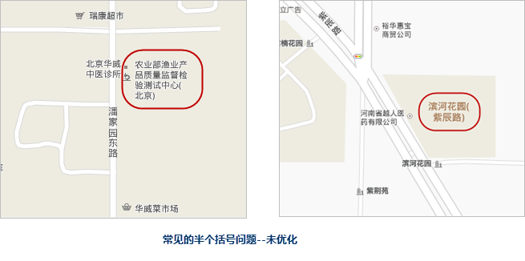
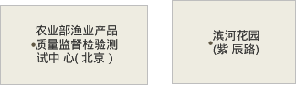
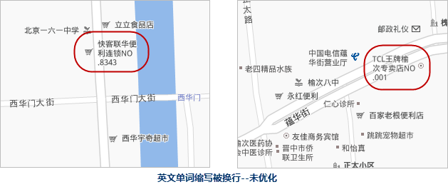
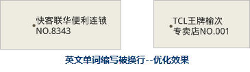
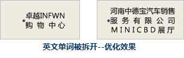
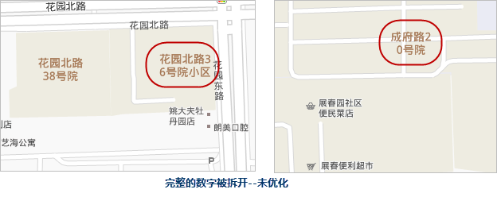
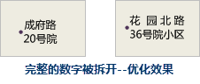
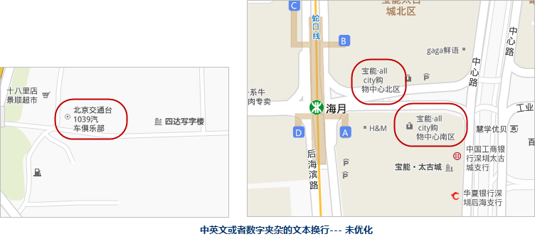
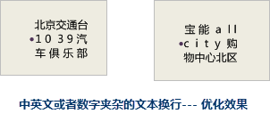

地图注记是地图上一种特殊的视觉元素，地图注记通过文字说明图形符号难以说明的地图内容，它与图形符号结合在一起存在于地图上。地图制作的目的是为了满足实用，
因此，文字在地图上不可或缺，并且地图上的文字在地图上覆盖度一般比较大，所以地图上文字的处理是地图制作的重点、难点，也是关乎地图构图美的关键因素之一。

地图注记制作往往涉及文字的位置、文字的排列、文字的风格、文字之间的冲突处理等工作。本篇文章中，将以“文字的排列”为重点，逐一列举我们在实际制图过程中遇到的各种
文字排列问题，并提供与之对应的解决方案。

**问题1：中文组词被拆开**

如下图 1红框中所示，中文组词被拆开，一般指的是中文组词中的一个字被换行，在阅读时，容易产生阅读不流畅的体验。

  

针对此类问题，解决方案有以下两种：

  1. **调整单行文本字数**

根据注记的字数分布特点，往小或者往大调整单行文本字数，以保证组词不被拆开。设置单行文本字数，也是有一些原则可以遵循的，例如：

  * 保持和保证换行的多行文字对齐。
  * 换行控制在两行是最美观的状态。
  * 一行文字控制在4个或5个或6个字比较完美，最多7个字，8个字就有些多。
  * 换行后，如果最后一行仅剩下一个字，需要提到上一行。
  2. **设置换行符**

超长文本在换行时，也可以通过指定换行符的方式，进行文本换行，减少中文组词被拆开的问题。SuperMap中支持换行符有：“\””/””,””;”。例如，图
1中的标签“红旗连锁翡翠城分场”， 只需在属性值中添加换行符，即修改属性为“红旗连锁\翡翠城分场”，就能得到较好的换行效果

结合以上两种方法，优化后的标注效果如下图所示。

  

另外，如果有大批量的，有一定规则的标注，需要在属性中添加换行符，可以使用 **标签预处理工具** 进行批量处理。

  

**问题2：数字和短横线组合被拆开**

数字和短横线组合一般表示固定意义，所以在超长文本换行时，它们不应该被拆开。如下图所示的问题。

  

针对此类问题，最佳的解决的方案是: **设置换行符**

如果不设置换行符，也可以通过调整单行文本字数的方式。目前，SuperMap软件中针对“-”，默认的优化效果是：“-”换行在下一行，而不是在上一行的结尾处。并且，我们也可以通过设置文本对齐方式为“分散对齐”，
让多行文本排列的更整齐一些，如下图所示。

  

**问题3：换行处出现半个括号**

如下图所示，是常见的超长文本换行时，出现的半个括号的问题。

 

针对此类问题，最佳的解决方案也是： **设置换行符** 。通过此种方式，调整括号的位置，尽量避免其出现在第一行的末尾。同时，也可以设置多行文本的对齐方式为
**“分散对齐”** ，让标注分布更整齐。

**问题4：英文单词缩写“.”号被换行。**

如下图所示，为常见的英文单词缩写“.”号被换行

此类问题，可以根据标注的具体情况而定，可以采用 **调整单行文本字数** 的方式，如下图 9，也可以 **设置换行符**
的方式，将“.”和英文或者汉字放在同一行中，如图下图。

**问题5：英文单词被拆开。**

下图中为在换行时，常见的英文单词被拆开的问题。

  

此类问题的解决方案，也是根据实际的标注情况，选择 **调整单行文本字数** 或者 **设置换行符**
的方式。常见的被拆开的例子还有数字和文字的混排，解决方案也是相同的

**问题6：应该为完整的数字被拆开。**

如下图所示，像“花园北路36号院小区”中“36”这种具有完成语义的数字，在标注时，是不应该不拆开的。但自动换行有时避免不了这样的问题，就需要人工干预处理。

此类问题的解决方案，也同问题5一样，通过调整单行文本的字数或者指定换行符的方式。

**问题7：其他文本换行问题。**

如下图所示，当标注中数字或者英文存在时，因为数字或者英文占的宽度与汉字的不一样，所以就会出现宽窄不一的情况。

此问题的解决方案：设置多行文本的对齐方式为 **“分散对齐”** ，让标注分布更整齐。

**小结：**

由前面7个问题可以看出，由于注记的多样性，例如字数的多少不一，有纯汉字的，也有英文、数字和汉字组合在一起的，这就导致，在设置超长文本换行时，只能是按照大多数注记的特点来设定单行字数，对于特殊的，需要人工干预，例如，设置换行符。

但是，目前在软件中，设置了换行符和未设置换行符的注记，不能放在同一个图层中，如若指定了换行符，没有换行符的注记，就会以单行文本的方式显示，而不是多行文本；反之，注记中存在换行符，但是设置时又没有指定换行字符，换行符就会以普通符号的方式，
显示在标注中。

如下图中红框内所示，绝大部分的标注排列问题，都可以通过设置“文本字符设置”中的参数解决。

  

