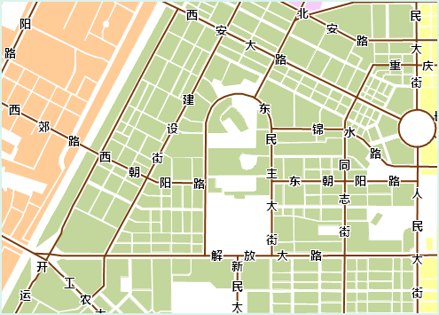
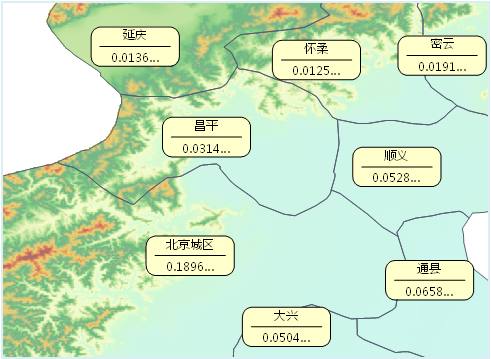
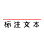
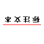
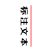
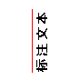
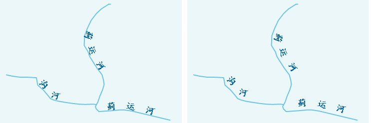
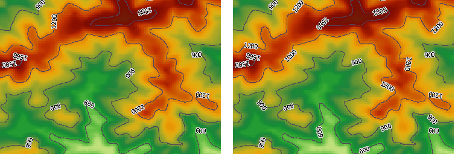

沿线标注用于设置文本是否沿着线对象的方向标注，在绘制专题图时有广泛应用，对于公路、河流、等高线、海图航线等要素，都需要使用沿线标注对其进行注释。

沿线标注功能可在制作统一风格、分段风格的标签专题图时使用，位于“ **标签专题图** ”窗口的“ **高级**
”选项卡内，该功能仅对二维线图层、路由图层、网络图层有效。

下面将详细介绍设置沿线标注涉及到的参数及其功能。

### 使用说明

1. **设置标注的字段表达式**

标签表达式用于指定专题图中标注的的显示内容，位于“ **统一风格标签专题图** ”窗口的“ **属性** ”选项卡内。

在标签表达式右侧的下拉列表中，列出了制作当前标签专题图用到的数据集的所有属性字段名称，用户可根据需求选择合适的属性字段，新建标签专题图时，系统会根据属性字段的名称选择较为匹配的字段生成专题图。

  

  
此外，用户也可以在标签表达式右侧的下拉列表中选择“表达式…”，进入“SQL表达式”对话框，定制标注的显示内容。

若想同时显示多个字段，可以使用“字段表达式1 [/] 字段表达式2 [/] 字段表达式3 [/] …”来设置，各字段间以分数的形式显示，其中，这里的 [/]作为一个整体符号，用于同时显示多个字段，[ ]符号不可去掉。如下图所示，当设置了显示多个字段后(表达式为：Name [/]Pop_Density99)，沿线标注功能不可用。

  

2. **设置标注的对齐方式**

标注的对齐方式用于设置标签专题图中文本对象的摆放位置。以文本对象的锚点为起始点，通过改变文本对像的锚点与被标注对象的相对位置来确定文本对象的摆放位置，以完成标注的对齐。对齐方式位于“
**统一风格标签专题图** ”窗口的“ **风格** ”选项卡内。

在对齐方式右侧的组合框下拉列表中，列出了12种对齐方式，包括9种锚点对齐方式和3种基线对齐方式，对齐方式的详细说明请参阅[文本对齐方式说明](../../Visualization/Interaction/TextAlignDirection)。

3. **标注的沿线显示方向**

用于设置标签中文本沿线标注的方向，位于“ **统一风格标签专题图** ”窗口的“ **高级** ”选项卡内，系统提供了 5 种显示方式（具体见下表）。

系统首先会判断线的走向是水平的还是竖直的（判断标准：将线对象的起点和终点连接起来，若连接线与水平方向的夹角小于 60
度，则认为该线对象的走向是水平的，否则是竖直的）。对于水平走向的线，则按照选项中从左到右或者从右到左的设置进行标注，从上到下或者从下到上的设置不予考虑；反之，对于竖直走向的线，则按照选项中从上到下或者从下到上的设置进行标注，从左到右或者从右到左的设置不予考虑。

沿线显示方向 | 说明  
---|---  
沿线的法线方向放置标签 | 根据线对象的走向，按从上到下或者从左到右的规律标注。  
从上到下，从左到右放置 | 根据标注所在位置的线的走向，从上到下或者从左到右标注。  
从上到下，从右到左放置 | 根据标注所在位置的线的走向，从上到下或者从右到左标注。  
从下到上，从左到右放置 | 根据标注所在位置的线的走向，从下到上或者从左到右标注。  
从下到上，从右到左放置 | 根据标注所在位置的线的走向，从下到上或者从右到左标注。  
  
标注的表现规律见下表：

**显示方向** | 从左到右 | 从右到左 | 从上到下 | 从下到上  
---|---|---|---|---  
**图示** |  |  | |   
  
此外，标注的起始位置与其对齐方式有关，如何选择合适的对齐方式请参阅[文本对齐方式说明](../../Visualization/Interaction/TextAlignDirection)。

4. **设置标注的偏移**

用户可以通过设置标签偏移量对标签位置进行位置上的调整。“标签偏移量”位于“ **统一风格标签专题图** ”窗口的“ **属性** ”选项卡中。

对于采用沿线标注方式的标签，标签的偏移方式为沿着表达对象的法线方向平移，标签的偏移量由“水平偏移量”设置的参数控制，“垂直偏移量”不起作用。

  
 
5. **设置重复标注**

当线对象的过长时，用户可通过“沿线周期间距”和“固定循环标注间隔”控制线对象标注的显示个数，使专题图更加直观。功能位于“ **统一风格标签专题图**”窗口的“ **高级** ”选项卡中。

通过“沿线周期间距”右侧的文本框设置两个标注之间的距离（即前一个标签文本的首部到下一个标签文本首部的距离），控制线对象上标签的显示个数。该功能仅在勾选“固定循环标注间隔”后才有效果。

  

  
“去除重复标注”用于控制复合对象的标注的重复显示功能，用户可以通过该功能来控制含有多个子对象的线对象的标注显示方式。未勾选“去除重复标注”复选框时，线对象内的每一个子对象均被标注；勾选“去除重复标注”复选框后，仅对可视范围内长度较大的子对象予以标注。

如下图所示，左图为未勾选“去除重复标注”的显示效果，图中所示的线对像包含三个子对象，每个子对象均进行了标注；右图为勾选“去除重复标注”的显示效果，系统在获取可视范围内每一个子对象的长度后，对长度较大的子对象进行标注（即左边的子对象），而其余子对象不做标注。

  
