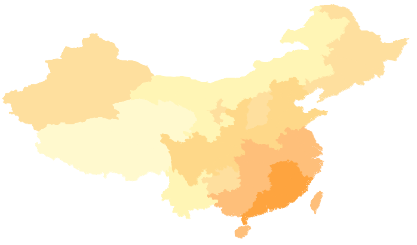

China400 数据源中的各省行政区划面数据集： Provinces_R 可用于底图面数据的配置，此处为了更好的展示专题内容，可基于
Provinces_R 的 AvgTemperature_Aug
字段（字段值表示2009年8月全国各地区的平均温度），制作全国平均气温分布图（2009年8月），叠在天气预报标签矩阵专题图的下层，不仅能提供更多气象方面的信息，而且能使图面更为丰富。

### 操作步骤

1. 在图层管理器中选中图层 Provinces_R ； 
2. 在功能区“ **专题图** ”选项卡，选择“分段专题图”，应用系统将基于图层 Provinces_R 创建一幅默认风格的分段专题图。新建的分段专题图将自动添加到当前地图窗口中作为一个专题图层显示于地图的最上层，同时在图层管理器中也会相应地增加该分段专题图图层结点；
3. 在弹出的“分段专题图”窗口中，进行各项参数设置： 
* **表达式:** 在“表达式:”标签右侧的组合框中设置分段表达式为 AVGTEMPERATURE_AUG ，单击“刷新”按钮，地图窗口中的分段专题图与范围段列表都进行实时刷新； 
* **分段方法：** 点击该标签右侧的下拉按钮，设置分段方法为自定义分段；
* **合并范围段：** 在范围段列表区域，可通过合并工具条上的“合并”按钮，合并某些平均温度接近的范围段。各温度段的覆盖面积尽量相当， 可将所有温度范围段分为6段：小于18、[18，21）、[21，24）、[24，27)、[27，29）、大于29；
* **范围段风格设置：** 可选择颜色方案下拉列表中系统预定义的色带应用到该分段专题图，也可以通过以下操作自定义各范围段列表的风格： 

（1）全选范围段，单击工具条中的填充风格设置对话框中的线型选择项，设置为 NULL，即设置所有范围段为无轮廓；

（2）双击各范围段中的风格颜色，或点击工具条中的填充风格设置按钮，在弹 出的“填充符号选择器”窗口中，设置各温度范围段的颜色值。各范围段颜色 RGB
值的具体设置为：（255，249，206）、（255，245，181）、（254，223，158）、（254，216，137）、（254，191，122）、（254，164，63）。

* 在图层管理器中设置其它图层为不可见，可以在地图窗口中查看当前分段专题图的显示效果：   
   

* 在图层管理器中选中 Provinces_R 分段专题图图层，右键点击鼠标，选择“输出专题图模板”项，弹出“另存为”对话框。在该对话框中指定保存路径，即可将已配好的专题图保存为一个 *.xml 专题图模板文件，便于重复使用。

### 备注说明

安装目录\SampleData\China 目录下，已存放本分段专题图模板文件（TemperatureRanges.xml），用户可直接加载该专题图模板到 Provinces_R 图层，即可配成如上图所示的专题图效果。

