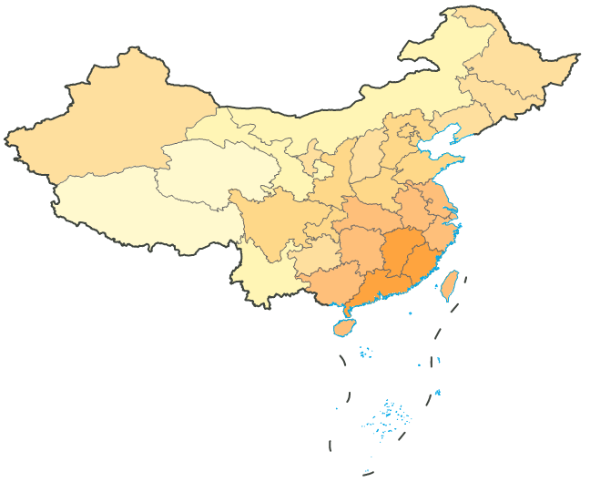

China400 数据源中包含国界、省界、海岸线的线数据集：District_L ，可用于行政界线单值专题图的制作。此处基于 District_L 的 ID 字段（字段值10表示国界，20表示省界，30表示海岸线，11表示未定国界），制作单值专题图，作为必要的地理底图，表达重要的行政区划信息和地理信息。

### 操作步骤

1. 在图层管理器中选中图层 District_L ；
2. 功能区“ **专题图** ”选项卡中选择“单值专题图”，应用系统将基于图层 District_L 创建一幅默认风格的单值专题图。新建的单值专题图将自动添加到当前地图窗口中作为一个专题图层显示于地图的最上层，同时在图层管理器中也会相应地增加该单值专题图图层结点；
3. 在弹出的“单值专题图”窗口中，进行各项参数设置： 
    * **表达式:** 在“表达式:”标签右侧的组合框中设置单值表达式为 ID ，单击“刷新”按钮，地图窗口中的单值专题图与专题值列表都进行实时刷新；
    * **专题值风格设置：** 可选择颜色方案下拉列表中系统预定义的色带应用到该分段专题图，也可以通过以下操作自定义各范围段列表的风格： 

（1）设置线型：双击各专题值中的风格颜色，或点击工具条中的线风格设置按钮，在弹出的“风格设置”窗口中，设置各类界线的风格。在地形图中，各类境界按国家标准线型与宽度要求，但专题图更为突出专题内容，地理底图简单配置即可。此处，将各类界线的线型都设置为直线。

（2）修改专题值标注内容：在专题值列表中，修改各专题值对应的标注内容。

（3）设置线颜色和宽度：在“风格设置”窗口中设置各类界线的颜色和宽度为：

字段值（ID） | 名称 | 颜色（RGB） | 宽度（0.1mm）  
---|---|---|---  
10 | 国界 | （62，68，62） | 6  
11 | 未定国界 | （49，52，49） | 6  
20 | 省界 | （102，102，102） | 5  
30 | 海岸线 | （0，168，232） | 4  
  
4. 完成各项设置后，可在地图窗口中查看当前地图的显示效果：   
   

5. 在图层管理器中选中 District_L 单值专题图图层，右键点击鼠标，选择“输出专题图模板”项，弹出“另存为”对话框。在该对话框中指定本专题图模板的保存路径，即可将已配好的专题图模板保存为一个 *.xml 文件，便于重复使用。

### 备注说明

安装目录\SampleData\China 目录下，已存放本分段专题图模板文件（DistrictUnique.xml），用户可直接加载该专题图模板到 District_L 图层，即可配成如上图所示的专题图效果。
