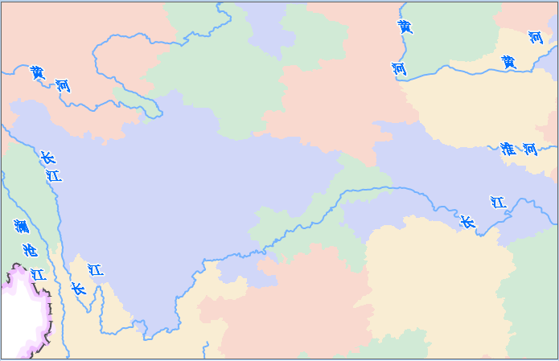

地图上的水体包括了河流、湖泊以及海洋等。在中小比例尺地图上，弯曲的线表示了河流的形状与位置。在对线状的河流进行标注的时候，需要注意，使用沿线标注功能对河流进行标注，同时标注的字体为左斜的宋体。

本应用实例通过对中国主要河流的标注，介绍如何使用循环标注对河流进行标注。

### 内容提要：

通过在SuperMap 桌面应用程序中，对河流进行循环标注，并对底图进行配置，得到一幅既标准又美观的河流水系专题图。   
   

  
按照以下步骤可以完成本实例：

 [第一步 数据准备](LablingRiverStep1.htm)

 [第二步 制作河流专题图](LablingRiverStep2.htm)

 [第三步 配置底图和地图整饰](LablingRiverStep3.htm)

