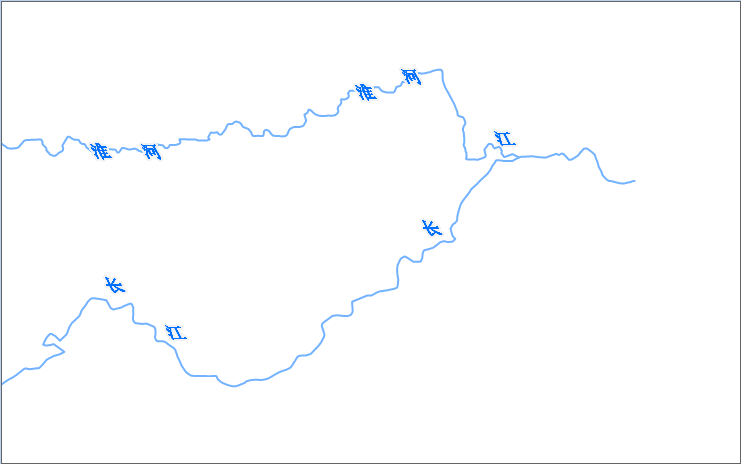

本地图的目的是为了突出河流注记。由于主要河流的长度往往比较长，需要对其进行循环标注。

### 操作步骤

1. 在图层管理器中，选中 MainWater_L 数据集。
2. 单击“**地图**”选项卡 “ **专题图** ”组中的“ **新建** ”按钮，在弹出的“制作专题图”窗口中，选择“标签专题图”的“统一风格”模板。标签表达式选择“NAME”，即可基于河流名称生成一个默认风格的标签专题图。
3. “统一风格标签专题图”窗口的“属性”页面中，做如下设置：   

参数 | 值  
---|---  
偏移量单位 | 0.1mm  
水平偏移量 | -40  
4. “统一风格标签专题图”窗口的“风格”页面中，做如下设置：    

参数 | 值  
---|---  
字体 | 宋体  
字号 | 15  
倾斜角度 | 40  
文本颜色 | RGB(0,113,255)  
字体效果 | 斜体，轮廓，固定大小  
其他参数使用默认值。

5. “统一风格标签专题图”窗口的“风格”页面中，做如下设置：  

参数 | 值  
---|---  
沿线标注 | 勾选  
固定文本角度 | 勾选  
沿线显示方向 | 从上到下，从左到右放置  
沿线字间距 | 8  
沿线周期间距 | 2500  
固定循环标注间隔 | 勾选  
沿线字间距表示标签文本中文字之间的间隔距离，单位为字高的倍数。取值范围为1-8，表示文字之间的距离为字高的1-8倍。这里去沿线字间距为8，表示文本之间的间隔为字高的8倍。
沿线周期间距为2500表示前一个标签文本的首部（尾部）到下一个标签文本的首部（尾部）之间的距离为2500个地图单位，其他参数使用默认值。有关统一标签专题图的“高级”选项卡参数的详细说明，请参见
[标签专题图“高级”选项卡](../../Mapping/LabelMap/AdvancedDia)。

6. 修改 MainWater_L 的显示风格。在图层管理器中，选中 MainWater_L 图层，单击鼠标右键，在弹出的右键菜单中选择“图层风格”项，在“线型符号选择器”窗口中，设置线型为默认线型，线宽度为0.1毫米，线颜色为 RGB(115,178,255)。
7. 为了地图的显示效果更好，在“ **地图属性** ”界面中的“ **基本** ”参数设置处，勾选“ **线型反走样** ”和“ **文本反走样** ”两项。
8. 设置完成后，保存地图，地图名称为河流沿线标注。 

配好的地图效果，如下图所示：

  

### 相关主题

 [第一步 数据准备](LablingRiverStep1)

 [第三步 配置底图和地图整饰](LablingRiverStep3)

