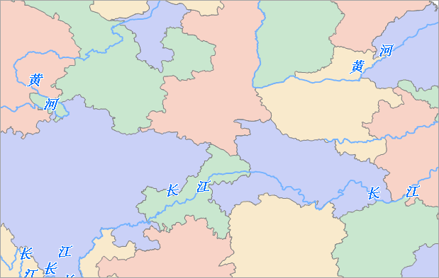

完成了标签专题图内容制作后，为了地图显示的美观，还需要添加底图，并进行地图整饰。

### 操作步骤

1. 在图层管理器中，选中 Provinces_R 数据集。
2. 单击“ **地图** ”选项卡“ **专题图** ”组的“新建”按钮，在弹出窗口单击“单值专题图”选择“默认”选项，标签表达式选择“ID”，即可基于 ID 值生成一个默认风格的标签专题图。
3. “单值专题图”窗口的“属性”页面中，对单值专题图的子项风格进行设置，具体如下：   

ID 值 | 风格  
---|---  
1 | 前景颜色：RGB(202,209,247)；线型：NULL  
2 | 前景颜色：RGB(201,231,207)；线型：NULL  
3 | 前景颜色：RGB(248,211,199)；线型：NULL  
4 | 前景颜色：RGB(249,234,204)；线型：NULL  
4. 制作完成后，将 Provinces_R 从图层管理器中移除。
5. 在图层管理器中，选中 County_L 图层，单击鼠标右键，在弹出的右键菜单中选择“图层”项，为该图层设置风格。在弹出来的“线型符号选择器”对话框的根组中选择“国界”线型符号。设置完成后，单击“确定”按钮，退出该对话框。
6. 调整图层属性。Provinces_R 单值专题图图层位于最底层，Country_L 图层位于 Provinces_R 单值专题图图层之上。MainWater_L 图层位于此上层，MainWater_L 标签专题图图层位于最上层。
7. 为了地图的显示效果更好，在“ **地图属性** ”界面中的“ **基本** ”参数设置处，勾选“ **线型反走样** ”和“ **文本反走样** ”两项。
8. 设置完成后，保存地图，地图名称为河流沿线标注。 

配好的地图效果，如下图所示：

  

  
### 相关主题

[第一步 数据准备](LablingRiverStep1.htm)

[第二步 制作河流专题图](LablingRiverStep2.htm)
