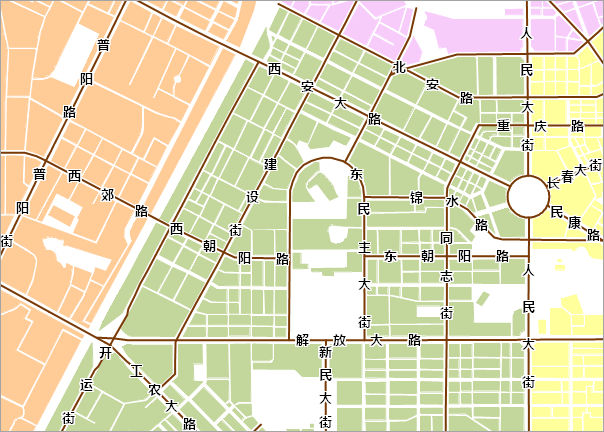

在地理世界中，道路往往被抽象成线对象（少数情况下道路也被抽象成面对象）。较窄的道路可以用单线来表示，较宽的道路可以考虑用双线表示。在利用道路名称给道路进行标注的时候，需要注意两个问题：标注时，标签要沿着道路走向，并且在道路上；对于较短的道路，也需要显示其名称。

本文档通过城市道路沿线标注的实例，介绍如何使用标签专题图对道路进行标注。

### 内容提要：

本应用实例包括数据准备、制作标签专题图和整饰地图三大部分。通过在
桌面应用系统中进行专题制作，完成对城市的沿线标注，通过地图整饰以后，得到如下图所示的地图：  
    

  
按照以下步骤可以完成本实例：

 [第一步 数据准备](LablingRoadStep1.htm)

 [第二步 制作道路标签专题图](LablingRoadStep2.htm)

 [第三步 配置底图和地图整饰](LablingRoadStep3.htm)

###  注意事项

分段标签专题图、复合标签专题图和矩阵标签专题图沿线标注的方式类似，其他参数略有不同。关于如何使用分段标签专题图、复合标签专题图和矩阵标签专题图的更多内容，请参见[地图专题表达](Mapping.htm)。
