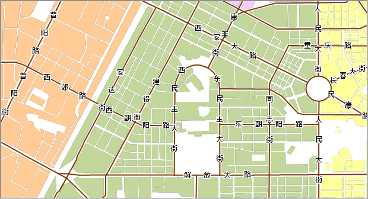

### 操作步骤

本地图的目的是为了突出显示城市道路的名称，我们首先通过制作统一风格标签专题图，对道路数据进行标注，然后启用沿线标注功能，对沿线标注的高级参数进行设置。

1. 在图层管理器中，选中 RoadLine1。
2. 单击“ **地图** ”选项卡 “ **专题图** ”组中的“ **新建** ”按钮，在弹出的“制作专题图”窗口中，选择“标签专题图”的“统一风格”模板。
3. 在“属性”页面上做如下设置：标签表达式选择“NAME”字段，即可基于道路名称生成一个默认风格的标签专题图。其他参数使用默认值。
4. 在“风格”页面上做如下设置：    

参数 | 值  
---|---  
字体 | 微软雅黑  
字号 | 15  
对齐方式 | 中心点  
字体效果 | 加粗  
其他参数使用默认值。

5. 在“统一风格标签专题图”窗口的“高级”页面中，做如下设置：  
勾选沿线标注，表示启用沿线标注。同时还需要勾选固定文本角度。其他参数使用默认值。

6. 修改 RoadLine1 的显示风格。在图层管理器中，选中 RoadLine1 图层，单击鼠标右键，在弹出的右键菜单中选择“图层风格”项，在“线型符号选择器”窗口中，设置线型为 System0，线宽度为 0.6 mm，线颜色设置为 RGB(121,57,4)。 

完成以上设置后，得到如下图所示的显示效果：

  

###  相关主题

 [第一步 数据准备](LablingRoadStep1)

 [第三步 配置底图和地图整饰](LablingRoadStep3)
