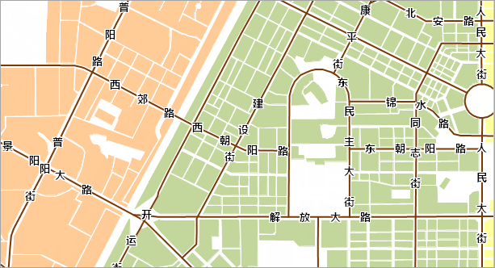

### 操作步骤

完成了标签专题图内容制作后，为了地图显示的美观，还需要添加底图，并进行地图整饰。

1. ResidentialArea 为该区域的居住面数据，单击“ **地图** ”选项卡 “ **专题图** ”组中的“ **新建** ”按钮，在弹出的“制作专题图”窗口中，选择“单值专题图”的“默认”模板，对该图层制作单值专题图，标签字段为 CLASSID。每个单值子项的风格设置如下：  
    
单值子项 | 风格设置参数  
---|---  
32021 | 前景颜色：RGB(255,203,151)，线型选择：NULL  
32022 | 前景颜色：RGB(247,204,251)，线型选择：NULL  
32023 | 前景颜色：RGB(195,214,155)，线型选择：NULL  
32024 | 前景颜色：RGB(255,255,155)，线型选择：NULL  
32025 | 前景颜色：RGB(255,218,191)，线型选择：NULL  
32026 | 前景颜色：RGB(204,193,217)，线型选择：NULL  
其他参数使用默认值。

2. 调整图层的显示顺序。  
移除 ResidentialArea 图层，该图层的单值专题图图层位于最底层，RoadLine1 位于 ResidentialArea
单值专题图图层之上，RoadLine1 标签专题图图层位于最上层。

3. 在“ **地图属性** ”界面中的“ **基本** ”参数设置中，勾选“线型反走样”和“文本反走样”，对地图的显示效果进行优化。
4. 配置完成后，保存地图，名称为道路沿线标注。 

最终得到如下图所示的地图：  
    

  
###  相关主题

 [第一步 数据准备](LablingRoadStep1.htm)

 [第二步 制作标签专题图](LablingRoadStep2.htm)
