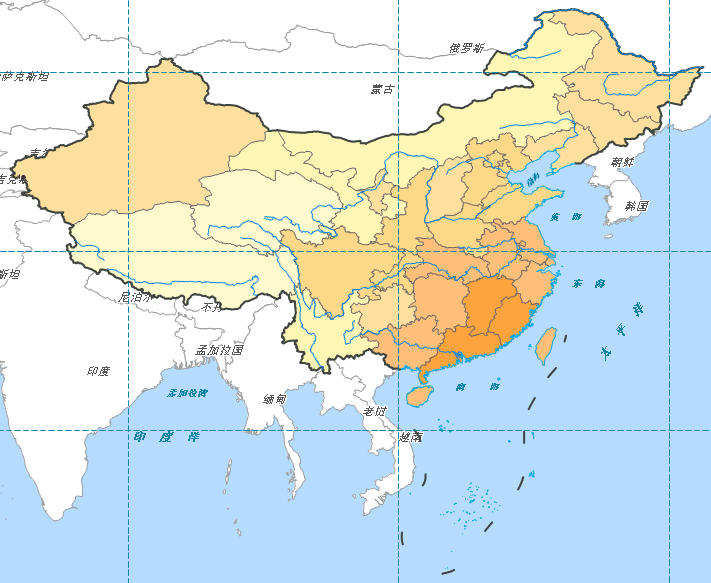

图层管理器中的图层 MapDivision_L 为覆盖中国地域范围的经纬网，需要对该线图层设置风格。

### 操作步骤

1. 在图层管理器中，双击 MapDivision_L 图层结点的  按钮，或选中该图层，右键单击鼠标，在右键菜单中选中“图层风格”项，弹出“风格设置”窗口；
2. 经纬网的线型设置为短虚线，线颜色（RGB）设为（2，132，168），线宽度（单位：0.1mm）设为1；
3. 在图层管理器中，将 MapDivision_L 置于最顶层。

以上操作完成后即完成了所有底图图层的配置，此时地图显示为：    
