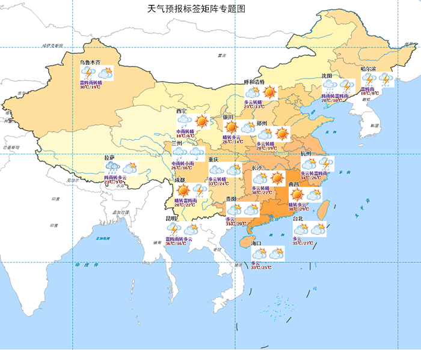

专题地图是突出表示一种或几种自然现象和社会经济现象的地图，由专题内容与地理底图两部分组成。

本专题文档主要通过一个制图实例，介绍如何使用  桌面应用系统设计并配置一幅专题地图的地理底图与专题内容，制作一幅美观的地图。

### 内容提要：

本应用实例包括数据准备、底图配置、专题内容设计与配置、地图整饰四个部分。通过在  桌面应用系统中进行配图操作，配置地图： **天气预报标签矩阵专题图**
，表达某日各省会城市的天气预报并通过一定的底图图层辅助表达全国水文、气象方面的某些信息，最终完成一幅如下图所示的地图。

  

  
 [第一步 数据加载](DataAdding)

 [第二步 底图配置](BaseMapMaking)

 [第三步 专题内容配置](ThematicMapMaking)

 [第四步 地图整饰](MapDecoration)
