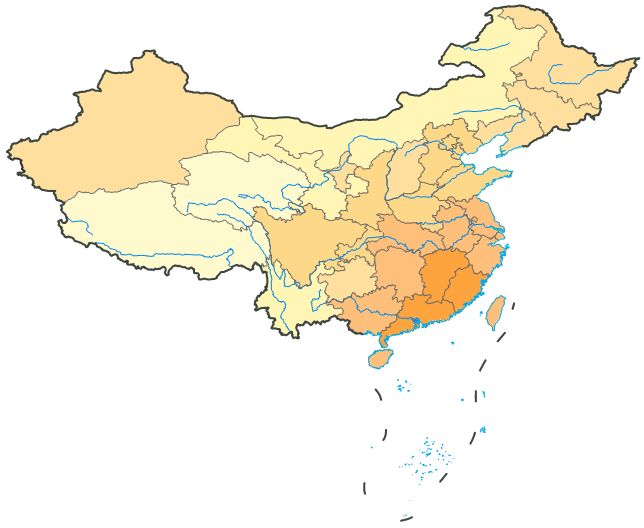

河流水系是地图中重要的地理要素。由于本地图的制图目的是表达气象方面的专题信息，因此，将全国主要河流进行符号化后，作为底图地理要素显示在专题图层的下层，能表达一定的水文信息。

### 操作步骤

1. 在图层管理器中，双击 MainWater_L 图层结点的  按钮，或选中该图层，右键单击鼠标，在右键菜单中选中“图层风格”项，弹出“风格设置”窗口；
2. 河流的线型可采用系统默认的直线线型设置，线颜色（RGB）设为（0，133，232），线宽度（单位：0.1mm）设为4；
3. 河流符号风格设置完成后，可在图层管理器中将 MainWater_L 图层移至 District_L 图层的下层，Provinces_R 分段专题图层的上层，在地图窗口中显示为：    
