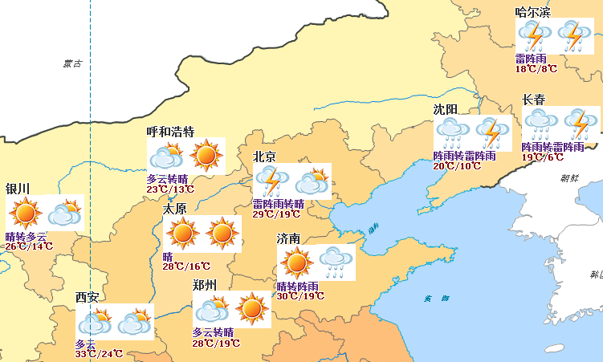

本地图的制图目的是配置一幅反应某日全国天气预报的专题图，因此需要在一幅地图上，通过标签专题图同时表达出城市名称、天气情况、当日最高/最低温度等信息，这是一般标签专题图无法满足的。

的“专题图”选项卡提供了制作标签矩阵专题图的功能，能够很好的满足气象行业的这一需求，即在标签专题图中采用矩阵式格式组织用于标注的内容。通过标签矩阵专题图能将符号、图片、文本集于一个标签矩阵中，并标注相应的对象。

本地图的专题内容通过配置一幅天气预报标签矩阵专题图，表达某日（2009年8月17日）全国首都和省会城市的天气情况，使用的数据集为 China400
数据源中的首都和省会点数据集：Capital_P，Capital_P 中需要使用的字段以及各字段表达的标签内容如下表所示：    
字段名称 | 标签内容  
---|---  
CapitalName | 首都、省会名称  
Path_1 | 各城市天气预报图片相对路径，用于显示天气预报图标 | Path_2 | 各城市天气预报图片相对路径，用于显示天气预报图标 |
Weather | 天气预报文字描述  
Temperature | 最高/最低温度

### 操作步骤

1. 在图层管理器中，选中图层 Capital_P ；
2. 在右键菜单中选择“ **制作专题图...** ”，在弹出的对话框窗口选择中“标签专题图”的“矩阵风格”模板，同时应用系统将基于图层 Capital_P 创建一幅2列1行的默认风格的标签矩阵专题图。新建的标签矩阵专题图将自动添加到当前地图窗口中作为一个专题图层显示于地图的最上层，同时在图层管理器中也会相应地增加该标签矩阵专题图图层结点；
3. 根据该标签矩阵专题图需要表达的专题信息，以及数据集 Capital_P 的字段属性，设计标签矩阵的行数和列数。 

（1）选中默认生成的标签矩阵，设置矩阵的行列数为1列4行；

（2）点击第2行标签矩阵单元格，点击其右边的下拉按钮，弹出标签类型的下拉菜单，选择“标签矩阵”项，设置第2行标签矩阵为一个的标签矩阵，系统默认为生成一个2列1行的嵌套的标签矩阵，可以满足要求，不需再做修改。

4. 设置标签矩阵中各个矩阵单元格的标签内容。 

 [设置第1行矩阵单元格](LabelMatrix1.htm)

 [设置第2行第1列矩阵单元格](LabelMatrix2_1.htm)

 [设置第2行第2列矩阵单元格](LabelMatrix2_2.htm)

 [设置第3行矩阵单元格](LabelMatrix3.htm)

 [设置第4行矩阵单元格](LabelMatrix4.htm)

 5. 按以上步骤将矩阵标签的各矩阵单元格中的内容设置完成后，地图窗口中的天气预报标签矩阵专题图显示为：   
    
  
6. 在图层管理器中选中 Capital_P 标签矩阵专题图，右键点击鼠标，选择“输出专题图模板”项，弹出“另存为”对话框。在该对话框中指定本专题图模板的保存路径，即可将已配好的专题图模板保存为一个 *.xml 文件，便于重复使用。 

### 备注说明

安装目录\SampleData\China 目录下，已存放本分段专题图模板文件（WeatherMatrixLabel.xml），用户可直接加载该专题图模板到 Capital_P 图层，即可配成如上图所示的专题图效果。

