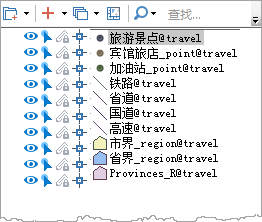

配制地图时，往往需要同时表达点、线、面等数据集的信息，可通过调整图层顺序，设置地图反走样、对象最小显示尺寸，显示完整线型等设置，优化地图的显示效果。

### 操作步骤

1. 在工作空间管理器中同时选中旅游景点、宾馆旅店、加油站、国道、省道、铁路、市界、省界、Province_R 等数据集，单击右键，选择“添加到新地图”选项，将这些数据集在同一个地图中打开。
2. 在“图层管理器”中按照下图顺序，拖拽调整图层的显示顺序。 

  

3. 在“地图”选项卡的“属性”组中，单击“地图属性”按钮，在弹出的“地图属性”面板中勾选线型反走样和文本反走样复选框，使文字和矢量数据集的线条平滑，消除锯齿的显示效果。
4. 在“地图”选项卡的“属性”组中，单击“图层属性”按钮，弹出“图层属性”面板，在图层管理器中选中所有面数据和线数据，在属性面板中设置“最小对象尺寸”为 0，避免对象显示不全的情况。
5. 同时，在“图层属性”面板中，勾选“显示完整线型”复选框，使长度较短以及折线较多的线图层有较好的显示效果。
