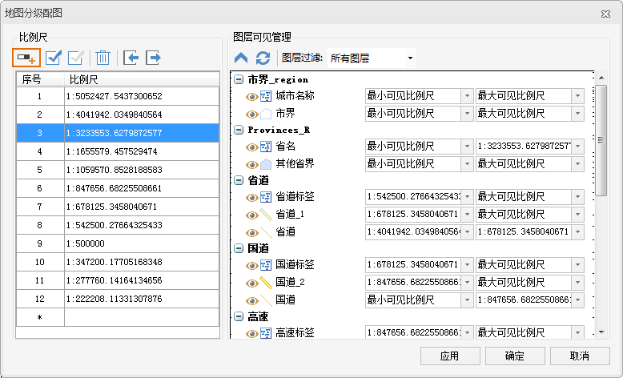
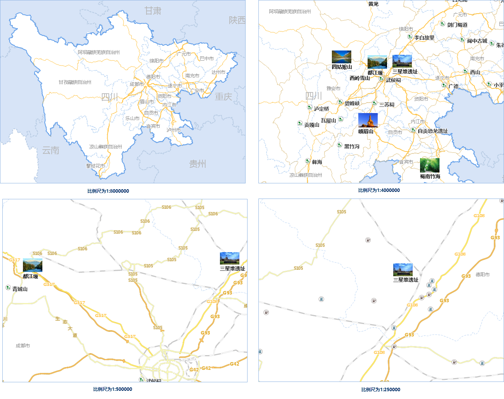

分级配图功能可对当前地图批量设置特定比例尺下需要显示的图层，满足用户按照分级比例尺配图的需求。这里既能方便地查看和修改每个比例尺下可显示的图层，也能查看和修改每个图层所设置的最大/最小可见比例尺。

### 操作步骤

1. 打开需要调整比例尺的地图。
2. 单击功能区“地图”选项卡“制图”组的“分级配图”按钮，弹出“地图分级配图”对话框。
3. 单击工具栏中的“添加”按钮，添加多级需要的比例尺，此处添加12级比例尺，同时在比例尺列表中修改比例尺值，具体设置如下图所示。
4. 右侧图层列表中，可单击最大或最小可见比例尺下拉按钮，设置各个图层的可见比例尺范围，具体设置如下表和下图所示：
  

5. 单击“应用”或“确定”按钮后，当前窗口地图则会根据图层的可见比例尺进行显示，当地图的比例尺小于该图层的最小比例尺，或者大于等于该图层的最大比例尺时，该图层不可见。
6. 此时，在不同比例尺下土地图窗口的显示不同，下图分别为不同比例尺下的显示效果：  

 
