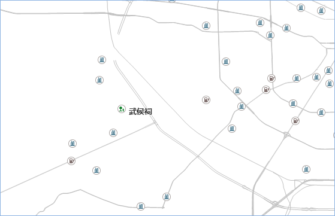
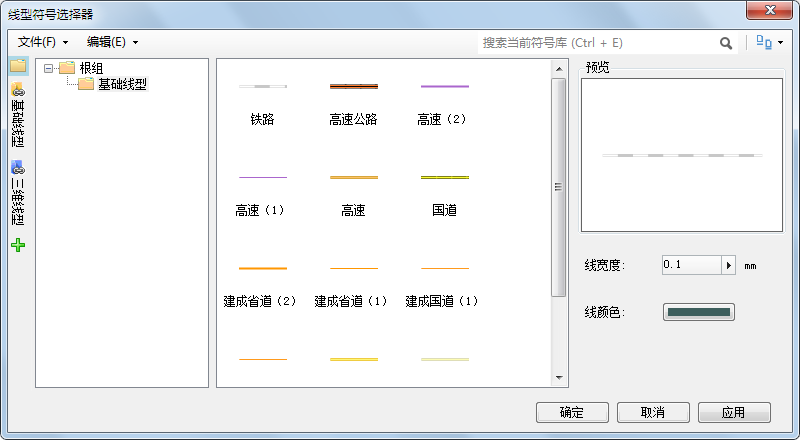
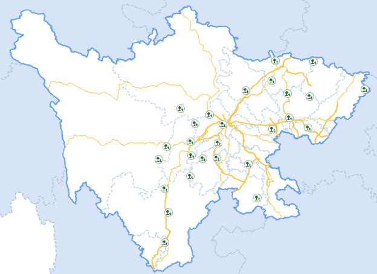

地图最直接的表达就是使用符号表达，符号化可将简单的点线面要素渲染成最直观的地理符号，提高地图的可读性。SuperMap
的符号选择器中提供了丰富的二三维符号资源，可选择符号样式，设置符号大小、颜色、透明度等显示风格。同时，可根据用户的需求重新设计符号样式，也可以把png、jpg、bmp等格式的图标图片导入到符号库中。

桌面产品对符号资源的管理是通过符号编辑器、符号选择器统一管理的。其中符号选择器主要用来管理符号资源，包括符号库的存储结构、添加或者删除符号、导入或者导出符号等；同时提供了制作新符号或者对已有符号进行编辑的功能；符号选择器用来对符号的风格进行设置，包括符号的类型、大小、颜色等。

下面通过设置点、线、面图层的符号，优化图层显示效果：

### 操作步骤

1. 在“工作空间管理器”中双击“资源”目录下的“点符号库”，打开点符号库选择器对话框，单击对话框工具栏的“文件”下拉按钮，选择“导入”中的“导入栅格符号”选项。
2. 在弹出的“导入栅格符号”对话框中，选择需导入的图片，单击“打开”按钮，选择保持栅格图像的高宽比，将图片导入成栅格点符号。在此例中，新建一个“城市符号”分组，存放导入的栅格符号。
3. 双击图层管理器中的“旅游景点”图层，在弹出的“点符号选择器”中，在点符号分组列表中单击“城市符号”组，在点符号列表中选中刚导入的“景点”符号。为保证栅格符号在地图中显示时不失真，在符号风格设置处，需要将符号显示大小和符号大小设置为0mm，以保持原有符号比例，这就要求在栅格符号制作时应考虑其显示大小。
4. 双击对话框中的“确定”或“应用”按钮，即可在地图中看到符号设置效果。并用上述方式分别设置宾馆旅店、加油站两个图层的点符号及符号风格。
  
  
5. 分别在图层管理器中双击铁路、国道、省道、高速、县道图层，在“线符号选择器”中设置线符号类型和颜色。单击对话框左侧的“基础线型”，可在基础线型符号库中选择道路符号，并设置线宽度和线颜色。
  

6. 双击图层管理器中的“市界_region@travel”图层，在弹出的“填充符号选择器”中，设置修改填充符号风格。设置填充符号“前景颜色”为白色，单击“线型选择”右侧按钮，在“线型符号选择器”中选择线型为根组文件夹中的 System 0，设置线宽度为0.1mm，设置线颜色RGB为193、216、244。
7. 设置“省界”面图层的符号填充符号风格，将前景颜色和背景颜色都设置为白色，且填充符号的透明度设置为100%；设置线宽度为0.5mm，线颜色RGB为98、159、234。
8. 设置“Province_P”面图层的符号填充符号风格，将前景颜色RGB值设置为215,228,247，选择符号名称为8的线型符号，设置线宽度为0.5mm，线颜色RGB为184,204,228。
9. 通过以上的符号设置，优化了地图中图层显示效果，部分图层显示如下图所示：
  
