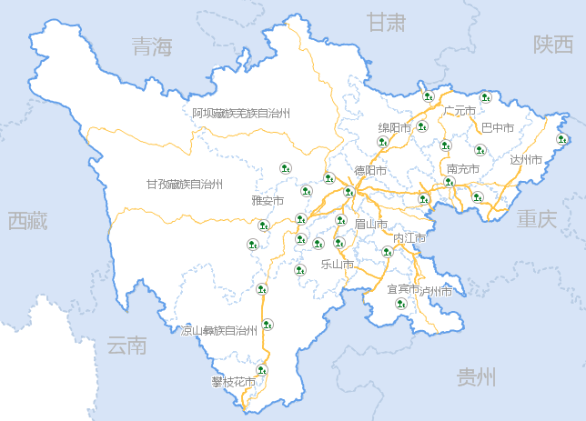
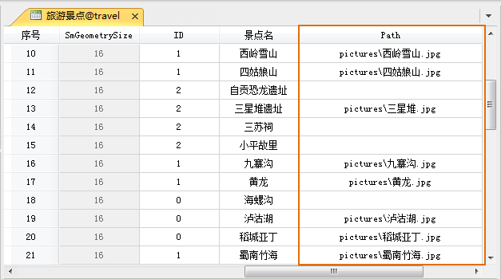
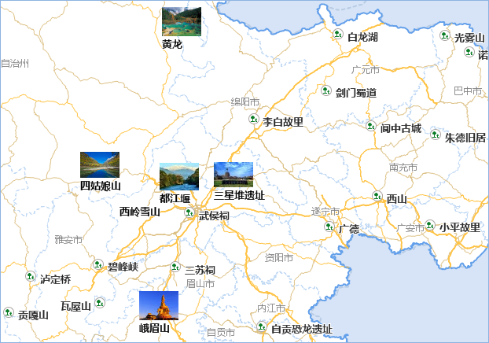

专题地图是为适应某种专门需要而着重显示制图区域内某一种或某几种自然现象或社会经济现象的地图。在SuperMap中专题地图实质上是地图图层的符号化显示，即用各种图形渲染风格（大小，颜色，线型，填充等）来图形化地表现要素的某方面特征。矢量数据专题图可基于属性表中的属性信息，使数据可视化。

在 SuperMap 中可以创建单值专题图、分段专题图、标签专题图、统计专题图、等级符号专题图、点密度专题图、自定义专题图等。此次配图，我们需对市界图层制作单值专题图和标签专题图，对旅游景点制作标签专题图。

### 操作步骤

**基于市界、Province_R 、国道、省道、高速图层创建统一风格专题图：**

1. 选中“图层管理器”中的“市界_region@travel”图层，右键菜单中选择“制作专题图...”，在弹出的“制作专题图”对话框左侧选中“标签专题图”，并在右侧的专题图风格模板列表中选中“统一风格”，单击确定按钮即可基于市界图层创建一幅统一风格的标签专题图。
2. 创建好的专题图会自动添加到当前地图窗口中，同时会弹出“专题图”窗口，窗口中显示了当前统一风格标签专题图的默认设置信息，在此基础上对专题图的风格进行设置，优化专题图显示风格。
3. 在“专题图”面板的“属性”界面中，单击“标签表达式”右侧下拉按钮，选择“市界_region.NAME”字段，使用该字段作为专题变量，重新对图层中的对象进行标注。
4. 设置“背景形状”为“默认”方式，即标签专题图中的文本对象没有任何背景形状修饰。
5. 在“专题图”面板的“风格”界面中，设置“字体名称”为微软雅黑，字号大小为9，文本颜色RGB值设置为127、127、127。
6. 以上述操作步骤对其他几个图层创建统一风格标签专题图，并设置相应的标签表达式和标签风格，创建后标签专题图的预览效果如下图所示：
  

  
**基于旅游景点图层创建标签矩阵专题图**

标签矩阵专题图可通过图片和文本来表达各个景点的信息。制作图片标签专题图时，数据集属性表中需有一个字段存储图片所在相对路径信息，在创建标签专题图之前，需修改旅游景点数据集的属性信息。注：在本例中，为显示效果美观，将有图片展示的旅游景点对象提取出另存为一个点数据集，标签矩阵专题图是针对这个点数据集制作。

1. 在工作空间管理器中，单击“旅游景点”数据集结点右键，选择“属性”项，打开数据集属性对话框。
2. 在属性对话框中单击“属性表”结点，可查看数据集属性表的字段结构，单击“添加”按钮，增加一个新的属性字段，在表格最后追一行中，设置新字段的字段名称和别名为：Path，字段类型为：文本型，长度为：50，如下图所示。单击“应用”按钮即可保存对属性表结构的修改。
3. 在旅游景点属性表的 Path 字段属性单元格中，输入景点对象相应图片的相对路径和图片名称，相对路径是指该数据集所在的数据源与图片的相对路径。
  

4. 基于旅游景点图层创建一幅默认矩阵风格的标签专题图，可在专题图面板中进行风格设置，优化专题图显示效果。
5. 在“专题图”面板中单击子项标签专题图列表的空白处，修改标签矩阵的列数为1，行数为2。同时，在专题图面板的“属性”界面中设置“背景形状”为“默认”风格，即没有任何背景形状修饰；勾选“自动避让”复选框，并设置为四方向文本避让。
6. 选中第一行标签矩阵单元格，单击右侧下拉按钮，选该标签类型为“图片标签”；在“图片路径”处选中“Path”字段。并勾选“保持原始大小”复选框。 
    * 在“属性”界面中设置“标签表达式”为“景点名”字段，并将“背景形状”设置为“默认”风格。
    * 在“风格”界面中设置“字体名称”为“微软雅黑”，字号为10，文本颜色为黑色，勾选“轮廓”复选款，将背景颜色设置RGB为0、0、0。
7. 标签专题图中的标签文字若存在压盖的现象，可选中标签点、线或面对象，单击“专题图”选项卡中“标签”组的“移动标签”项，在目标位置单击鼠标左键，将该对象的标签移动到目标位置。
  
