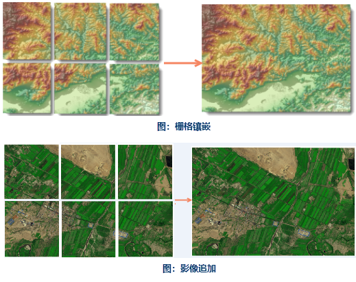
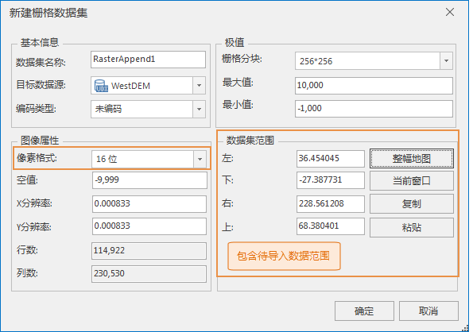
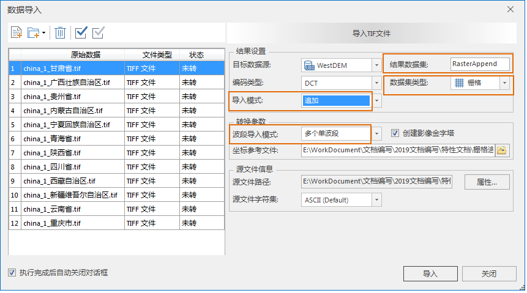
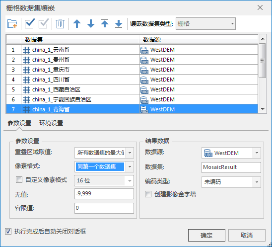
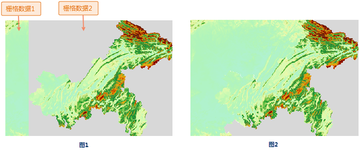

### 应用背景

当待研究分析的区域很大，或者感兴趣的目标对象分布很广，涉及到多个栅格数据或者多幅影像，用户需要将多个栅格数据或影像数据进行拼接。 在 SuperMap
iDesktop 中，您可通过 **栅格拼接** 、 **栅格追加** 、 **栅格镶嵌** 三种方式进行栅格/影像拼接。以下栅格数据集做说明。

  

  
### 栅格拼接

通过栅格拼接功能可将多个栅格数据快速拼接生成新的栅格数据集；详细操作说明请参看[栅格拼接](../../DataProcessing/Raster/RasterSplice)。进行栅格拼接时，需要注意以下要点：

  * 输入的待拼接数据的坐标系需一致；
  * 输入的待拼接数据的像素格式需一致。 
  * 若输入的待拼接数据为影像数据，波段数需一致。 

### 栅格追加

栅格追加是在数据导入时，以追加的导入模式将多个栅格数据追加到一个现有的目标栅格数据集中。首先需要创建一个满足条件的空栅格数据集，因为栅格数据是只读型数据，栅格数据集的范围、像素格式以及波段数均为只读，一旦创建后期将不能修改，所以想要追加导入前必须要创建满足条件并指定范围的目标数据集。

**第一步：新建栅格数据集**

追加导入过程中不会对数据的格式进行改变，所以创建的栅格数据集属性需要与待导入的栅格数据属性信息保持一致，否则追加导入会失败。具体属性参数描述如下：

  * **数据集范围** ：追加导入的所有栅格数据的最大范围，单位与导入数据坐标系的单位相同。例如用户将导入整个四川省的多幅栅格数据，即可将省界范围作为数据集的范围。
  * **像素格式** ：与待导入栅格数据的像素格式相同。
  * **波段数** ：若创建的为影像数据集，需要与待导入数据的波段数相同。  

  

  * **X/Y分辨率** ：目标栅格数据集的分辨率可与待导入数据的分辨率不同：当目标数据集分辨率低，待导入栅格数据的分辨率高，则导入后栅格数据集分辨率与目标数据集分辨率一致为低分辨率。当目标数据集分辨率高，待导入栅格数据的分辨率低，则导入后栅格数据集分辨率与目标数据集分辨率一致为高分辨率。

**注意：**

  * 以上数据属性信息用户可通过以文件数据源直接打开一个待导入栅格数据，在属性面板中进行查看。
  * 创建空数据集之后对其创建金字塔再进行栅格追加导入，可提高效率。
  * 若用户已有一个满足范围及属性参数的目标栅格数据集，则无需再新建栅格数据集，直接进入第二步。

**第二步：将多个栅格数据导入至已创建的目标栅格数据集中。**

  1. 通过[数据导入](../../DataProcessing/DataConversion/ImportIMG)功能，将待追加导入的栅格数据添加至列表框中。  

  
  
  2. 追加数据集与目标数据集需满足如下条件：
    * 待导入栅格必须具有 **相同的坐标系** 。
    * **结果数据集** ：结果数据集与上一步创建的目标栅格数据集相同。
    * **数据集类型** ：追加的数据集类型必须一致。
    * **导入模式** ：设置“追加”。
    * **数据波段模式** ：追加导入的波段模式应与原有数据波段模式保持一致，同时为单个多波段、多波段或者合成波段。

通过以上两步操作完成栅格追加导入。

### 栅格镶嵌

通过栅格镶嵌操作可将多个栅格数据集拼接起来；镶嵌处理需要先将待镶嵌栅格以数据集的形式导入，再做镶嵌处理。详细操作说明请参看[栅格镶嵌](../../DataProcessing/Raster/Mosaic.html)。进行栅格数据镶嵌时，需要注意以下要点：

  1. **待镶嵌栅格必须具有相同的坐标系** ：镶嵌要求所有栅格数据集或影像数据集具有相同的坐标系，否则镶嵌结果可能出错。
  2. **重叠区域的处理** ：镶嵌时，经常会出现两幅或多幅栅格数据之间有重叠区域的情况，此时需要指定对重叠区域栅格的取值方式。程序提供五种重叠区域取值方式，使用者可根据实际需求选择适当的方式。

  3. 待镶嵌数据为栅格数据集，可指定无值及无值的容限；即参与镶嵌的栅格数据集中单元格的值在无值数据的设置范围内时，这些单元格在结果数据集的相应位置为空值。
  4. 待镶嵌数据为影像数据集，可以指定背景色及其容限，当栅格镶嵌运算过程中遇到这种颜色的单元格时，将其视为背景色。
  

### 应用实例

选取中国12个省的 DEM 栅格数据，文件大小为4.42G；分别使用栅格拼接、栅格追加和栅格镶嵌三种方式将12个栅格数据合并为一个栅格数据集。

栅格拼接用时:8分20秒 ;

栅格追加导入用时:导入时间同栅格拼接，但需要先创建包含待导入数据范围的数据集 ;

栅格镶嵌用时：栅格导入和栅格镶嵌共用时1小时42分；

**1.拼接效率比对**

  * 栅格拼接：可直接添加待导入数据文件进行快速批量拼接操作，数据处理效率最高。
  * 栅格追加导入：以追加的方式导入数据，需要用户预先创建一个包含待导入数据范围的数据集；在数据导入的同时实现数据追加。
  * 栅格镶嵌：先导入数据再进行镶嵌，当数据量较大时，导入之后再镶嵌比较耗时。

**2.重叠区域处理方式**

  * 栅格拼接、栅格追加导入处理重叠区域方式相同，当数据之间存在重叠区域时，默认为后一个数据覆盖前一个数据，故用户在导入数据时，需要根据数据实际情况调整数据导入顺序，避免有效区域被无值区域压盖。如下图所示，栅格数据1和栅格数据2拼接，栅格数据2边界处有存在无值区域（灰色区域），当栅格数据集2为后导入数据，则结果如图1所示，拼接后的栅格1中的有效区域被栅格2的无值区域覆盖；若将栅格1作为后导入数据，则结果如图2所示。
  
---  
  * 栅格镶嵌：当数据集之间存在压盖时，可设置重叠区域的取值方式，应用程序提供五种处理方式，分别是：同第一个数据集、同最后一个数据集、所有数据集的最大值、所有数据集的最小值以及所有数据集的平均值，用户可根据实际需求选择适当的方式。

**3.栅格镶嵌可设置结果数据集的像素格式** ，像素格式不需要保持一致，可根据需求改变结果数据的像素格式。

**4.栅格镶嵌可设置镶嵌后数据集为空值的值** ，即参与镶嵌的栅格数据集中单元格的值在无值数据的设置范围内时，这些单元格在结果数据集的相应位置为空值。

通过以上分析，得出以下结论:

  * 栅格拼接：可直接添加数据文件进行拼接，操作简洁，效率最高。
  * 栅格导入：需提前创建包含待导入范围的数据集，相交栅格拼接操作略复杂，追加的方式合并多个栅格数据的处理方式相较于栅格镶嵌效率较高。
  * 栅格镶嵌：能够设置重叠区域的取值方式，能够更好的处理数据之间的重叠区域。

用户可根据数据实际情况，以及结果数据需求选择适用的方式进行数据拼接。

