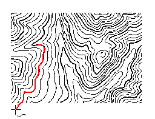

半自动跟踪矢量化是指通过多次人机交互，对栅格底图中的线进行矢量化，其主要步骤包括跟踪设置、自动跟踪线、跟踪回退、自动跟踪面四个功能。下面将以等高线图为例，详细介绍栅格矢量化半自动跟踪的过程。

### 1 数据准备

导入待矢量化的影像文件并配准，新建线数据集或CAD数据集，用于存储矢量等高线数据，将导入进来的栅格图和等高线数据集添加到同一个地图窗口中。

### 2 矢量化设置

在图层管理器中将线图层（CAD图层）设为可编辑状态，单击“对象操作”选项卡“栅格矢量化”组中的“设置”按钮，弹出“栅格矢量化”对话框，在对话框中设置相应的参数。

从栅格底图；然后设置栅格底色和颜色容限，使RGB颜色任一分量的误差不超过该容限值时都可以被认为是栅格底色，这里沿用系统默认的值32；接下来设置光滑参数（过滤锯齿以后，折线每两点间插值点的个数）和过滤参数（去锯齿参数），也可以使用系统默认值；最后就是要如上图所示设置栅格底色为白色，这样在矢量化跟踪过程中，系统将不会跟踪栅格图的底色

1. 栅格地图图层：下拉列表中选择要进行矢量化的影像地图数据作为矢量化底图
2. 背景色：本例中选择栅格底色为白色，这样在矢量化跟踪过程中，系统将不会跟踪栅格图的底色。
3. 颜色容限：栅格底图的颜色相似程度，在矢量化过程中，只要 RGB 颜色任一分量的误差在此容限内，则应用程序认为可以沿此颜色方向继续进行矢量化。取值范围为[0-255]，默认值为32。
4. 过滤像素数：设置去锯齿过滤参数，即光栅法消除线对象锯齿抖动的垂直偏移距离（单位为图像像素），默认值为0.7。去锯齿过滤参数越大，过滤掉的点越多。
5. 光滑系数：将栅格矢量化时，需要进行光滑处理。设置的光滑系数越大，则结果矢量线/面的边界的光滑度越高。
6. 自动移动地图：如果处于选中状态，则表示自动移动地图。当矢量化至地图窗口边界上时，窗口会自动移动；反之，则表示需要手动移动地图。应用程序默认为选中状态。

### 3 半自动追踪线

1. 在“ **对象操作** ”选项卡的“ **栅格矢量化** ”组中，单击“ **矢量化线** ”按钮，开始进行栅格矢量化
2. 将鼠标移至需要矢量化的图像线上，单击鼠标左键开始矢量化该线对象，矢量化至断点或者交叉口，矢量化会停下来，等待下一次矢量化操作。此时跨过断点或者交叉口，在前进方向的底图线上双击鼠标左键，矢量化过程会继续，直到再次遇到断点或交叉口处停止。   
   

3. 遇到线段端点，单击鼠标右键进行反向追踪，遇到另一个端点，矢量化绘制结束。  
     
4. 再次单击鼠标右键结束矢量化操作。如果曲线是闭合的，则矢量化过程中会自动闭合该线，并结束此次矢量化操作。   
   

  
### 4 线回退

在矢量化跟踪过程中，由于栅格底图原因，可能对某些矢量化效果不太满意，可以点击“矢量化线回退”按钮，回退一部分线，单击鼠标左键确定，或单击右键，回到当前矢量化绘制状态。矢量化线结束之后，“线回退”按钮就会灰掉，处于不可用状态。

如果碰到在呈“U”的线图像上回退的时候，可能回退不到你所希望的地方，建议在拐角的地方先单击鼠标左键，然后再选中跟踪回退按钮，移动光标进行回退操作即可。

### 5 矢量化面

在做半自动栅格矢量化时，有的栅格需要矢量化为面对象，例如河流、湖泊等。矢量化面与矢量化线操作方式类似，开启面图层为可编辑状态，设置好矢量化的相关参数后，在“
**对象操作** ”选项卡的“ **栅格矢量化** ”组中，单击“ **矢量化面**
”按钮，讲鼠标移至地图窗口，在需数据化的栅格要素处单击鼠标左键，即可将容限范围内的像元格矢量化为面，单击鼠标右键结束矢量化面。矢量化的面对象可通过[对象编辑](../../DataProcessing/Objects/EditObjects/EdittingGeometry)功能进行调整。

### 备注

* 如果栅格底图中线的大小不合适，可用“放大”、“缩小”等功能调整图像大小，以便能看清线的细节，然后单击鼠标右键，回到矢量化绘制状态。 
* 在矢量化绘制过程中，单击 Esc 键或者在“栅格矢量化”组中单击“矢量化线”功能按钮，即可取消当前的绘制。
* 通过 Alt + Q 快捷键，可以快速便捷地使用矢量化线功能。
  
