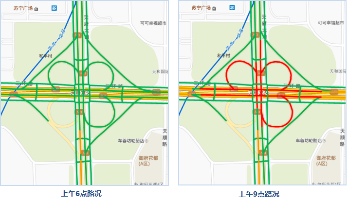
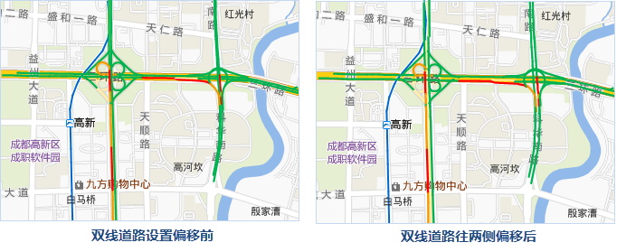
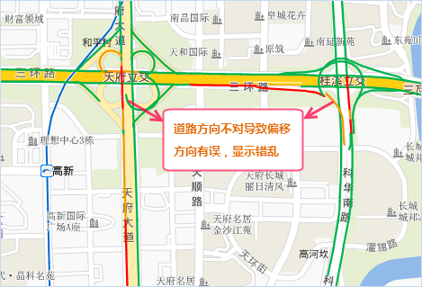

配置好底图图之后，基于道路数据的路况字段做单值专题图，分别用绿色、黄色、红色表示畅通、缓行、拥堵。并且设置图层可见比例尺，在小比例尺下显示双向道路路况，大比例尺下显示所有道路路况。同时，可以制作不同时间的交通路况图，具体操作如下：

### 大比例尺路况图

添加四维图新的线数据到配置好的底图窗口中，分别基于Condition6、Condition9、Condition18制作6点、9点、18点三个时间的单值专题图，其中的字段值1表示畅通、字段值2表示缓行、字段3表示拥堵，
例如某字段“Condition”其中的字段值1表示畅通、字段值2表示缓行、字段3表示拥堵，将单值1使用绿色线条表达、单值2使用黄色线条表达、单值3使用红色线条表达，如下图所示：

  

  
设置专题图图层的最小可见比例尺为1:9028，想查看某一时间点的路况，将其他时间的图层设置为不显示即可。

### 小比例尺路况图

按照地图显示的比例尺级别，路况也应该分层级制图和显示，例如，大比例尺下，匝道的路况可以显示出来，而到了中比例尺下，匝道可能不显示路况；大比例尺下显示辅道的路况，小比例尺下辅道的路况不显示。

对于小比例尺地图中的道路，首先要保证数据字段包含两类信息：第一：有表达单双线及是否显示路况的字段；第二：有表达道路拥堵情况的字段。接下来就可以通过拥堵状况字段为道路制作单值专题图，并设置对应状态的风格；指定字段或字段表达式，用来表示道路单双线情况或者是否显示路况；设置双线路况向两侧的偏移距离，单位为：0.1毫米。具体操作如下：

1. 在图层管理器中双击路况专题图，打开“专题图”面板，在“高级”界面中勾选“交通实况”复选框，设置“道路分级”字段，及设置道路的显示情况，字段值为 0 表示不显示路况，例如：小比例尺下的辅道；字段值为 1 表示所显示路况的道路为单线道路，例如：匝道；字段值为 2 表示所显示路况的道路为双线道路，例如：高速公路。 

**注意**：交通实况专题图的偏移效果仅对非系统符号生效，不支持ID为System0至5的线型符号。建议在修改需要做偏移在专题图线型符号，具体操作请参见[单值专题图属性面板](../../Mapping/UniqueValueMap/PropertiesDia.htm)。

 2. 在“道路偏移”右侧数值框中，对表达路况专题图中的双线线型分别向两侧偏移指定距离，偏移量为正，则表示往线方向左侧偏移；偏移量为负，则表示往线方向的右侧偏移，单位为0.1毫米。通过对道路进行两侧偏移，使得小比例尺下也可以清楚地显示出双线道路的路况。 
  
 
  
当缩小地图比例尺查看路况，道路会交错重叠到一起，此时无法清楚地看到双向道路的拥堵情况。基于上述地图比例尺较小的情况下，需要显示双线道路的路况，SuperMap提供了“路况线校正”功能很好地实现了所需效果，该功能会对线数据的路况是否显示和路况偏移值两个属性值进行处理，具体操作请参见[路况校正](TrafficLineRevise.htm)。

  

---

