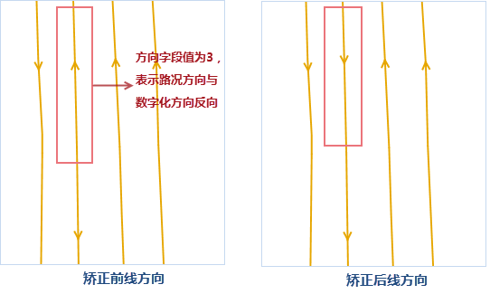
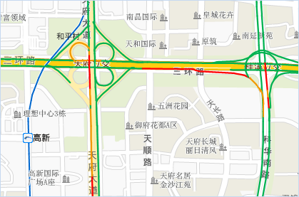

双线道路的路况显示的原则是分别对双线道路的两根线向两侧偏移指定距离，偏移方向是线对象数字化方向的右侧（正值）或者左侧（负值），但是用户数据会存在双线道路的两条线的数字化方向是相同的，此时偏移不合理，都会朝向一侧偏移，而非两侧偏移，因此，需要用“路况线校正”的功能，将这种双线道路的两条线数字化方向相同改为数字化方向相反的情况。

“路况线校正”功能会改变源数据，建议做好数据备份， **注意**：以下示例来源于四维图新数据的字段内容，若您的数据不是四维图新数据，请根据字段的含义选择对应正确的字段。

1. 在“数据”选项卡的“数据处理”分组中，单击Gallery中的“路况线校正”，在弹出“交通实况线数据校正”对话框中设置以下参数。
2. 在“校正线”区域选择待校正的道路线数据集，及相关的字段信息。 
  * 起始字段：线对象的起始节点字段。
  * 终止字段：线对象的终止节点字段。
  * 方向字段：道路线的方向与 数字化方向的关系，并指定双向、正向、反向道路对应的字段值。 
    * 双向：表示道路方向与数字化方向无关，为双向道路，用1表示双向；
    * 正向：表示道路方向与数字化方向一致，用2表示正向；
    * 反向：表示道路方向与数字化方向想法，用3表示反向。
  
---  
  3. 在“参考点”区域设置道路方向校正时的参考点数据集，并设置ID字段信息，用以与线数据的起始和终止字段进行地理位置匹配。
  4. 辅助设置区域用于通过统一的值来表示相同类型的道路显示情况，便于设置小比例尺地图中道路的显示情况，SuperMap 统一用0、1、2来表示道路的显示情况，其中，0表示不显示路况，例如：小比例尺下的辅道；1 表示所显示路况的道路为单线道路，例如：匝道；2 表示所显示路况的道路为双线道路，例如：高速公路。 

由于四维图新的数据表示同一种类型道路的编码不同，在设置道路显示类型时建议通过SQL表达式来表示，根据道路类型指定的字段值对应的转为0或1或2存储在“显示类型”字段中。例如表示辅道的编码有030a和060a，对应对象的“Status”字段值为0。

  5. 设置好以上参数之后，单击“确定”按钮，即可对道路线方向进行校正，校正结果如下图所示：
  
