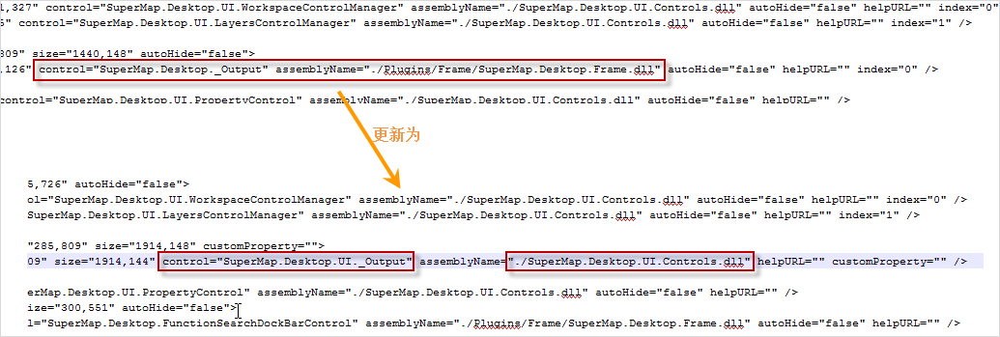

本文档介绍了基于SuperMap iDesktop低版本扩展开发的应用系统或者插件，升级到 SuperMap iDesktop 8C(2017)
及更新版本时，可能遇到的一些问题以及具体的解决办法。

**现象一：** 编译插件源代码时，提示未找到XtraForm的引用。

产生原因：继承了桌面的UIForm。

解决方法：需在工程中，手动添加对DevExpress.Utils.V15.2的引用。注：DevExpress.Utils.V15.2.dll在桌面产品包目录下的Bin中。

**现象二：** 启动桌面后，输出窗口看起来不可用。

产生原因：“SuperMap.Desktop._Output”名称修改为“SuperMap.Desktop.UI._Output”，且位置从“./Plugins/Frame/SuperMap.Desktop.Frame.dll”迁移到“./SuperMap.Desktop.UI.Controls.dll”。

解决方法：修改一下WorkEnvironment的Default中SuperMap.Desktop.Frame.config里边的相关配置内容。

  

  
**现象三：** 直接使用了桌面提供的功能，比如SQL查询。启动桌面后，这些功能可以用，但没有功能图片。

产生原因：部分功能的图片，在8.1.0的Resources里边，调整了存放的路径。比如SQL查询，之前是放在image="..\Resources\DataView\Icon\Dataset\Query\SQLQuery.png"，现在是放在image="..\Resources\DataView\Icon\Query\SQLQuery.png"。

解决方法：对照已发布的8C(2017)及更新版本中WorkEnvironment的相关配置文件，修改相关图片的位置。

**现象四：** 直接使用了桌面提供的功能，比如空间查询，但点击功能按钮后，没有任何反应。

产生原因：8C(2017)及更新版本去掉了SuperMap.Desktop.Assistance.dll和SuperMap.Desktop.DataProcess.dll，功能移动到了别的工程dll中。

解决方法：对照已发布的8C(2017)及更新版本中WorkEnvironment的相关配置文件，修改相关功能所在dll的位置。

**现象五：** Ribbon上部分控件排列不整齐，大部分是CheckBox和控件比较密集的位置。

产生原因：8C(2017)及更新使用了新的界面库DevExpress，配置文件可能存在兼容不好的地方。

解决方法：修改WorkEnvironment的相关配置文件。

**现象六：** CtrlAction中 public CtrlAction(IBaseItem caller, IForm formClass)
构造函数已标记为过时。

产生原因：8C(2017)及更新版本的CtrlAction的构造函数，不支持两个及两个以上的参数。

解决方法：修改WorkEnvironment的相关配置文件。

