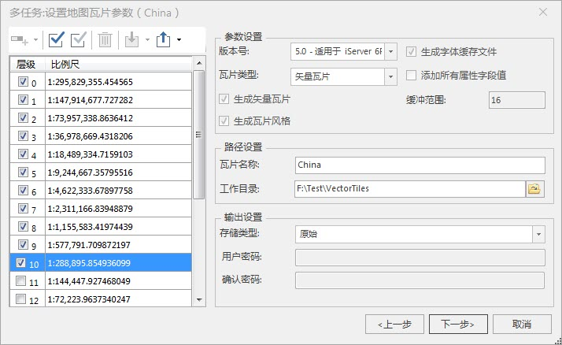
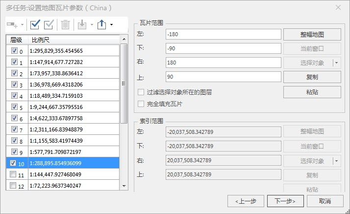
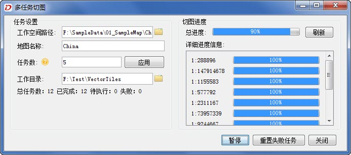
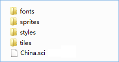

生成的矢量瓦片，支持[单任务](../../MapTiles/MapTilesSingle.htm)(即在一台机器上只启动单个进程完成切图任务)和[多任务](../../MapTiles/MultiProcessTiles.htm)（即在一台计算机上开启多个进程，或在多台计算机分别开启多个进程）两种切图方式
，此处选择多任务的切图方式，多任务的切图方式能充分利用机器的硬件资源，综合利用多个节点并行切图，有效提升切图效率。

###  操作步骤

1. 在当前工作空间中，打开示范数据中的 China.smwu 工作空间，将数据源设置为只读并保存工作空间。
2. 打开 China 地图，在地图窗口右键菜单中，选择“ **生成地图瓦片（多任务）** ”。在 **“生成地图瓦片（多任务）”** 对话框中选择“ **新建切图任务** ”选项，弹出“多任务：设置地图瓦片参数(China)”对话框。  

  
 
3. 在对话框右侧参数设置区域的“ **瓦片类型** ”处选择瓦片类型为“ **矢量瓦片** ”。
4. 通过勾选对话框左侧的比例尺层级复选框，此处设置生成的比例尺层级为1-10级。
5. 矢量瓦片结果中同时生成矢量瓦片数据、瓦片风格和瓦片字体文件，并分开存储在不同的文件夹下。此处程序默认三者同时生成。
6. **路径设置** :设置瓦片名称和输出路径。
7. 设置存储类型为原始型。有关存储类型的更多内容，请参见[地图瓦片存储类型](../../MapTiles/MapCacheType.htm)。
8. **设置瓦片生成范围** ：单击“下一步”，指定瓦片范围。
  

9. 所有参数设置完成后，单击“下一步”，打开“多任务切图”对话框，设置多任务切图的进程数，有关参数的具体描述请参看[多任务切图](../../MapTiles/MultiTaskStep.htm)。  

  
 
10. 设置完成后，单击“生成”，开始多进程切图。这里，可以通过单击“刷新”按钮，查看切图进度。
11. 执行切图任务完成，在输出窗口会提示地图生成平面地图瓦片成功。在输出路径下，将产生如下所示的文件夹和文件。   
   
 
* **fonts** ：矢量瓦片使用的字体文件。
* **sprites** ：矢量瓦片图标相关风格内容资源。
* **styles** ：矢量瓦片风格描述文件；
* **tiles** ：矢量瓦片数据（.mvt文件）。在tiles文件夹下，瓦片按照比例尺层级进行分文件夹存储，文件夹名称为全球剖分层级，级数从0开始计数。层级文件夹下的子文件夹命名为全球剖分的列号，其下为矢量瓦片文件，格式为.mvt，文件名称为全球剖分的行号。

* **sci文件** ：矢量瓦片的元信息描述文件，记录了数据的投影、地理范围、层级比例尺等信息。 

**相关内容** ：

 [矢量瓦片专题](../../MapTiles/VectorTiles.htm)

 [第一步：数据准备](PerpareVectorMap.htm)

 [第三步：浏览矢量瓦片](ViewVectorTiles.htm)

