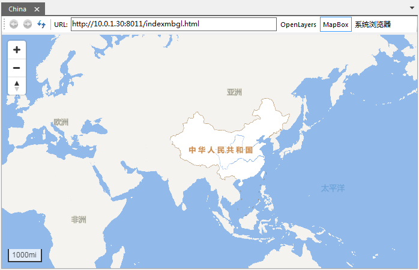

在 SuperMap iDesktop中，支持以打开文件型数据源的方式，打开矢量瓦片目录中的*.sci 文件浏览矢量瓦片。

###  操作步骤

1. 在当前工作空间中，在数据源节点处右键，在右键菜单中选择“打开文件数据源”，在矢量瓦片结果文件夹下，打开 China.sci 文件。
2. 双击打开加载进来的文件，即可在地图窗口显示矢量瓦片，如下图所示：
  

  
**相关内容** ：

 [矢量瓦片专题](../../MapTiles/VectorTiles.htm)

 [第一步：数据准备](PerpareVectorMap.htm)

 [第二步：生成矢量瓦片](GenerateVectorExample.htm)

