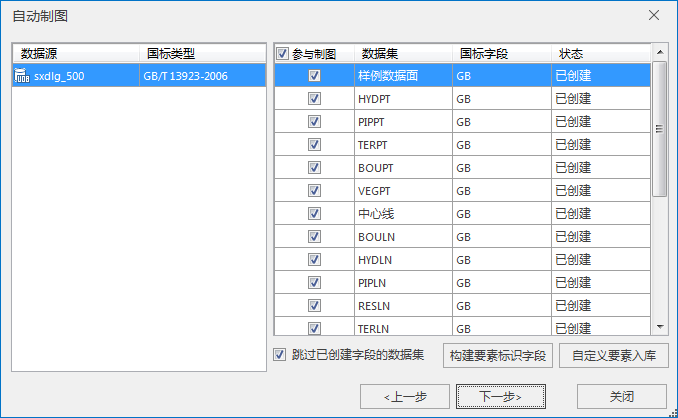
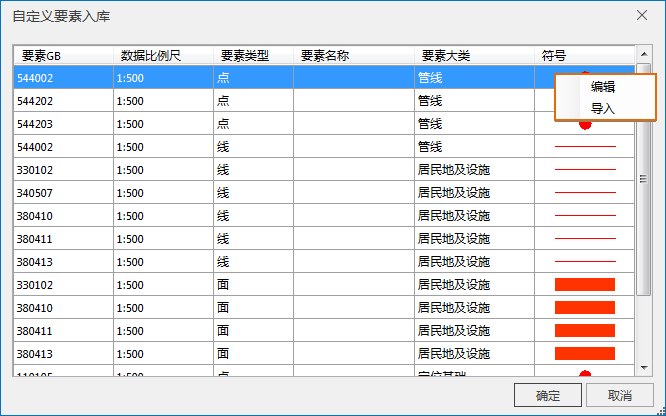
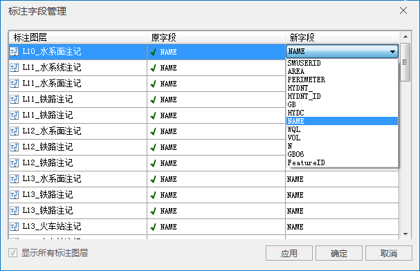
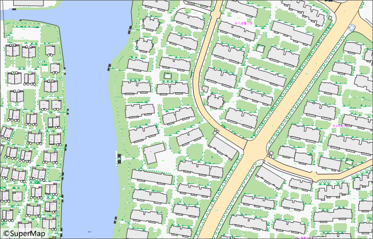

### 使用说明

专业版和高级版提供自动制图功能。自动制图过程中根据国土基础信息数据分类与代码对数据要素进行分类，分为八大类：定位基础、水系、居民地及设施、交通、管线、境界与地区、地貌、植被与土质，每一类要素配以相应的地图表达标准符号、要素标注，自动生成符合国家标准的电子地图。同时自动制图提供整套扩展制图方案，支持用户数据编码和制图方式扩展。
请参见[自动制图技术专题](AutoMapMaking2.htm)。

### 操作说明

  1. **第一步、打开自动制图数据源**

打开需要配图的数据源。

在制图时，对数据的要求，同一个比例尺的只能放在同一个数据源中，不支持分散在多个数据源中。

  2. **第二步、设置自动制图符号库**

在“开始”选项卡的“浏览”组中，点击“地图”按钮，新建一个空白地图窗口。在“ **地图** ”选项卡的“ **制图** ”组中，选中“ **自动制图**
”按钮，弹出自动制图符号库导入提示对话框，开始向导式自动制图第一步。

在对话框中点击“是”，将系统默认标准电子地图符号库覆盖追加到当前符号库中，系统默认标准电子地图符号库是参照1992年和2006年国家标准要素编码绘制的。如果勾选“导入时覆盖当前符号库”，对于符号编码相同的符号自动替换为当前导入的对应符号；如果不勾选，则遇到符号编码相同的不替换，跳过追加。

在对话框中点击“否”，不对当前符号库做任何修改，在用户当前符号库基础上进行制图。

  3.  **第三步、设置制图显示比例尺**

设置好配图所需的符号库后，开始下一步的操作，会弹出自动制图数据比例尺选择窗口。

根据自己的数据选择相应的数据比例尺。在这里用户可以选择多个比例尺，每个比例尺配以对应的数据。用户选择比例尺有两种选择方式：第一种是直接设置对话框右上方的双滑块，设置地图显示层级。另一种方法是直接选择对话框左边表格中的比例尺层级，支持鼠标拖动顺次选中多个比例尺层级，但是不支持间隔选中。

  4. **第四步、处理国标**

设置完制图比例尺后点击"下一步"，弹出国标选择和要素标识字段的创建页面。将国标字段转为要素标识字段FeatureID。具体处理规则请参见[自动制图自定义扩展](AutoMapMaking3.htm)。

  
---  
图："自动制图构建要素标识字段"对话框  
  
a、先选择左边的数据源的国标类型。目前支持 GB/T 13923-1992和 GB/T 13923-2006 国家标准。

b、对话框表格中列出了数据源下面所有的数据集，默认只要是数据集中有国标字段的全部勾上，表示全部都参与制图。如果用户只需要其中的某几个数据集参与制图可以设置勾选所需数据集。

c、再点击"构建要素标识字段"按钮，创建自动制图要素编码字段。表格下方有个"跳过已创建字段的数据集"复选框，默认是勾选的。如果取消勾选，则重新构建所有数据集的要素标识字段。

  5.  **第五步、自定义要素入库**

对于用户数据中存在未匹配的GB要素，需要用户自定义入库。如果没有，跳过此步。点击对话框中的"自定义要素入库"按钮，系统将会检查这些未匹配的GB记录。检查完成后将弹出如下图所示的“自定义要素入库”对话框
  
---  
a、对于需要用户自定义的要素，系统默认给定的符号为红色，目的是给用户制图过程中很清楚的提示以及制图后在地图中让用户明显的看到这些没有指定合适符号的要素。符号名称和编码默认为国标码加上对应比例尺段两位扩展位。例如需要用户自定义的是1:500比例尺下GB为380411的要素，这时系统默认赋给该要素匹配的符号的编码和名称都为38041101。用户根据实际情况给这些要素指定相应的名称。

b、对于自定义要素符号的指定，通过点击符号右键选择"编辑"或"导入"。"编辑"是指用户修改当前符号为所需符号；"导入"是指用户从外面导入进来一个符号文件作为该要素的符号。

  6. **第六步、处理待分类数据集**

要素自定义入库完成后点击"确定"后再点击"下一步"按钮，进入数据分类和要素检查页面。

    * 点击“检查”按钮，会自动检查出每个数据集中与所属大类不匹配的对象，这些不匹配的对象组成一个新的数据集，新数据集的名称在原数据集名称的基础上带上要素编码，这些新的数据集被放到新的大类中，如图，左边树节点中带要素编码的数据集即为检查出来重新归类的数据集。
    * 对话框左下角复选框“处理已勾选的要素”，默认是勾选的，在点击下一步"开始制图"后将检查出来的与当前大类不匹配的数据集中的对象会自动处理，提取到一个新的数据集中并归到新的大类中；如果不勾选，在点击下一步“开始制图”后则跳过不处理这些分类不准确的对象。
    * 对话框左侧树结构，将数据源中的数据集按照八大类分别划分到定位基础、水系、居民地及设施、交通、管线、境界与政区、地貌、植被与土质中。并新增一个“未识别”大类，将除八大类之外的编码的要素数据集归为此类。
  7.  **第七步、处理标注**

要素检查和处理完成后就可以开始制图了，点击“开始制图”按钮开始自动制图。自动制图完成后弹出“标注字段管理”对话框。用户可以选择对应的标注字段。“原字段”为系统读取的默认标注字段。用户可以在“新字段”中选取并更改为有实际意义的标注字段。自动制图完成。

  
 
  8. 所有操作完毕后自动制图完成。制图结果会即时显示到地图窗口，同时制图结果会自动保存到地图中。

### 应用实例

已知用户有一份GB/T 13923-06标准的1：500比例尺的标准数据，现在希望制作一幅符合国家标准的电子地图。自动制图的步骤如下：

  1. 启动，加载用户数据。
  2. 打开自动制图功能窗体，选择1：500数据比例尺。
  3. 点击"下一步"，选择GB/T 13923-2006国标类型。点击"构建要素标识字段"，此时将创建与符号库中符号编码匹配的要素字段。如果有未配的要素，这种需要用户自定义的要素点击"自定义要素入库"根据实际数据给定相应的要素名称和对应的符号。
  4. 点击"下一步"进行要素检查，系统自动将归类错误的要素对象归到相应的大类中
  5. 点击"开始制图"，自动制图开始。制图完成后弹出标注管理功能窗体，选择对应标注的字段即可完成地图要素的标注。下图为自动制图的结果展示。
  
---  

### 相关说明

关于自动制图有如下几点说明：

  1. 支持GB92，GB06国家标准。
  2. 整套扩展制图方案，支持用户自定义要素入库配图。对于国标中没有的用户数据中新增的要素支持用户扩展。用户需要根据该要素所属大类指定或制作相应的符号和对应标注字段。
  3. 在每次自动制图操作的第一步都需要导入已制作好的一套标准电子地图符号库，符号库的导入采用追加符号模式，这时用户需要注意：如果需要使用已有的符号库，取消追加即可。

