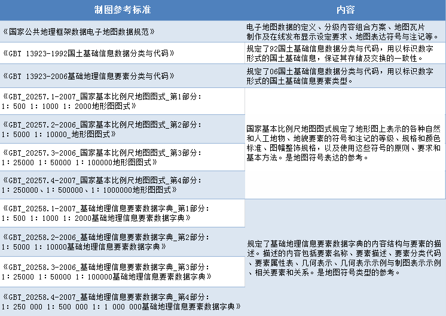
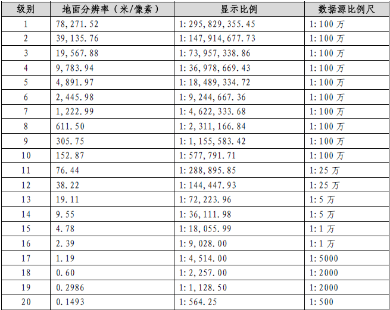
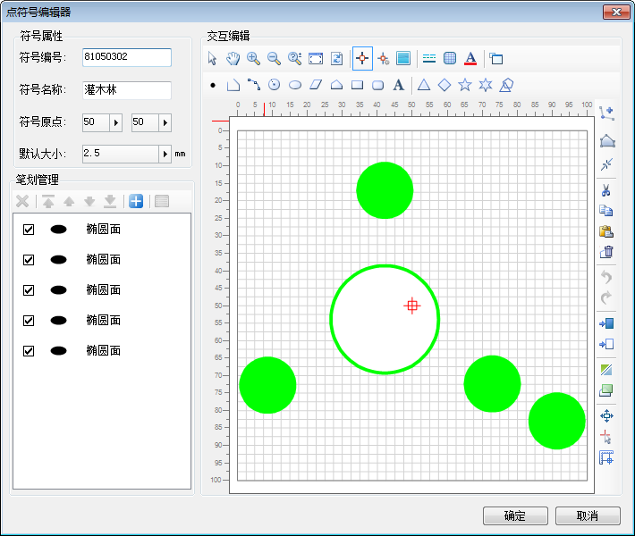

### 自动制图概念

电子地图配图是指电子地图符号化的过程。自动制图是根据国家公共地理框架电子地图数据和规范的电子地图符号库，对原始数据要素符号化、自动匹配检查、要素标注等，自动生成符合规范的电子地图。

电子地图数据是针对在线浏览和专题标图的需要，对矢量数据、影像数据进行内容选取组合所形成的数据集，经符号化处理、图面整饰、分级缓存后形成重点突出、色彩协调、符号形象、图面美观的视屏显示地图。电子地图矢量数据集的源数据包括1：100万、1：25万、1：5万、1：1万、1：5000、1：2000、1：1000、1：500等不同比例尺的基础数据。

### 自动制图价值

传统的地图制图有许多弱点，生产难度大、成本高、周期长、不能反映空间地理事物的动态变化、信息难以共享等。因此，自动化制图技术应运而生。地图制图的自动化可以大大提高制图的效率和规范性。推出一套完整的解决方案，帮助用户成功创建地图、清楚、准确、高效的展示地理数据。

### 自动制图原理

1、自动制图的参考标准如下：

  
  

  * 补充说明：以上参考标准，通过《国家公共地理框架数据电子地图数据规范》提取每个比例尺下显示的要素；通过《国土基础信息数据分类与代码》提取要素的国标码，以及如何通过国标扩展要素编码；通过《国家基本比例尺地图图式》获得不同比例尺下要素具体的符号显示样式；通过《基础地理信息要素数据字典》得到不同比例尺下要素的符号类型，如点、线、面等。
  * SuperMap自动制图，已录入所有要素及其国标码，并根据要素字典和图示做了一套自动制图标准电子符号库。自动制图根据《国土基础信息数据分类与代码》将数据要素分为八大类：定位基础、水系、居民地及设施、交通、管线、境界与地区、地貌、植被与土质。根据数据比例尺对应匹配比例尺级别，即相应的显示比例尺。某一比例尺级别所对应的要素内容严格遵从《国家公共地理框架数据电子地图数据规范》。自动制图对各比例尺级别下数据中的所有要素配以相应的地图表达标准符号、要素标注，自动生成符合国家标准的电子地图。

### 比例尺和符号编码

为了向用户提供色彩协调、符号形象、图面美观的视屏显示地图，需要设定不同显示比例下要素显示符号（包括要素及注记的样式、规格、颜色等），这时就涉及比例尺和符号编码。

### **一、比例尺相关**

  * 不同比例尺级别下，对应的数据比例尺和显示比例尺如下图：

显示比例尺： 自动制图后结果地图的显示的比例尺；

数据源比例尺：电子地图矢量数据集的源数据比例尺。

  

  * 某一比例尺级别所对应的要素内容在《国家公共地理框架数据电子地图数据规范》都有详细说明，下面以第8级别，显示比例尺为1：2,311,166.84，数据源比例尺为1：100万为例，展示其对应要素内容的选取：
  
---  

### **二、** 数据要素符号编码

  * 按照《国家基本比例尺地图图式》以及《基础地理信息要素数据字典》，要素符号比例尺分为四段：

  
---  

SuperMap自动制图要素符号编码为八位，第八位扩展位一般用来表示比例尺位，用1、2、3、4表示，特殊符号除外。

1表示1：500 1：1000 1：2000比例尺段要素扩展位编码

2表示1：5000 1：10000比例尺段要素扩展位编码

3表示1∶25000 1∶50000 1∶100000比例尺段要素扩展位编码

4表示1∶250000、1∶500000、1∶1000000比例尺段要素扩展位编码

例如，符号编码为"11040201"的要素表示第一段比例尺1：500 1：1000 1：2000比例尺段要素符号。

### **三、** 要素符号制作

具体点符号的制作请参考：[新建点符号](../SymManager/SymMarkerManager7.htm)

  
---  

具体线符号的制作请参考：[新建线符号](../SymManager/SymLineEditor0.htm)

  
---  

具体面符号的制作请参考：[新建面符号](../SymManager/SymFillManager5.htm)

  
---  
