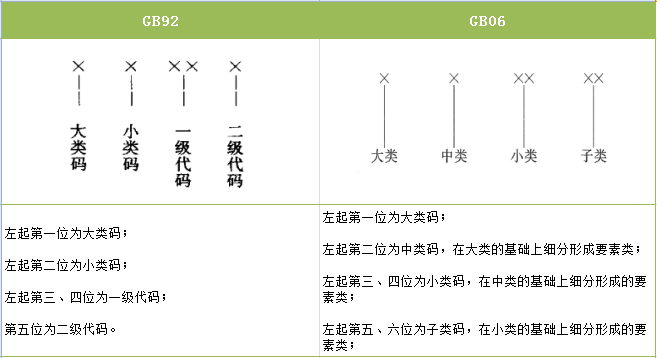
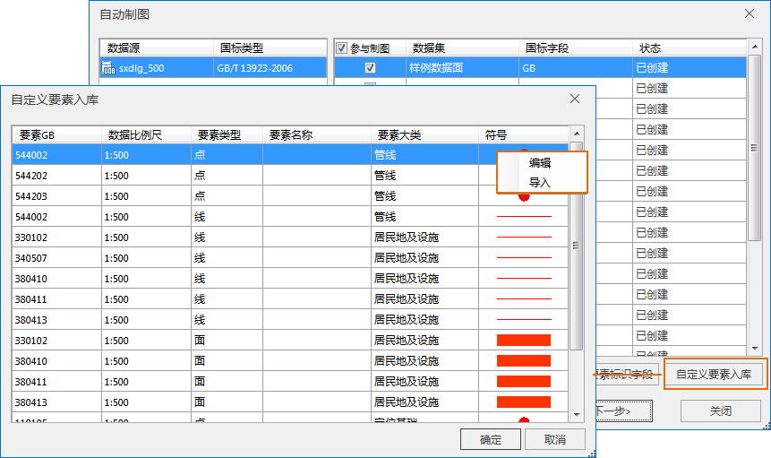
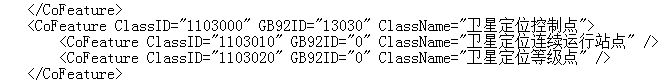
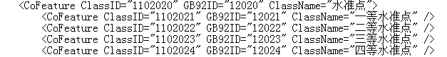
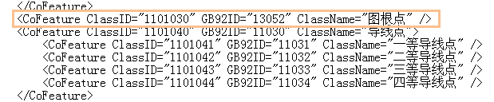
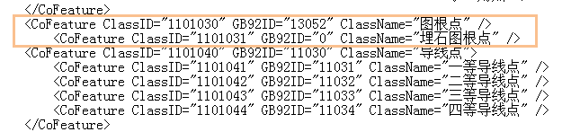
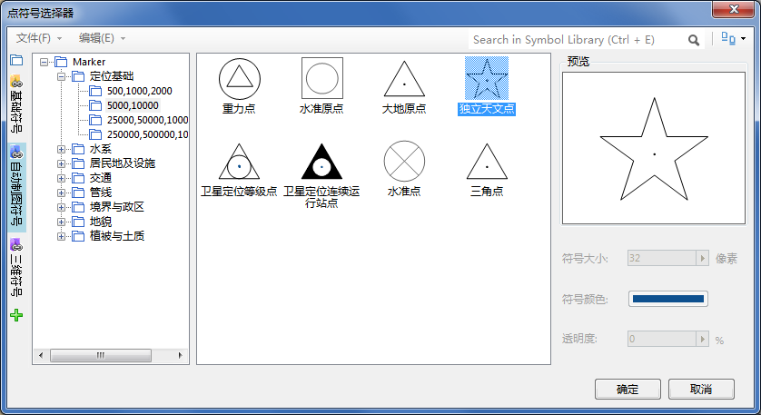

### 自动制图自定义扩展概述

SuperMap自动制图，采用规范的分层体系，规范的数据展示形态，规范的电子地图产出。提供了整套扩展方案，支持自定义要素扩展制图。制图过程中，将国标字段处理为SuperMap自己的要素标识字段。了解自动制图自定义扩展首先需要了解以下几个概念：

  * 国标（GB）：即国家标准要素编码，指国家标准的用以标识基础地理信息要素数字形式代码。通过要素的分类和编码，确定类别、等级明确的代码结构，最终形成我国统一和协调一致的基础地理信息要素分类代码标准，以满足我国当前大、中、小不同比例尺基础地理信息数据的采集、建库以及数据交换、应用等需求。SuperMap自动制图，支持GB92和GB06标准，下面会具体描述GB92、GB06。

  * GB92：1992年国家标准要素编码。国家基础地理信息系统地形数据库数据分类编码执行国家标准《国土基础信息数据分类与代码》（GB/T 13923-92）。代码为五位数字码,其结构如图

  * GB06：2006年国家标准要素编码。国家基础地理信息系统地形数据库数据分类编码执行国家标准《国土基础信息数据分类与代码》（GB/T 13923-06）。代码为六位数字码,其结构如图

  
---  

1、92标准国土基础信息数据分为九大类，并依次细分为小类、一级和二级。分类代码由5位数字码组成。如果用户数据是 GB/T
13923-92标准的，可以按照GB92标准对要素进行扩展。

2、06标准国土基础信息数据要素分类采用线分类法，要素类型按照从属关系依次分为四级：大类、中类、小类、子类。大类包括：定位基础、水系、居民地及设施、交通、管线、境界与政区、地貌、植被与土质8大类，不得重新定义和扩充。如果用户数据是
GB/T 13923-06标准的，可以按照GB06标准对要素进行扩展。

### SuperMap自动制图要素编码扩展规则

SuperMap自动制图要素符号编码为8位。前6位为GB06国标码，第七位为系统92和06对照匹配扩展位以及用户自定义要素扩展位，第8位为比例尺位。

自动制图"自定义要素入库"支持要素扩展。用户点击"自定义要素入库"按钮，弹出"自定义要素入库"对话框，通过"编辑"和"导入"指定要素对应符号：

  
---  
  
### **第七位扩展编码规则：**

当用户的数据是符合国家标准的规范数据，即在数据属性有国标字段的情况下，自动制图过程，会在原属性中新创建一个FeatureID字段，将要素按照自动制图相应规则扩展为7位。对于用户数据为GB92标准的，系统会通过内部字典匹配为GB06标准的要素编码方式。前6位为GB06国标码，第七位为系统92和06对照匹配扩展位以及用户自定义要素扩展位。具体请在"...\Templates\AutoMapMaking\Dictionary\FeatureDictionary.xml"文件中编码的基础上扩展。要素字典FeatureDictionary支持用户自定义，

如果用户使用的数据是GB/T 13923-1992标准的，自动制图的实质都是将92标准的转化为06标准制图。首先用户需明确要素字典中对应要素的写入规则：

a、要素字典中，对于GB06要素，第七位扩展位的扩展规则为：第七位赋值为0。例如，名称为"卫星定位等级点"的要素，GB为110302，FeatureID即为1103020。

  
---  
b、要素字典中，对于GB92有而GB06没有的要素，第七位扩展位的扩展规则为：首先将其匹配对照到06标准下，第七位赋值为0以外的数字。例如，名称为"一等水准点"的要素，GB为12021，它是92标准中才有的一个要素，故需要将其匹配指定一个GB06码，由于"一等水准点"是"水准点"这个要素的细分，故指定其FeatureID为11020201。
  
---  
  
### **第八位编码规则：**

要素按照FeatureID以及比例尺来匹配对应的要素符号。SuperMap自动制图要素符号编码在FeatureID基础上新增一个扩展位，这个扩展位，即第八位扩展位一般用来表示比例尺位，用1、2、3、4表示，特殊符号除外。

1表示1：500 1：1000 1：2000比例尺段要素扩展位编码

2表示1：5000 1：10000比例尺段要素扩展位编码

3表示1∶25000 1∶50000 1∶100000比例尺段要素扩展位编码

4表示1∶250000、1∶500000、1∶1000000比例尺段要素扩展位编码

### **实例分析：**

例如：用户1：5000的数据中现有名称为"埋石图根点"的一个要素，对其指定绘制一个符号，确定符号编码如下：

参照字典如下：

  
---  
  
字典中已有一个"图根点"要素，"埋石图根点"属于"图根点"要素的细分，FeatureID指定为1101031，将其写入要素字典如下:

  
---  
  
由于1：5000属于第二段比例尺，故第八位比例尺位为2.符号编码即为11010312。

### 自定义要素符号入库：

确定了要素符号编码后，需要对要素制作对应的符号。符号库中按照八大类和四段比例尺将符号放置到指定的位置。如上面实例，符号属于"定位基础"1：5000
1：10000下的符号，故符号制作和入库情况如图：

  
---  
  
### 有关用户数据为非国标数据的说明：

SuperMap自动制图建议使用国家标准数据。如果用户的数据不是标准数据，即用户数据属性字段中没有国标字段，这时需要用户给定一个能够唯一标识要素的5位或6位编码字段。如果用户给定的是5位的要素标识字段，则可以选择
GB/T 13923-1992 国家标准；如果用户给定的是6位的要素标识字段，请选择 GB/T 13923-2006
国家标准，对要素进行唯一标识。这样在自定义要素入库的时候，用户只需要指定与之匹配的符号即可完成制图。

对于这种不标准的数据，整个制图过程相对比较繁琐一些，主要是在构建要素标识字段后"自定义要素入库"这一步，用户需要为每一个要素指定相应的符号。

