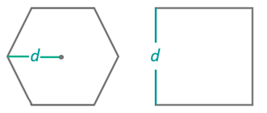
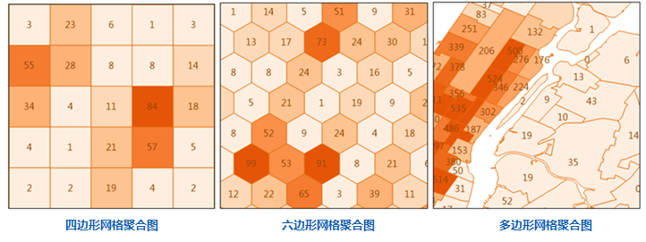

点聚合分析是指针对点数据集制作聚合图的一种空间分析。通过网格面或多边形对地图点要素进行划分，然后计算每个面对象内点要素的数量，并作为面对象的统计值，也可引入点的权重信息，考虑面对象内点的加权值作为面对象的统计值；最后基于面对象的统计值，按照统计值大小排序的结果，通过色带对面对象进行色彩填充。

点聚合分析类型包括：网格面聚合、多边形聚合，其中网格面聚合图按照网格类型又可分为：四边形网格、六边形网格。

###  应用场景

* 可根据近几年全球恐怖袭击数据，分析恐怖袭击事件对各地区的影响，例如：伤亡人数、事件发生次数等。
* 分析自然灾害对各地区的影响，以及伤亡情况，例如地震、泥石流、暴雨等。

###  功能入口

* **在线** 选项卡-> **分析** 组-> **点聚合分析** 。

###  操作说明

1. **iServer服务地址** ：通过下拉选项登录iServer服务地址和帐号，详细说明请参见[数据输入](DataInputType)页面。
2. **源数据** ：用于设置进行聚合分析的点数据集，单击下拉按钮选择即可，下拉选项中会自动过滤符合分析要求的源数据集，详细说明请参见[数据输入](DataInputType)页面。
3. **分析范围** ：选填参数，指定范围内的点参与汇总分析，默认为源数据集的全幅范围。可手动输入范围，还可以通过复制属性中的数据集或对象范围，将其粘贴至此。
4. **分析参数设置** ： 
  * **聚合类型** ： 
    * 多边形聚合：若为多边形聚合分析，则需要设置需要聚合的面数据集，比如行政区划面，设置方式请参见[数据输入](DataInputType)。
    * 网格面聚合：若为网格面聚合分析，还需要设置以下网格面类型、分析范围、网格大小、网格大小单位。
  * **网格面类型** ：必填参数，包括四边形网格和六边形网格。
  * **分析范围** ：选填参数，指定范围内的点参与汇总分析，默认为源数据集的全幅范围。可手动输入范围，还可以通过复制属性中的数据集或对象范围，将其粘贴至此。
  * **网格大小** ：必填参数，四边形网格为网格的边长；对于六边形网格为六边形顶点到中心点的距离，默认值为100。 
  * **网格单位** ：必填参数，可选值：米、千米、码、英尺、英里，默认值为米。
  * **权重值字段** ：指定待分析的点的权重值所在的字段名称，可设置多个字段，格式如：col7,col8。
    * 可以传递多个表示权重的字段索引，以逗号分隔，相当于对待分析的点进行多次操作，每次对应不同的权重值。
    * 如果该参数为空，则点的权重为1。
    * 无论该值设置与否，都会自动分析权重值为1的情况，即以点的个数作为面对象的统计值，结果体现在结果数据集的属性表字段里。
    * 当该字段设置时，则“统计模式”也必须设置，且二者的个数需要一致，一一对应。
  * **统计模式** ：选填参数，支持的模式包含：最大值、最小值、平均值、总和、方差、标准差。统计模式的个数需与“权重值字段”个数保持一致。
5. **专题图参数设置**
  * **数字精度** ：此字段用于设置分析结果标签专题图中标签数值的精度，如“1”表示精确到小数点的后一位，默认值为1。
  * **分段模式** ：设置专题图的分段模式，提供了等距离分段、对数分段、等计数分段、平方根分段、标准差分段几种分段方式。
  * **分段个数** ：设置专题图的分段个数。
  * **颜色渐变模式** ：设置专题图的颜色渐变模式，提供了绿橙紫渐变色、绿橙红渐变、彩虹色、光谱渐变、地形渐变几种颜色模式。
6. 设置好以上参数即可执行分析，分析结果会自动在地图窗口中打开，结果数据的保存路径也会在输出窗口中打开，从该路径获取结果数据集。 **注意** ：用户若直接打开生成结果路径的数据会提示打开失败，是由于基于iSever服务的分析，会存在数据被占用而无法打开的情况。建议用户将数据拷贝至其他路径中打开该数据进行编辑操作。

###  相关主题

 [环境配置](BigDataAnalysisEnvironmentConfiguration)

 [数据准备](DataPreparation)
