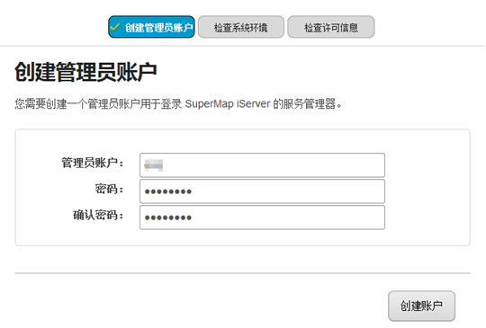

SuperMap 提供了大数据在线分析的功能，可对数据量较大、对象个数较多的数据进行高效、稳定的在线分析功能。大数据在线分析依赖于 iServer
服务，基于 Spark 计算平台，可对分布式存储的数据进行分析，支持 HDFS、iServer DataStore 及
UDB中存储的数据。同时还提供了大数据的管理、分析、地图制图、出图等功能，在线分析功能支持：简单点密度分析、核密度分析、矢量裁剪分析、单对象查询、网格面聚合分析、多边形聚合分析、范围汇总分析。

大数据在线分析的环境配置和操作步骤如下：

  * 分析服务环境配置
  * 数据准备
  * 大数据在线分析

### 大数据在线分析服务配置

若在使用大数据在线分析功能之前，没有可用的分析环境和数据，需先配置iServer服务环境与数据。iServer 服务在 Windows 中的配置操作说明如下：

1. 获取的iServer产品包，并启动 iServer 服务；
2. 在浏览器中访问 <http://localhost:8090/iserver/>，创建管理员帐户后，依次检查系统环境--检查许可--配置示范服务，单击“下一步”按钮； 
3. 点击“配置完成”页面中的“服务管理器”地址，登录帐号后，选择页面中的“使用集群”选项，勾选“是否使用集群”，并选择一种集群服务，如下图所示：  
4. 切换到“配置集群”面板，勾选“是否启用分布式计算集群”，并选择“启用本机的Spark集群（默认）”，单击“保存”按钮即可；
5. 切换到“加入集群”面板，单击“集群服务地址”处的“编辑”，将默认地址中的 **anotherclusterservice** 修改为本机的ip，确定之后，勾选“是否分布式分析节点”及“报告器是否启用”，单击“保存”即可。 
6. 切换至“分布式分析服务”面板，勾选“是否启用”复选框，设置关联服务地址、关联服务Token等参数，单击“保存”按钮即可； 
7. 配置好分析环境后，在iServer注册数据即可执行大数据在线分析操作，数据准备的操作可参见[注册数据](DataPreparation)页面。

###  相关主题

 [数据准备](DataPreparation)

 [密度分析](DensityAnalysis)