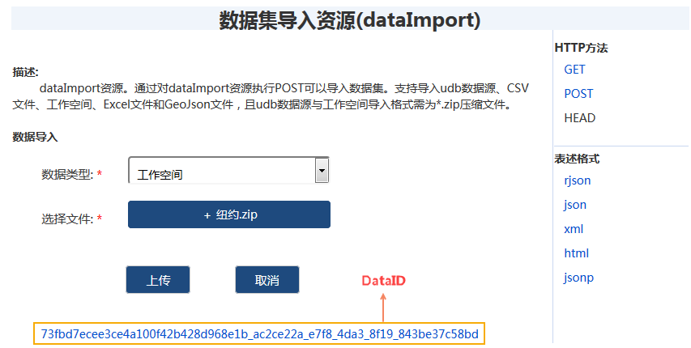
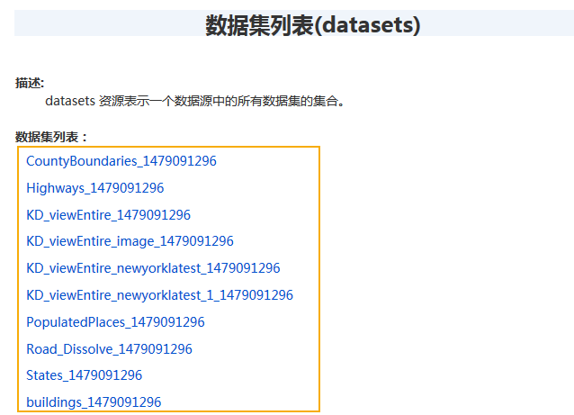

大数据在线分析服务支持的 HDFS 和 iServer 两种数据输入方式，其中 iServer Catalog
数据包括两种存储类型：大数据共享目录和空间数据库。当数据准备就绪后，在创建各类大数据分析任务时，iServer 会自动列出符合分析条件的数据集。

  * 大数据共享目录：支持注册本地共享目录数据和 HDFS 目录，支持注册的数据类型有csv 数据、udb 数据。
  * 空间数据库：支持 HBase、Oracle、PostgreSQL、PostGIS、MongoDB 数据库。

### iServer 注册数据

用户可将拥有的数据库或数据文件所在目录注册到 iServer，即可以使 iServer 提供的服务访问并使用这些数据。

在 iServer
服务管理页面：http://supermapiserver:8090/iserver/manager，依次点击“集群”→“数据注册”，即可将以下数据库或数据存储目录注册到
iServer：

  * **注册大数据文件共享** ：可将网络中共享目录、本地文件目录或 HDFS 目录，注册到 iServer 中，目录中的 csv文件、index文件、udb 数据集文件及子文件夹可用于分布式分析服务。
  * **注册空间数据库** ：可将远程 HBase、Oracle、PostgreSQL、PostGIS、MongoDB 服务注册到 iServer，用于存储空间数据，并提供给分布式分析服务。 **注意** ，注册的 MongoDB 服务仅支持分布式分析服务中的叠加分析、单对象空间查询分析。

###  注册大数据文件共享

iServer 分布式分析服务提供对 csv 数据和 udb 数据集的处理与分析能力。您可以将共享目录以及HDFS 目录注册到 iServer 中，目录中的
csv文件、index文件、udb 数据集文件及子文件夹用于分布式分析服务。下面将具体为您介绍。

  1. 在 iServer 服务管理页面(http://supermapiserver:8090/iserver/manager)，依次点击“集群”→“数据注册”→"注册数据存储"，"数据存储类型"选择"大数据文件共享"。
  2. 文件共享类型可选择以下两种：
    * 共享目录：可以将存储于本地或者文件共享的csv 数据和 udb 数据注册到iServer中,用于分布式分析。其中，注册的csv数据支持修改数据的字段类型。
    * HDFS目录：为更好的适应大规模数据的 GIS 应用，推荐您使用 HDFS（Hadoop Distributed File System），即 Hadoop 分布式文件系统。它具有高容错特性，适合大规模数据集上的应用。iServer 支持注册 HDFS 中存储的 csv 数据（注册的csv数据支持修改数据的字段类型）、index文件数据。 
  3. 在“共享目录”中输入注册数据所在的共享路径，或在“HDFS目录”中输入csv 数据数据的路径即可。
  4. 设置好以上参数后，单击“注册数据存储”按钮，即可将数据注册到iServer中。

### 注册空间数据库

登录服务管理器（http://:/iserver/manager），依次点击进入“集群”、“数据注册”。数据存储列表中展示了所有已注册的数据存储，点击存储
ID，可查看详细的存储配置信息。

具体配置信息如下：

  * 存储 ID：为数据库创建一个唯一标识。
  * 数据存储类型：选择“空间数据库”。
  * 数据库类型：当前支持 HBase、Oracle 、 PostgreSQL、PostGIS、MongoDB。
  * 服务地址： 数据库连接地址。
  * 数据库：您将使用的数据库。
  * 用户名：该数据库所有者的用户名（HBASE除外）。
  * 密码：该数据库所有者的密码（HBASE除外）。
  * 允许编辑：当前仅注册的 HBase、 PostgreSQL、POSTGIS数据库支持该选项。不勾选"允许编辑",该数据库不可作为目录服务上传关系型数据的存储节点。勾选"允许编辑"：该数据库可作为目录服务上传关系型数据的存储节点。作为上传的关系型数据的存储节点，遵循以下原则：

    * 当注册多个允许编辑的数据库时，优先选择数据集最少的数据库做为存储节点。
    * 当同时注册了允许编辑的数据库和iServer DataStore，则优先选择允许编辑的数据库作为存储节点，且遵循数据集最少原则。
    * 如只注册了iServer DataStore，则iServer DataStore可作为存储节点。

**注**
：在进行数据注册时，如果iServer服务与HBase集群不在同一机器，需要将HBase集群各个节点所在机器的ip、主机名添加到iServer服务所在机器的hosts文件中。

也可以通过修改数据目录服务配置文件来注册空间数据库，具体操作时，在 iserver-datacatalog.xml 中添加如下配置信息：

    
    
    <datastore> 
    <datastoreType>SPATIAL</datastoreType> 
    <name>postgresql2</name>
    <type>POSTGRESQL</type>   
      <connectionInfo>  
        <dataBase>postgres2</dataBase>   
        <engineType>POSTGRESQL</engineType>   
        <password>iserver</password>   
        <server>192.168.17.116</server>   
        <user>iserver</user>   
        <connect>false</connect>   
        <exclusive>false</exclusive>   
        <openLinkTable>false</openLinkTable>   
        <readOnly>false</readOnly>  
      </connectionInfo> 
    </datastore> 

其中，datastoreType、name、type 为必填参数，conectionInfo
中：dataBase、password、server、user也均为必填参数。

###  iServer DataStore

iServer DataStore 是一款应用程序，您可以通过 iServer DataStore 快速创建数据存储，并将数据存储与 iServer
关联起来。在 DataStore 中配置关系型数据存储时，将自动创建一个 PostgreSQL 数据库，可存储数据集。通过 iServer
大数据服务访问数据，进而可下载、上传数据，以及分析这些数据等。

### 环境搭建

DataStore 默认端口为 8020，请先修改防火墙配置，使该端口通过。如果您的 DataStore 将安装在 Windows 系统上，请确认是否安装了
vcredist 2013，如未安装，DataStore 产品包中提供安装文件，位于 DataStore
产品包\support\vcredist\vcredist_x64-2013.exe。

  1. 在iServer DataStore 产品包的 bin 文件夹中，启动服务；
  2. 在浏览器中输入地址：http://{ip}:8020 访问 DataStore 配置向导，输入 iServer 管理员用户名、密码； 

  3. 指定内容目录，用于存储数据、日志，备份文件等。默认为【DataStore 安装目录】\data。注意：DataStore的内容目录暂不支持包含中文和空格的路径； 

  4. 选择要创建的数据类型，目前支持关系型数据、二进制文件、切片缓存、时空数据；二进制数据和切片数据的存储能力依托于 MongoDB 数据库，需要在本机安装 MongoDB。选择创建二进制数据存储或切片数据存储后，指定本机 MongoDB 的安装路径，例如D:\mongodb；
  5. 点击完成后，等待配置成功。
  6. 配置成功后，“配置状态”页面会提示 iServerDataStore 的关系组件已成功配置给 iServer，单击该页面中的“数据目录服务”，在跳转的页面中登录后，单击“dataimport”即可选择数据上传； 

  7. 在数据导入界面选择相应的数据，单击“上传”按钮，即可将数据上传至 DataStore 中。支持导入 udb 数据源、CSV文件、工作空间、Excel文件和GeoJson文件，且udb数据源与工作空间导入格式需为*.zip压缩文件。 

  8. 数据集上传成功后，会返回一个唯一的 dataID，如上图所示，用于代表该上传文件的数据包。单击该DataID，可查看该数据包的详细描述信息。上传成功的数据集，也会出现在 relationship/datasets 资源的“数据集列表”中。 

  9. 上传数据之后，在桌面应用程序中通过打开刚配置好的 iServer DataStore 数据源，即可查看其中上传的数据。

###  相关主题

[环境配置](BigDataAnalysisEnvironmentConfiguration.html)

 [密度分析](DensityAnalysis.html)

