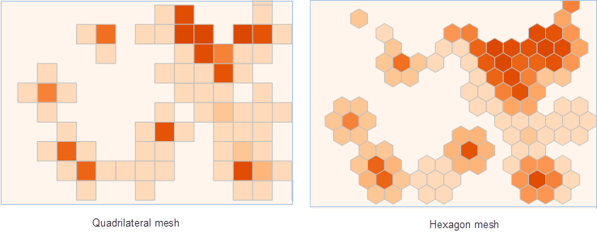
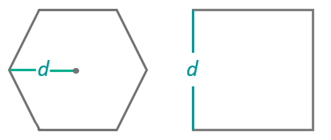

大数据分布式分析服务提供了密度分析，并支持简单密度分析和核密度分析两种分析方式：

  * **简单点密度分析** ：用于计算每个点的指定邻域形状内的每单位面积量值。计算方法为点的测量值除以指定邻域面积，点的邻域叠加处，其密度值也相加，每个输出栅格的密度均为叠加在栅格上的所有邻域密度值之和。结果栅格值的单位为原数据集单位的平方的倒数，即若原数据集单位为米，则结果栅格值的单位为每平方米。
  * **核密度分析** ：用于计算点、线要素测量值在指定邻域范围内的单位密度。简单来说，它能直观的反映出离散测量值在连续区域内的分布情况。其结果是中间值大周边值小的光滑曲面，栅格值即为单位密度，在邻域边界处降为0。核密度分析可用于计算人口密度、建筑密度、获取犯罪情况报告、旅游区人口密度监测、连锁店经营情况分析等等。

###  应用场景

  * 分析全球各区域恐怖袭击事件发生的密度。
  * 根据车辆GPS定位数据，分析交通的车流量。

###  功能入口

  * **在线** 选项卡-> **分析** 组-> **密度分析** 。

###  操作说明

1. **iServer服务地址** ：通过下拉选项登录iServer服务地址和帐号，详细说明请参见[数据输入](DataInputType)页面。
2. **源数据** ：用于设置进行汇总的数据集，仅支持线数据集和面数据集。单击下拉按钮，选择即可，下拉选项中会自动过滤符合分析要求的源数据集，详细说明请参见[数据输入](DataInputType)页面。
3. **分析范围** ：分析区域外的点数据不参与计算，默认为输入数据的全幅范围。
4. **分析参数设置** ：
  * **分析模式** ：支持简单点密度分析和核密度分析两种方式，单击下拉按钮选择即可。
  * **网格面类型** ：指定网格单元为四边形网格，还是六边形网格。必填参数。 
  * **权重值字段** ：指定待分析的点的权重值所在的字段名称集合。格式如：col7,col8。选填参数。 **备注** ：可以传递多个表示权重的字段索引，以逗号分隔，相当于对待分析的点进行多次操作，每次对应不同的权重值。如果该参数为空，则点的权重为1。无论该值设置与否，都会自动分析权重值为1的情况。结果体现在结果数据集的属性表字段里。
  * **网格大小** ：对于四边形网格为网格的边长，对于六边形网格为六边形顶点到中心点的距离，默认值为50。 
  * **网格大小单位** ：提供单位有：米、千米、码、英里、英尺，默认值为米。
  * **搜索半径** ：用于计算密度的搜索半径，默认值为300。
  * **搜索半径长度单位** ：提供单位有米、千米、码、英里、英尺，默认值为米。
  * **面积单位** ：即密度的分母单位。可选值：平方米、平方千米、公顷、公亩、英亩、平方英尺、平方码、平方英里，默认值为平方米。
5. **专题图参数**
  * **分段模式** ：设置专题图的分段模式，提供了等距离分段、对数分段、等计数分段、平方根分段、标准差分段几种分段方式。
  * **分段数** ：设置专题图的分段个数。
  * **颜色渐变模式** ：设置专题图的颜色渐变模式，提供了绿橙紫渐变色、绿橙红渐变、彩虹色、光谱渐变、地形渐变几种颜色模式。
6. **分析结果** :设置好以上参数之后即可执行分析，分析结果会自动在地图窗口中打开，结果数据的保存路径也会在输出窗口中打开，从该路径获取结果数据集。 **注意** ：用户若直接打开生成结果路径的数据会提示打开失败，是由于基于iSever服务的分析，会存在数据被占用而无法打开的情况。建议用户将数据拷贝至其他路径中打开该数据进行编辑操作。 

下图为美国交易金额的核密度分析结果：

###  相关主题

 [环境配置](BigDataAnalysisEnvironmentConfiguration)

 [数据准备](DataPreparation)
