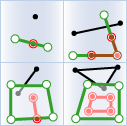
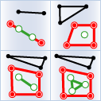
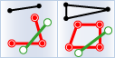
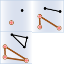
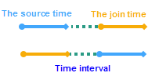
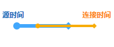
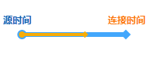
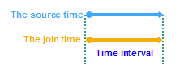
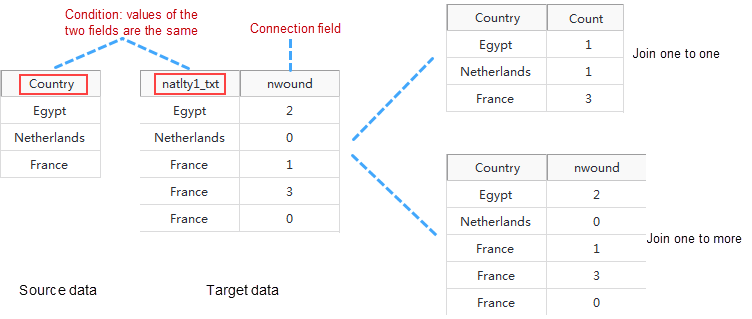

要素连接可根据空间、时间、属性关系，或这三者间的某种组合关系，将一个数据集中的属性连接到另一个数据集中，数据集可以是空间数据也可以是属性数据。要素连接会根据指定的条件，先确定满足连接条件的所有输入对象，再将满足要求的输入对象连接到源数据的对象。

连接要素工具可将信息从一个图层传递并追加到另一个图层。连接要素时，可以基于空间关系、属性关系、时间关系或三者的组合来连接要素。

**空间关系**

确定要素彼此的空间关系，可用的关系将取决于正在连接的图层的几何类型（点、线或面）。提供的空间关系如下：邻近、包含、被包含、交叉、相交、重叠、邻接、不相交、同一，具体说明请参考[空间查询的基本算子](../Query/SQ_BasicOperators.htm)。

空间关系 | 图示 | 说明  
---|---|---  
邻近 |  | 连接对象与源对象在指定的距离半径的范围内，则满足条件。  
包含 |  | 源对象包含连接对象。  
被包含 |  | 源对象被连接对象包含。  
交叉 |  | 源对象与连接对象有穿越关系。  
重叠 |  | 同类型对象重合，如点与点、线与线、面与面重合。  
相交 |  | 源对象与连接对象有交集。  
邻接 |  | 两个数据集中的对象有公共点或公共边。  
不相交 |  | 两个数据集中的对象没有交集。  
重合 |  | 同类型对象重合，如点与点、线与线、面与面重合。  
  
**时间关系**

时间关系 | 图示 | 说明  
---|---|---  
**邻近** |  | 当源时间在连接时间的指定时间范围内时，源时间邻近连接时间。  
**之后** |  | 当源时间在连接时间之后，且与其间隔在指定时间范围内时，源时间则处于连接时间之后。  
**之前** |  | 当源时间在连接时间之前，且与其间隔在指定时间范围内时，源时间则处于连接时间之前。  
**包含** |  | 当连接时间发生在源时间间隔的起点和终点之间时，源时间包含连接时间。  
**期间** |  | 当源时间发生在连接时间间隔的起点和终点之间时，源时间处于连接时间期间。  
**终止** |  | 当源时间与连接时间在同一时间结束，且源时间在连接时间之后开始。  
**被终止** |  | 源时间与连接时间在同一时间结束，且源时间在连接时间之前开始。  
**相接** |  |
源时间与连接时间间隔在同一时间开始，且源时间在连接时间之前开始，在连接时间间隔终点之前结束。  
**被相接** |  | 源间隔时间与连接时间在同一时间开始，且源时间在连接时间之后开始，在连接时间之后结束时。  
**重叠** |  | 源时间间隔在连接时间间隔的起点前开始，连接时间终点前结束，则源时间与连接时间重叠。  
**被重叠** |  | 源时间间隔在连接时间间隔的起点后开始，连接时间终点后结束。  
**起始** |  | 源时间与连接时间间隔在同一时间开始，且源时间在连接时间间隔终点之前结束。  
**被起始** |  | 源时间与连接时间间隔在同一时间开始，且源时间在连接时间间隔终点之后结束。  
**相同** |  | 两个时间的起始时间或间隔完全一致，则这两个时间完全相同。  
  
###  应用场景

  * 分析资金交易的流向，统计指定时间内，汇入同一个账户的金额总和。
  * 通过要素连接工具，可将城市各辖区（如学区、警务区、社区等）附加信息追加到每一起犯罪中，进一步研究和分析犯罪对不同辖区的影响。 

###  操作说明

  1. 在“在线”选项卡的“分析”组中，选择“要素连接”，即可弹出 **要素连接** 参数设置对话框。
  2. **iServer服务地址** ：通过下拉选项登录iServer服务地址和帐号，详细说明请参见[数据输入](DataInputType.html)页面。
  3. **源数据** ：需要连接属性的数据，即将连接数据的要素和属性连接到源数据中，单击下拉按钮，选择源数据即可。源数据设置的详细说明请参见[数据输入](DataInputType.html)页面。
  4. **要素连接数据** ：必填参数，提供连接属性的数据，单击下拉按钮，选择连接数据，支持点、线、面类型的数据集。数据设置的详细说明请参见[数据输入](DataInputType.html)页面。
  5. **分析参数设置** ：
    * **连接方式** ：必填参数，指源对象属性与连接对象的匹配关系，提供了一对一、一对多两种连接方式。 
      * **一对一连接** ：如果满足条件的连接对象是一个，那么就会将连接对象的连接字段属性值更新到源对象中；如果满足条件的连接对象是多个，那么将只统计满足条件的个数。
      * **一对多连接** ：此方式会将每一个满足条件的多个对象，都保留到结果数据集中，例如：源数据集中的一个对象与连接数据集中的五个对象相匹配，结果数据集中将包含这五个对象 
    * **属性统计字段** ：可以将符合条件的字段值进行统计，可统计单个字段信息，也可分别对多个字段进行统计，若设置了多个统计字段，那么统计模式也要对应设置多个。
    * **属性统计模式** ：提供了最大值、最小值、平均值、总和、方差、标准差集中统计模式，单击下拉按钮设置即可。
    * **容限值** ：该参数仅对邻近空间关系的空间距离生效，若空间距离设置为100米，容限设置为1，则表示距离源对象99和101米的连接对象都满足条件。
  6. **要素关联方式设置** ：连接要素时，可以基于空间关系、属性关系、时间关系或三者的组合来连接要素，这三个复选框可勾选一个、两个或者三个进行设置，具体说明如下：
    * **空间关系** ：确定要素彼此的空间关系，可用的关系将取决于正在连接的图层的几何类型（点、线或面）。提供的空间关系如下：邻近、包含、被包含、交叉、相交、重叠、邻接、不相交、同一。
    * **时间关系** ：确定对象彼此的时态关系，可用的关系取决于正在连接的图层的时间类型（时刻或间隔）。详细说明可参见上述的时间关系。
    * **属性关系** ：确定对象彼此的属性关系，如果连接数据中的字段值等于源数据中的字段值相等或（不相等），满足条件的对象进行匹配。
    * **时间间隔单位** ：必填参数，提供了秒、毫秒、分钟、小时、天、周、月、年，默认为秒。
  7. **专题图参数设置**
    * **数字精度** ：此字段用于设置分析结果标签专题图中标签数值的精度，如“1”表示精确到小数点的后一位，默认值为1。
    * **分段模式** ：设置专题图的分段模式，提供了等距离分段、对数分段、等计数分段、平方根分段、标准差分段几种分段方式。
    * **分段个数** ：设置专题图的分段个数。
    * **颜色渐变模式** ：设置专题图的颜色渐变模式，提供了绿橙紫渐变色、绿橙红渐变、彩虹色、光谱渐变、地形渐变几种颜色模式。
  8. 设置好以上参数之后，即可进行要素连接，分析成功之后，地图窗口会自动弹出分析结果，同时输出窗口会提示结果数据集所保存在的工作空间路径，可从该路径获取结果数据路径。 **注意** ：用户若直接打开生成结果路径的数据会提示打开失败，是由于基于iSever服务的分析，会存在数据被占用而无法打开的情况。建议用户将数据拷贝至其他路径中打开该数据进行编辑操作。

###  相关主题

[环境配置](BigDataAnalysisEnvironmentConfiguration.html)

 [数据准备](DataPreparation.html)

